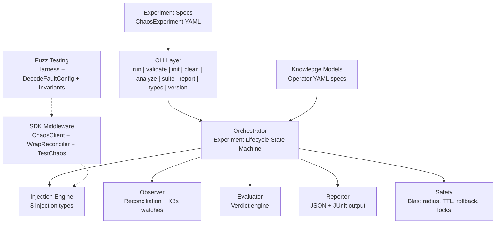
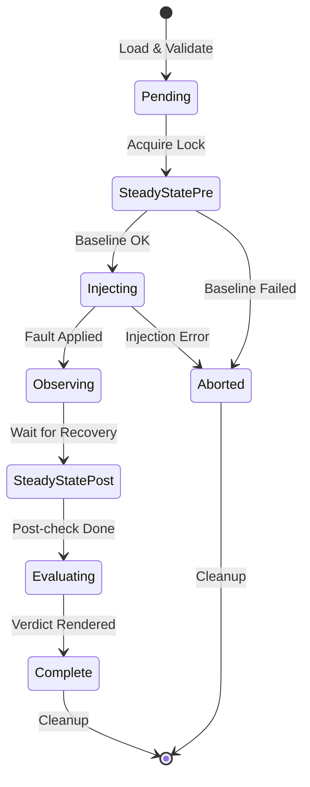

# ODH Platform Chaos

Chaos engineering framework for OpenDataHub operators. Tests operator reconciliation semantics --- not just that pods restart, but that operators correctly restore all managed resources.

## Why ODH Platform Chaos?

Existing chaos tools (Krkn, Litmus, Chaos Mesh) test infrastructure resilience: kill a pod, verify it comes back. But Kubernetes operators manage complex resource graphs --- Deployments, Services, ConfigMaps, CRDs --- where the real question is:

**"When something breaks, does the operator put everything back the way it should be?"**

ODH Platform Chaos answers this by:
- **Testing reconciliation**: Verifying operators restore resources to their intended state
- **Operator-semantic faults**: CRD mutation, config drift, RBAC revocation --- faults specific to operators
- **Knowledge-driven**: Understanding what each operator manages via knowledge models
- **Structured verdicts**: Resilient, Degraded, Failed, or Inconclusive

## Prerequisites

- **Go 1.25+** (check `go.mod` for exact version)
- **Kubernetes/OpenShift cluster** (for CLI experiments and SDK middleware against a live cluster; not needed for fuzz testing)
- **cluster-admin RBAC** (CLI experiments perform destructive operations: pod deletion, RBAC revocation, webhook mutation, NetworkPolicy creation)
- **controller-runtime v0.23+** (for SDK and fuzz testing integration)

## Three Usage Modes

ODH Platform Chaos provides three distinct ways to test operator resilience, each suited to different stages of the development lifecycle:

| Mode | What It Tests | Requires Cluster? | When to Use |
|------|--------------|-------------------|-------------|
| **CLI Experiments** | Full operator recovery on a live cluster | Yes | Pre-release validation, CI/CD pipelines |
| **SDK Middleware** | Operator behavior under API-level faults | Yes (or fake client) | Integration tests, staging environments |
| **Fuzz Testing** | Reconciler correctness under random faults | No (uses fake client) | Development, unit tests, CI |

### Mode 1: CLI Experiments (Cluster-Level Chaos)

Run structured chaos experiments against a live cluster. The CLI orchestrates the full experiment lifecycle: establish steady state, inject fault, observe recovery, evaluate verdict.

```bash
# Generate an experiment skeleton
odh-chaos init --component odh-model-controller --type PodKill > experiment.yaml

# Validate the experiment YAML
odh-chaos validate experiment.yaml

# Dry run (validates without injecting)
odh-chaos run experiment.yaml --dry-run --knowledge knowledge.yaml

# Execute against a live cluster
odh-chaos run experiment.yaml --knowledge knowledge.yaml
```

**Use this when**: You need to verify that a real operator recovers correctly on a real cluster --- the definitive resilience test before shipping.

### Mode 2: SDK Middleware (ChaosClient Wrapper)

Wrap a controller-runtime `client.Client` with fault injection. The `ChaosClient` intercepts CRUD operations and injects errors, delays, or disconnections based on a `FaultConfig`. No code changes to your reconciler are needed.

```go
import "github.com/opendatahub-io/odh-platform-chaos/pkg/sdk"

// Wrap an existing client with chaos fault injection.
// FaultSpec fields:
//   ErrorRate float64       - probability of injecting an error (0.0-1.0)
//   Error     string        - error message to return
//   Delay     time.Duration - fixed delay before each operation
//   MaxDelay  time.Duration - random delay up to this value (jitter)
faults := sdk.NewFaultConfig(map[sdk.Operation]sdk.FaultSpec{
    sdk.OpGet: {ErrorRate: 0.3, Error: "connection refused"},
    sdk.OpList: {MaxDelay: 2 * time.Second}, // random jitter up to 2s, no errors
})
chaosClient := sdk.NewChaosClient(realClient, faults)

// Use chaosClient wherever you'd use the real client.
// 30% of Get calls will return "connection refused".
// All List calls will have random delay up to 2s.
```

You can also wrap an entire reconciler to inject faults at the reconcile-entry level (before your reconciler code runs):

```go
// Using the faults variable from above:
wrapped := sdk.WrapReconciler(myReconciler, sdk.WithFaultConfig(faults))
```

For Go tests, use the `TestChaos` helper which auto-cleans up via `t.Cleanup`:

```go
func TestMyReconciler(t *testing.T) {
    tc := sdk.NewForTest(t, "my-component")
    tc.Activate(sdk.OpGet, sdk.FaultSpec{ErrorRate: 1.0, Error: "not found"})

    // Works with both real clients and fake clients (no cluster needed)
    fakeClient := fake.NewClientBuilder().WithScheme(scheme).Build()
    chaosClient := sdk.NewChaosClient(fakeClient, tc.Config())
    // ... test your reconciler with the chaos client
}
```

**Distinguishing chaos errors from real errors**: When using `ChaosClient`, injected faults return `*sdk.ChaosError`. Use `errors.As` to tell them apart:

```go
var chaosErr *sdk.ChaosError
if errors.As(err, &chaosErr) {
    // This error was injected by ChaosClient -- expected behavior
} else {
    // This is a real error from the Kubernetes API or your reconciler
}
```

You can also load fault configuration from a Kubernetes ConfigMap at runtime:

```go
// ConfigMap "odh-chaos-config" with key "config" containing JSON:
// {"active": true, "faults": {"get": {"errorRate": 0.5, "error": "not found"}}}
fc, err := sdk.ParseFaultConfigFromData(configMap.Data)
chaosClient := sdk.NewChaosClient(realClient, fc)
```

The SDK also provides an HTTP admin handler for runtime introspection:

```go
adminHandler := sdk.NewAdminHandler(faults)
// Exposes:
//   GET /chaos/health      - health check
//   GET /chaos/status       - active state + fault count
//   GET /chaos/faultpoints  - all configured fault injection points
```

**Use this when**: You want to test how your reconciler handles API-level failures (timeouts, conflicts, connection errors) in integration tests or staging, without needing the full experiment lifecycle.

### Mode 3: Fuzz Testing (Automated Fault Exploration)

Use Go's native fuzz engine to automatically explore fault combinations your reconciler might encounter. The `pkg/sdk/fuzz` package provides a harness that:

1. Creates a fresh fake client with seed objects
2. Wraps it with `ChaosClient` using fuzz-generated fault configurations
3. Runs your reconciler and catches panics
4. Distinguishes chaos-injected errors (expected) from real bugs
5. Checks post-reconcile invariants

#### Writing a Fuzz Test

```go
package mycontroller_test

import (
    "testing"

    corev1 "k8s.io/api/core/v1"
    metav1 "k8s.io/apimachinery/pkg/apis/meta/v1"
    "k8s.io/apimachinery/pkg/runtime"
    "k8s.io/apimachinery/pkg/types"
    "sigs.k8s.io/controller-runtime/pkg/client"
    "sigs.k8s.io/controller-runtime/pkg/reconcile"

    "github.com/opendatahub-io/odh-platform-chaos/pkg/sdk/fuzz"
)

// Step 1: Implement a ReconcilerFactory.
// This constructs your reconciler with a given client.Client.
func myFactory(c client.Client) reconcile.Reconciler {
    return &MyReconciler{client: c}
}

// Step 2: Write the fuzz test.
func FuzzMyReconciler(f *testing.F) {
    // Seed corpus: the fuzz engine starts with these values and mutates them.
    f.Add(uint16(0x01FF), uint8(0), uint16(32768))
    f.Add(uint16(0), uint8(3), uint16(65535))

    scheme := runtime.NewScheme()
    _ = corev1.AddToScheme(scheme)

    f.Fuzz(func(t *testing.T, opMask uint16, faultType uint8, intensity uint16) {
        // Seed objects: the initial cluster state before reconciliation.
        cm := &corev1.ConfigMap{
            ObjectMeta: metav1.ObjectMeta{Name: "my-config", Namespace: "default"},
            Data:       map[string]string{"key": "value"},
        }
        req := reconcile.Request{
            NamespacedName: types.NamespacedName{Name: "my-config", Namespace: "default"},
        }

        // Create harness with factory, scheme, request, and seed objects.
        h := fuzz.NewHarness(myFactory, scheme, req, cm)

        // Add invariants: conditions that must hold after every reconciliation.
        h.AddInvariant(fuzz.ObjectExists(
            types.NamespacedName{Name: "my-config", Namespace: "default"},
            &corev1.ConfigMap{},
        ))

        // DecodeFaultConfig maps fuzz bytes to a valid FaultConfig:
        //   opMask:    bitmask selecting which operations get faults
        //              0x01FF enables all 9 operations, 0x0001 enables only Get
        //   faultType: selects error message from 11 realistic K8s errors
        //   intensity: maps to error rate (0 = never, 65535 = always fire)
        fc := fuzz.DecodeFaultConfig(opMask, faultType, intensity)

        // Run returns an error only for REAL bugs:
        //   - Panics (always a bug)
        //   - Non-chaos errors (reconciler returned an error not from ChaosClient)
        //   - Invariant violations (post-reconcile state is wrong)
        // Chaos-injected errors (sdk.ChaosError) are expected and silently ignored.
        if err := h.Run(t, fc); err != nil {
            t.Fatal(err)
        }
    })
}
```

#### Running Fuzz Tests

```bash
# Run for 30 seconds (quick smoke test)
go test ./pkg/mycontroller/ -fuzz=FuzzMyReconciler -fuzztime=30s

# Run for 5 minutes (thorough exploration)
go test ./pkg/mycontroller/ -fuzz=FuzzMyReconciler -fuzztime=5m

# Run indefinitely until a failure is found
go test ./pkg/mycontroller/ -fuzz=FuzzMyReconciler
```

Failures are saved to `testdata/fuzz/FuzzMyReconciler/` and automatically replayed on subsequent `go test` runs.

#### DecodeFaultConfig Reference

The `DecodeFaultConfig` function maps three fuzz primitives to a valid `*sdk.FaultConfig`:

| Parameter | Type | Mapping |
|-----------|------|---------|
| `opMask` | `uint16` | Bitmask: bit 0 = Get, bit 1 = List, bit 2 = Create, bit 3 = Update, bit 4 = Delete, bit 5 = Patch, bit 6 = DeleteAllOf, bit 7 = Reconcile, bit 8 = Apply |
| `faultType` | `uint8` | Index into 11 realistic K8s error messages (conflict, not found, timeout, server error, etcd, throttle, connection refused, gone, webhook denied, quota exceeded, unavailable) |
| `intensity` | `uint16` | Error rate: 0 = never fire, 65535 = always fire |

#### Built-in Invariants

| Invariant | Description |
|-----------|-------------|
| `ObjectExists(key, obj)` | Checks that a specific object still exists after reconciliation |
| `ObjectCount(list, n, opts...)` | Checks that the count of objects of a given type matches `n` |

**Use this when**: You want to find edge cases in your reconciler's error handling during development. The fuzz engine explores thousands of fault combinations automatically, finding panics and logic bugs that manual tests miss.

## Knowledge Models

A knowledge model describes what an operator manages. The chaos framework uses this to understand which resources to check during steady-state verification and what "recovered" means.

### Schema

```yaml
operator:
  name: string          # required: operator name
  namespace: string     # required: namespace where the operator runs
  repository: string    # optional: source repository URL

components:
  - name: string        # required: unique component name
    controller: string  # required: controller that manages this component
    managedResources:    # required: at least one
      - apiVersion: string  # required: e.g. "apps/v1"
        kind: string        # required: e.g. "Deployment"
        name: string        # required: resource name
        namespace: string   # optional: resource namespace
        labels: {}          # optional: expected labels
        ownerRef: string    # optional: owner reference kind
        expectedSpec: {}    # optional: expected spec fields
    dependencies:        # optional: other component names this depends on
      - string
    webhooks:            # optional: webhooks managed by this component
      - name: string     # required: webhook configuration name
        type: string     # required: "validating" or "mutating"
        path: string     # required: webhook path
    finalizers:          # optional: finalizers this component manages
      - string
    steadyState:         # optional: steady-state checks
      checks:
        - type: string   # "conditionTrue" or "resourceExists"
          apiVersion: string
          kind: string
          name: string
          namespace: string
          conditionType: string  # for conditionTrue checks
      timeout: string    # e.g. "60s"

recovery:
  reconcileTimeout: string    # required: e.g. "300s"
  maxReconcileCycles: int     # required: e.g. 10
```

### Example: odh-model-controller

```yaml
operator:
  name: opendatahub-operator
  namespace: opendatahub

components:
  - name: odh-model-controller
    controller: DataScienceCluster
    managedResources:
      - apiVersion: apps/v1
        kind: Deployment
        name: odh-model-controller
        namespace: opendatahub
        labels:
          control-plane: odh-model-controller
        expectedSpec:
          replicas: 1
      - apiVersion: v1
        kind: ServiceAccount
        name: odh-model-controller
        namespace: opendatahub
    webhooks:
      - name: validating.odh-model-controller.opendatahub.io
        type: validating
        path: /validate
    steadyState:
      checks:
        - type: conditionTrue
          apiVersion: apps/v1
          kind: Deployment
          name: odh-model-controller
          namespace: opendatahub
          conditionType: Available
      timeout: "60s"

recovery:
  reconcileTimeout: "300s"
  maxReconcileCycles: 10
```

### Validating Knowledge Models

```bash
odh-chaos validate knowledge.yaml --knowledge
```

Note: `--knowledge` is a boolean flag; the file path is a positional argument.

Validation checks: required fields, duplicate component/resource names, unknown dependencies, self-referential dependencies, webhook types, and recovery values.

## Experiment Format

```yaml
apiVersion: chaos.opendatahub.io/v1alpha1
kind: ChaosExperiment
metadata:
  name: string              # required: experiment name
  namespace: string         # optional
  labels: {}                # optional
spec:
  target:
    operator: string        # required: operator name (must match knowledge model)
    component: string       # required: component name
    resource: string        # optional: specific resource (e.g. "Deployment/odh-dashboard")
  injection:
    type: string            # required: injection type (see table below)
    parameters: {}          # type-specific parameters (see table below)
    count: int              # optional: number of targets (default 1)
    ttl: string             # optional: fault duration (e.g. "300s")
    dangerLevel: string     # optional: "low", "medium", or "high"
  hypothesis:
    description: string     # required: what you expect to happen
    recoveryTimeout: string # optional: defaults to "60s" if omitted
  steadyState:              # optional: pre/post steady-state checks
    checks:
      - type: string        # "conditionTrue" or "resourceExists"
        apiVersion: string
        kind: string
        name: string
        namespace: string
        conditionType: string
    timeout: string
  blastRadius:
    maxPodsAffected: int    # required: must be > 0
    allowedNamespaces: []   # required for namespace-scoped injections; omit for cluster-scoped
    forbiddenResources: []  # optional: resources that must not be touched
    allowDangerous: bool    # optional: allow high-danger injections
    dryRun: bool            # optional: validate without injecting
```

## Injection Types and Parameters

### PodKill

Delete pods matching a label selector. **Danger: low**

| Parameter | Required | Description |
|-----------|----------|-------------|
| `labelSelector` | Yes | Kubernetes label selector (must have at least one requirement) |
| `signal` | No | Signal to send (e.g. "SIGKILL") |

```yaml
injection:
  type: PodKill
  parameters:
    labelSelector: "control-plane=odh-model-controller"
  count: 1
```

### ConfigDrift

Modify ConfigMap or Secret data to simulate configuration drift. **Danger: medium**

| Parameter | Required | Description |
|-----------|----------|-------------|
| `name` | Yes | ConfigMap/Secret name |
| `key` | Yes | Data key to modify |
| `value` | Yes | Corrupted value to set |
| `resourceType` | No | "ConfigMap" (default) or "Secret" |

```yaml
injection:
  type: ConfigDrift
  parameters:
    name: inferenceservice-config
    key: deploy
    value: "corrupted-config-data"
```

### NetworkPartition

Create a deny-all NetworkPolicy to isolate pods. **Danger: medium**

| Parameter | Required | Description |
|-----------|----------|-------------|
| `labelSelector` | Yes | Kubernetes label selector for target pods |

```yaml
injection:
  type: NetworkPartition
  parameters:
    labelSelector: "control-plane=odh-model-controller"
```

### CRDMutation

Mutate a field on any Kubernetes resource. **Danger: medium**

| Parameter | Required | Description |
|-----------|----------|-------------|
| `apiVersion` | Yes | Resource API version |
| `kind` | Yes | Resource kind |
| `name` | Yes | Resource name |
| `field` | Yes | JSON field name to mutate |
| `value` | Yes | JSON value to set |

```yaml
injection:
  type: CRDMutation
  parameters:
    apiVersion: serving.kserve.io/v1beta1
    kind: InferenceService
    name: my-model
    field: replicas
    value: "0"
```

### FinalizerBlock

Add a blocking finalizer to prevent resource deletion. **Danger: medium**

| Parameter | Required | Description |
|-----------|----------|-------------|
| `kind` | Yes | Resource kind |
| `name` | Yes | Resource name |

```yaml
injection:
  type: FinalizerBlock
  parameters:
    kind: Deployment
    name: odh-model-controller
```

### WebhookDisrupt

Change webhook failure policy to disrupt admission control. **Danger: high**

| Parameter | Required | Description |
|-----------|----------|-------------|
| `webhookName` | Yes | ValidatingWebhookConfiguration or MutatingWebhookConfiguration name |
| `action` | Yes | Must be "setFailurePolicy" |

```yaml
injection:
  type: WebhookDisrupt
  parameters:
    webhookName: validating.odh-model-controller.opendatahub.io
    action: setFailurePolicy
```

### RBACRevoke

Revoke RBAC binding subjects to test permission loss recovery. **Danger: high**

| Parameter | Required | Description |
|-----------|----------|-------------|
| `bindingName` | Yes | ClusterRoleBinding or RoleBinding name |
| `bindingType` | Yes | "ClusterRoleBinding" or "RoleBinding" |

```yaml
injection:
  type: RBACRevoke
  parameters:
    bindingName: odh-model-controller-rolebinding-opendatahub
    bindingType: ClusterRoleBinding
```

## CLI Reference

| Command | Description |
|---------|-------------|
| `run` | Run a chaos experiment |
| `validate` | Validate experiment or knowledge YAML without running |
| `init` | Generate a skeleton experiment YAML |
| `clean` | Remove all chaos artifacts from the cluster (emergency stop) |
| `analyze` | Analyze Go source code for fault injection candidates |
| `suite` | Run all experiments in a directory |
| `report` | Generate summary reports from experiment results |
| `types` | List available injection types |
| `preflight` | Pre-flight checks for knowledge models |
| `controller start` | Start the ChaosExperiment controller |
| `version` | Print the version |

### Global Flags

These flags apply to all commands:

| Flag | Description | Default |
|------|-------------|---------|
| `--kubeconfig` | Path to kubeconfig file | `~/.kube/config` |
| `--namespace` | Target namespace | `opendatahub` |
| `-v`, `--verbose` | Verbose output | `false` |

### run

```bash
odh-chaos run experiment.yaml [flags]
```

| Flag | Description | Default |
|------|-------------|---------|
| `--knowledge` | Path to operator knowledge YAML (repeatable) | |
| `--knowledge-dir` | Directory of knowledge YAMLs (loads all *.yaml) | |
| `--report-dir` | Directory for report output | |
| `--dry-run` | Validate without injecting | `false` |
| `--timeout` | Total experiment timeout | `10m` |
| `--distributed-lock` | Use Kubernetes Lease-based distributed locking | `false` |
| `--lock-namespace` | Namespace for distributed lock leases | `opendatahub` |

### validate

```bash
odh-chaos validate <file.yaml> [flags]
```

| Flag | Description | Default |
|------|-------------|---------|
| `--knowledge` | Validate an OperatorKnowledge YAML file instead of an experiment | `false` |

### suite

```bash
odh-chaos suite <experiments-directory> [flags]
```

| Flag | Description | Default |
|------|-------------|---------|
| `--knowledge` | Path to operator knowledge YAML (repeatable) | |
| `--knowledge-dir` | Directory of knowledge YAMLs (loads all *.yaml) | |
| `--parallel` | Max concurrent experiments | `1` |
| `--report-dir` | Directory for report output | |
| `--dry-run` | Validate without running | `false` |
| `--timeout` | Timeout per experiment | `10m` |
| `--distributed-lock` | Use Kubernetes Lease-based distributed locking | `false` |
| `--lock-namespace` | Namespace for distributed lock leases | `opendatahub` |

### analyze

```bash
odh-chaos analyze <directory> [flags]
```

| Flag | Description | Default |
|------|-------------|---------|
| `--json` | Output results as JSON | `false` |

Scans Go source code for fault injection candidates:
- Ignored errors
- Goroutine launches
- Network calls
- Database calls
- K8s API calls

### report

```bash
odh-chaos report <results-directory> [flags]
```

| Flag | Description | Default |
|------|-------------|---------|
| `--format` | Output format (`summary` or `junit`) | `summary` |
| `--output` | Output directory for report files (JUnit only; summary always writes to stdout) | |

Generates summary reports from experiment results. Summary format writes to stdout. JUnit format writes to stdout by default, or to `<output-dir>/chaos-results.xml` when `--output` is specified.

### preflight

```bash
odh-chaos preflight [flags]
```

| Flag | Description | Default |
|------|-------------|---------|
| `--knowledge` | Path to operator knowledge YAML | |
| `--local` | Local-only validation (no cluster access) | `false` |

Pre-flight checks validate a knowledge model before running experiments. In `--local` mode, validates YAML structure and cross-references (e.g. steady-state checks reference declared managed resources). Without `--local`, also verifies that declared resources exist on the cluster.

### controller start

```bash
odh-chaos controller start [flags]
```

| Flag | Description | Default |
|------|-------------|---------|
| `--namespace` | Namespace to watch (required) | |
| `--metrics-addr` | Metrics bind address | `:8080` |
| `--health-addr` | Health probe bind address | `:8081` |
| `--leader-elect` | Enable leader election | `true` |
| `--knowledge-dir` | Directory of operator knowledge YAMLs | |

Starts a Kubernetes controller that watches ChaosExperiment CRs and drives them through the experiment lifecycle using the phase-per-reconcile pattern.

### init

```bash
odh-chaos init [flags]
```

| Flag | Description | Default |
|------|-------------|---------|
| `--component` | Component name (required) | |
| `--type` | Injection type | `PodKill` |
| `--operator` | Operator name | `opendatahub-operator` |
| `--namespace` | Target namespace | `opendatahub` |

Generates a skeleton experiment YAML to stdout. Customize the output for your operator and injection type.

### types

```bash
odh-chaos types
```

Lists all available injection types with their descriptions and danger levels.

### clean

```bash
odh-chaos clean [flags]
```

| Flag | Description | Default |
|------|-------------|---------|
| `--watch` | Continuously scan and clean chaos artifacts | `false` |
| `--interval` | Scan interval when --watch is set | `60s` |

Emergency stop: removes all chaos artifacts from the cluster. Finds resources with the `app.kubernetes.io/managed-by: odh-chaos` label and cleans them up. Restores original state from rollback annotations.

## Safety Mechanisms

- **Blast radius limits**: `maxPodsAffected` and `allowedNamespaces` prevent experiments from affecting unintended resources
- **Forbidden resources**: `forbiddenResources` list protects critical resources from injection
- **Dry run mode**: `--dry-run` validates the full experiment lifecycle without injecting faults
- **TTL-based auto-cleanup**: Faults have a time-to-live; the framework cleans up even if the process crashes
- **Rollback annotations**: Original resource state is stored in annotations with SHA-256 checksums for integrity verification
- **Distributed locking**: `--distributed-lock` uses Kubernetes Leases to prevent concurrent experiments on the same cluster
- **Danger levels**: Injection types have danger levels (low/medium/high); high-danger types require explicit `allowDangerous: true`
- **Emergency stop**: `odh-chaos clean` removes all chaos artifacts immediately

## Verdicts

| Verdict | Meaning |
|---------|---------|
| Resilient | Recovered within timeout, all resources reconciled |
| Degraded | Recovered but slow, partial reconciliation, or excessive cycles |
| Failed | Did not recover or steady-state checks failed |
| Inconclusive | Could not establish baseline |

## Cross-Component Side-Effect Detection

When injecting chaos on a target component (e.g., killing kserve-controller-manager), dependent components (e.g., llmisvc-controller-manager) may silently degrade. ODH Platform Chaos detects this collateral damage automatically.

**How it works:** Load multiple knowledge files to build a dependency graph. The framework resolves which components depend on the faulted target and checks their steady-state after recovery.

```bash
# Load all knowledge files from a directory — enables collateral detection
odh-chaos run experiment.yaml --knowledge-dir knowledge/

# Or load multiple individual files
odh-chaos run experiment.yaml --knowledge kserve.yaml --knowledge odh-model-controller.yaml
```

**Dependencies** are declared in knowledge model `components[].dependencies` arrays. Two resolution modes:
- **Intra-operator**: component name within the same knowledge file (e.g., `llmisvc-controller-manager` depends on `kserve-controller-manager`)
- **Cross-operator**: operator name across knowledge files (e.g., `odh-model-controller` depends on `kserve`)

**Verdict impact:** Collateral failures downgrade `Resilient` to `Degraded` (never to `Failed`). A collateral failure is a side effect, not the target's own failure. Collateral findings appear in the `collateral` field of experiment reports.

## Architecture



### Experiment Lifecycle

Each experiment follows a strict state machine:



### Package Structure

```
cmd/odh-chaos/          CLI entrypoint
internal/cli/           Command implementations
api/v1alpha1/           ChaosExperiment CRD types
pkg/
  analyzer/             Go source code analysis
  evaluator/            Verdict engine
  experiment/           Experiment loading and validation
  injection/            8 injection type implementations
  model/                Knowledge model types, validation, DependencyGraph
  observer/             Reconciliation, K8s resource observation, Blackboard pattern (ObservationBoard, Contributors)
  orchestrator/         Experiment lifecycle state machine
  reporter/             JSON and JUnit report generation
  safety/               Blast radius, TTL, rollback, distributed locks
  sdk/                  ChaosClient, WrapReconciler, TestChaos, FaultConfig
    fuzz/               Fuzz testing harness (Harness, DecodeFaultConfig, Invariants)
    faults/             Process-level fault types (CPU, memory, IO, network, timing, concurrency)
```

## Quick Start

### Install

```bash
go install github.com/opendatahub-io/odh-platform-chaos/cmd/odh-chaos@latest
```

### Run Your First Experiment

1. Create a knowledge model for your operator (see [Knowledge Models](#knowledge-models))

2. Generate an experiment:
```bash
odh-chaos init --component odh-model-controller --type PodKill > experiment.yaml
```

3. Validate both files:
```bash
odh-chaos validate knowledge.yaml --knowledge
odh-chaos validate experiment.yaml
```

4. Dry run:
```bash
odh-chaos run experiment.yaml --knowledge knowledge.yaml --dry-run
```

5. Execute (requires cluster access):
```bash
odh-chaos run experiment.yaml --knowledge knowledge.yaml
```

### Add Fuzz Testing to Your Operator

1. Add the dependency:
```bash
go get github.com/opendatahub-io/odh-platform-chaos/pkg/sdk/fuzz
```

2. Implement a `ReconcilerFactory`:
```go
func myFactory(c client.Client) reconcile.Reconciler {
    return &MyReconciler{client: c}
}
```

3. Write a fuzz test (see [Fuzz Testing](#mode-3-fuzz-testing-automated-fault-exploration))

4. Run it:
```bash
go test ./... -fuzz=FuzzMyReconciler -fuzztime=30s
```

## Further Reading

- [End-to-End Testing Guide](docs/e2e-testing-guide.md) --- Full walkthrough with knowledge models, all injection types, suite execution, and expected verdicts for odh-model-controller and kserve
- [Go Fuzz Testing](https://go.dev/doc/security/fuzz/) --- Go's native fuzz testing documentation (required for understanding `testing.F`)

## Contributing

1. Fork the repository
2. Create a feature branch
3. Write tests first (TDD)
4. Submit a pull request
