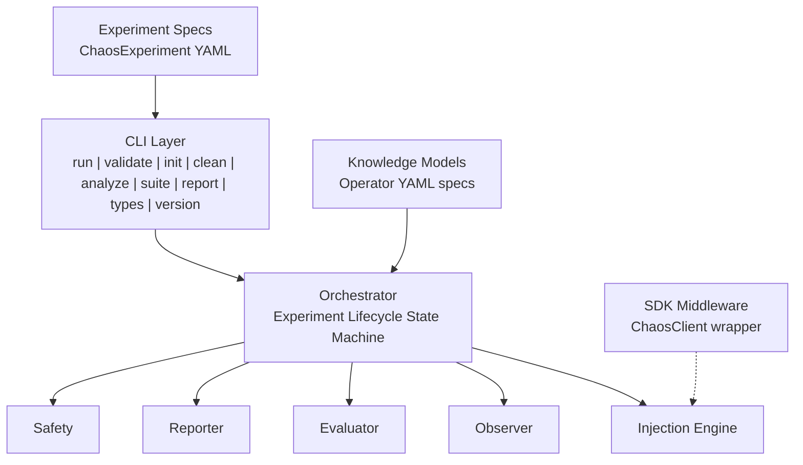
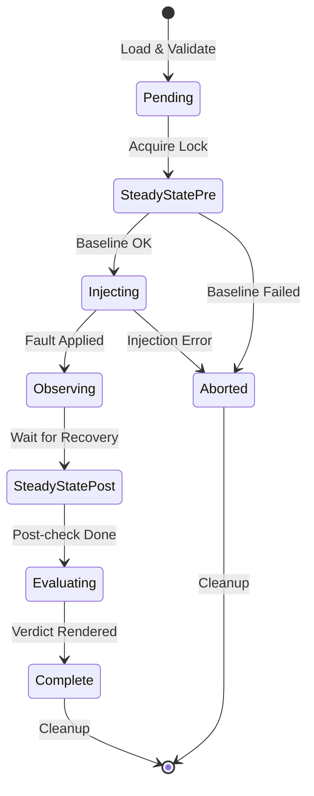
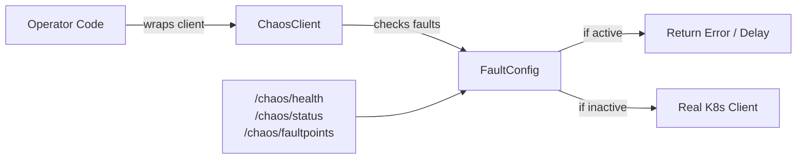

# ODH Platform Chaos

Chaos engineering framework for OpenDataHub operators. Tests operator reconciliation semantics --- not just that pods restart, but that operators correctly restore all managed resources.

## Why ODH Platform Chaos?

Existing chaos tools (Krkn, Litmus, Chaos Mesh) test infrastructure resilience: kill a pod, verify it comes back. But Kubernetes operators manage complex resource graphs --- Deployments, Services, ConfigMaps, CRDs --- where the real question is:

**"When something breaks, does the operator put everything back the way it should be?"**

ODH Platform Chaos answers this by:
- **Testing reconciliation**: Verifying operators restore resources to their intended state
- **Operator-semantic faults**: CRD mutation and config drift --- faults specific to operators
- **Knowledge-driven**: Understanding what each operator manages via knowledge models
- **Structured verdicts**: Resilient, Degraded, Failed, or Inconclusive

## Quick Start

### Install

```bash
go install github.com/opendatahub-io/odh-platform-chaos/cmd/odh-chaos@latest
```

### Run Your First Experiment

1. Create an experiment:
```bash
odh-chaos init --component odh-model-controller --type PodKill > experiment.yaml
```

2. Validate:
```bash
odh-chaos validate experiment.yaml
```

3. Dry run:
```bash
odh-chaos run experiment.yaml --dry-run
```

4. Execute (requires cluster access):
```bash
odh-chaos run experiment.yaml --knowledge knowledge/odh-model-controller.yaml
```

## CLI Reference

| Command | Description |
|---------|-------------|
| `run` | Run a chaos experiment |
| `validate` | Validate experiment YAML without running |
| `init` | Generate a skeleton experiment YAML |
| `clean` | Remove all chaos artifacts from the cluster (emergency stop) |
| `analyze` | Analyze Go source code for fault injection candidates |
| `suite` | Run all experiments in a directory |
| `report` | Generate summary reports from experiment results |
| `types` | List available injection types |
| `version` | Print the version |

### Run

```bash
odh-chaos run experiment.yaml [flags]
```

Flags:
- `--knowledge` --- Path to operator knowledge YAML
- `--report-dir` --- Directory for report output
- `--dry-run` --- Validate without injecting
- `--timeout` --- Total experiment timeout (default 10m)
- `--distributed-lock` --- Use Kubernetes Lease-based distributed locking
- `--lock-namespace` --- Namespace for distributed lock leases (default opendatahub)

### Analyze

```bash
odh-chaos analyze /path/to/operator [flags]
```

Scans Go source code for fault injection candidates:
- Ignored errors
- Goroutine launches
- Network calls
- Database calls
- K8s API calls

## Experiment Format

```yaml
apiVersion: chaos.opendatahub.io/v1alpha1
kind: ChaosExperiment
metadata:
  name: dashboard-pod-kill
spec:
  target:
    operator: opendatahub-operator
    component: dashboard
  hypothesis:
    description: "Dashboard recovers within 60s"
    recoveryTimeout: "60s"
  injection:
    type: PodKill
    count: 1
    ttl: "300s"
  blastRadius:
    maxPodsAffected: 1
    allowedNamespaces: [opendatahub]
```

### Suite

```bash
odh-chaos suite experiments/ [flags]
```

Run all experiments in a directory:
- `--knowledge` --- Path to operator knowledge YAML
- `--parallel N` --- Max concurrent experiments (default 1)
- `--report-dir` --- Directory for report output
- `--dry-run` --- Validate without running
- `--timeout` --- Timeout per experiment (default 10m)

### Injection Types

#### Resource-Level Faults (CLI-driven, requires cluster access)

| Type | Description | Danger |
|------|-------------|--------|
| PodKill | Delete pods matching selector | low |
| ConfigDrift | Modify managed ConfigMap/Secret data | low |
| NetworkPartition | Block traffic via NetworkPolicy | medium |
| CRDMutation | Mutate managed CR spec fields | medium |
| FinalizerBlock | Add a stuck finalizer to block resource deletion | medium |
| WebhookDisrupt | Set webhook failurePolicy to Fail | high |
| RBACRevoke | Remove subjects from role bindings | high |

#### SDK Middleware Faults (ChaosClient wrapper, no cluster needed)

| Type | Description | Danger |
|------|-------------|--------|
| ClientThrottle | Slow down API client responses | low |
| APIServerError | Return errors from API calls | medium |
| WatchDisconnect | Disconnect watch streams | medium |

### Verdicts

| Verdict | Meaning |
|---------|---------|
| Resilient | Recovered within timeout, all resources reconciled |
| Degraded | Recovered but slow, partial reconciliation, or excessive cycles |
| Failed | Did not recover or steady-state checks failed |
| Inconclusive | Could not establish baseline |

## Architecture



### Experiment Lifecycle

Each experiment follows a strict state machine through these phases:



### SDK Integration

For operators built with controller-runtime, integrate chaos testing with a single line change:



## End-to-End Testing Guide

For a complete walkthrough covering knowledge models, all injection types, suite execution, and expected verdicts --- see [docs/e2e-testing-guide.md](docs/e2e-testing-guide.md). Production knowledge models and experiment suites for **odh-model-controller** (10 experiments) and **kserve** (4 experiments) are shipped in `knowledge/` and `experiments/`.

## Contributing

1. Fork the repository
2. Create a feature branch
3. Write tests first (TDD)
4. Submit a pull request
