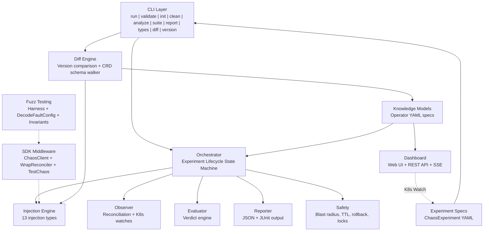
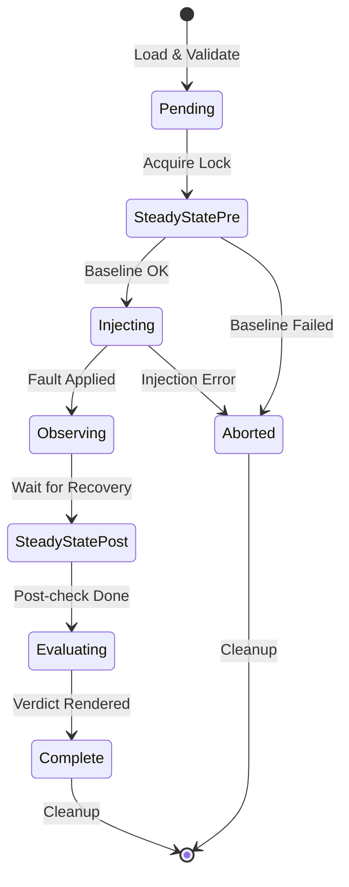

# Operator Chaos

Chaos engineering framework for Kubernetes operators. Tests operator reconciliation semantics, not just that pods restart, but that operators correctly restore all managed resources.

## Why Operator Chaos?

Existing chaos tools (Krkn, Litmus, Chaos Mesh) test infrastructure resilience: kill a pod, verify it comes back. But Kubernetes operators manage complex resource graphs (Deployments, Services, ConfigMaps, CRDs) where the real question is:

**"When something breaks, does the operator put everything back the way it should be?"**

Operator Chaos answers this by:
- **Testing reconciliation**: Verifying operators restore resources to their intended state
- **Operator-semantic faults**: CRD mutation, config drift, RBAC revocation, faults specific to operators
- **Knowledge-driven**: Understanding what each operator manages via knowledge models
- **Structured verdicts**: Resilient, Degraded, Failed, or Inconclusive

## Prerequisites

- **Go 1.25+** (check `go.mod` for exact version)
- **Kubernetes/OpenShift cluster** (for CLI experiments and SDK middleware against a live cluster; not needed for fuzz testing)
- **cluster-admin RBAC** (CLI experiments perform destructive operations: pod deletion, RBAC revocation, webhook mutation, NetworkPolicy creation)
- **controller-runtime v0.23+** (for SDK and fuzz testing integration)

## Four Usage Modes

Operator Chaos provides four distinct ways to test operator resilience, each suited to different stages of the development lifecycle:

| Mode | What It Tests | Requires Cluster? | When to Use |
|------|---------------|-------------------|-------------|
| **CLI Experiments** | Full operator recovery on a live cluster | Yes | Pre-release validation, CI/CD pipelines |
| **SDK Middleware** | Operator behavior under API-level faults | Yes (or fake client) | Integration tests, staging environments |
| **Fuzz Testing** | Reconciler correctness under random faults | No (uses fake client) | Development, unit tests, CI |
| **Upgrade Testing** | Breaking changes between versions | No (offline analysis) | Pre-upgrade validation, release qualification |

### Mode 1: CLI Experiments (Cluster-Level Chaos)

Run structured chaos experiments against a live cluster. The CLI orchestrates the full experiment lifecycle: establish steady state, inject fault, observe recovery, evaluate verdict.

```bash
# Generate an experiment skeleton
operator-chaos init --component my-controller --operator my-operator --type PodKill > experiment.yaml

# Validate the experiment YAML
operator-chaos validate experiment.yaml

# Dry run (validates without injecting)
operator-chaos run experiment.yaml --dry-run --knowledge knowledge.yaml

# Execute against a live cluster
operator-chaos run experiment.yaml --knowledge knowledge.yaml
```

**Use this when**: You need to verify that a real operator recovers correctly on a real cluster. The definitive resilience test before shipping.

### Mode 2: SDK Middleware (ChaosClient Wrapper)

Wrap a controller-runtime `client.Client` with fault injection. The `ChaosClient` intercepts CRUD operations and injects errors, delays, or disconnections based on a `FaultConfig`. No code changes to your reconciler are needed.

```go
import "github.com/opendatahub-io/operator-chaos/pkg/sdk"

// Wrap an existing client with chaos fault injection.
// FaultSpec fields:
//   ErrorRate float64       - probability of injecting an error (0.0-1.0)
//   Error     string        - error message to return
//   Delay     time.Duration - fixed delay before each operation
//   MaxDelay  time.Duration - random delay up to this value (jitter)
faults := sdk.NewFaultConfig(map[sdk.Operation]sdk.FaultSpec{
    sdk.OpGet: {ErrorRate: 0.3, Error: "connection refused"},
    sdk.OpList: {MaxDelay: 2 * time.Second}, // random jitter up to 2s, no errors
})
chaosClient := sdk.NewChaosClient(realClient, faults)

// Use chaosClient wherever you'd use the real client.
// 30% of Get calls will return "connection refused".
// All List calls will have random delay up to 2s.
```

You can also wrap an entire reconciler to inject faults at the reconcile-entry level (before your reconciler code runs):

```go
// Using the faults variable from above:
wrapped := sdk.WrapReconciler(myReconciler, sdk.WithFaultConfig(faults))
```

For Go tests, use the `TestChaos` helper which auto-cleans up via `t.Cleanup`:

```go
func TestMyReconciler(t *testing.T) {
    tc := sdk.NewForTest(t, "my-component")
    tc.Activate(sdk.OpGet, sdk.FaultSpec{ErrorRate: 1.0, Error: "not found"})

    // Works with both real clients and fake clients (no cluster needed)
    fakeClient := fake.NewClientBuilder().WithScheme(scheme).Build()
    chaosClient := sdk.NewChaosClient(fakeClient, tc.Config())
    // ... test your reconciler with the chaos client
}
```

**Distinguishing chaos errors from real errors**: When using `ChaosClient`, injected faults return `*sdk.ChaosError`. Use `errors.As` to tell them apart:

```go
var chaosErr *sdk.ChaosError
if errors.As(err, &chaosErr) {
    // This error was injected by ChaosClient -- expected behavior
} else {
    // This is a real error from the Kubernetes API or your reconciler
}
```

You can also load fault configuration from a Kubernetes ConfigMap at runtime:

```go
// ConfigMap "operator-chaos-config" with key "config" containing JSON:
// {"active": true, "faults": {"get": {"errorRate": 0.5, "error": "not found"}}}
fc, err := sdk.ParseFaultConfigFromData(configMap.Data)
chaosClient := sdk.NewChaosClient(realClient, fc)
```

The SDK also provides an HTTP admin handler for runtime introspection:

```go
adminHandler := sdk.NewAdminHandler(faults)
// Exposes:
//   GET /chaos/health      - health check
//   GET /chaos/status       - active state + fault count
//   GET /chaos/faultpoints  - all configured fault injection points
```

**Use this when**: You want to test how your reconciler handles API-level failures (timeouts, conflicts, connection errors) in integration tests or staging, without needing the full experiment lifecycle.

### Mode 3: Fuzz Testing (Automated Fault Exploration)

Use Go's native fuzz engine to automatically explore fault combinations your reconciler might encounter. The `pkg/sdk/fuzz` package provides a harness that:

1. Creates a fresh fake client with seed objects
2. Wraps it with `ChaosClient` using fuzz-generated fault configurations
3. Runs your reconciler and catches panics
4. Distinguishes chaos-injected errors (expected) from real bugs
5. Checks post-reconcile invariants

#### Writing a Fuzz Test

```go
package mycontroller_test

import (
    "testing"

    corev1 "k8s.io/api/core/v1"
    metav1 "k8s.io/apimachinery/pkg/apis/meta/v1"
    "k8s.io/apimachinery/pkg/runtime"
    "k8s.io/apimachinery/pkg/types"
    "sigs.k8s.io/controller-runtime/pkg/client"
    "sigs.k8s.io/controller-runtime/pkg/reconcile"

    "github.com/opendatahub-io/operator-chaos/pkg/sdk/fuzz"
)

// Step 1: Implement a ReconcilerFactory.
// This constructs your reconciler with a given client.Client.
func myFactory(c client.Client) reconcile.Reconciler {
    return &MyReconciler{client: c}
}

// Step 2: Write the fuzz test.
func FuzzMyReconciler(f *testing.F) {
    // Seed corpus: the fuzz engine starts with these values and mutates them.
    f.Add(uint16(0x01FF), uint8(0), uint16(32768))
    f.Add(uint16(0), uint8(3), uint16(65535))

    scheme := runtime.NewScheme()
    _ = corev1.AddToScheme(scheme)

    f.Fuzz(func(t *testing.T, opMask uint16, faultType uint8, intensity uint16) {
        // Seed objects: the initial cluster state before reconciliation.
        cm := &corev1.ConfigMap{
            ObjectMeta: metav1.ObjectMeta{Name: "my-config", Namespace: "default"},
            Data:       map[string]string{"key": "value"},
        }
        req := reconcile.Request{
            NamespacedName: types.NamespacedName{Name: "my-config", Namespace: "default"},
        }

        // Create harness with factory, scheme, request, and seed objects.
        h := fuzz.NewHarness(myFactory, scheme, req, cm)

        // Add invariants: conditions that must hold after every reconciliation.
        h.AddInvariant(fuzz.ObjectExists(
            types.NamespacedName{Name: "my-config", Namespace: "default"},
            &corev1.ConfigMap{},
        ))

        // DecodeFaultConfig maps fuzz bytes to a valid FaultConfig:
        //   opMask:    bitmask selecting which operations get faults
        //              0x01FF enables all 9 operations, 0x0001 enables only Get
        //   faultType: selects error message from 11 realistic K8s errors
        //   intensity: maps to error rate (0 = never, 65535 = always fire)
        fc := fuzz.DecodeFaultConfig(opMask, faultType, intensity)

        // Run returns an error only for REAL bugs:
        //   - Panics (always a bug)
        //   - Non-chaos errors (reconciler returned an error not from ChaosClient)
        //   - Invariant violations (post-reconcile state is wrong)
        // Chaos-injected errors (sdk.ChaosError) are expected and silently ignored.
        if err := h.Run(t, fc); err != nil {
            t.Fatal(err)
        }
    })
}
```

#### Running Fuzz Tests

```bash
# Run for 30 seconds (quick smoke test)
go test ./pkg/mycontroller/ -fuzz=FuzzMyReconciler -fuzztime=30s

# Run for 5 minutes (thorough exploration)
go test ./pkg/mycontroller/ -fuzz=FuzzMyReconciler -fuzztime=5m

# Run indefinitely until a failure is found
go test ./pkg/mycontroller/ -fuzz=FuzzMyReconciler
```

Failures are saved to `testdata/fuzz/FuzzMyReconciler/` and automatically replayed on subsequent `go test` runs.

#### DecodeFaultConfig Reference

The `DecodeFaultConfig` function maps three fuzz primitives to a valid `*sdk.FaultConfig`:

| Parameter | Type | Mapping |
|-----------|------|---------|
| `opMask` | `uint16` | Bitmask: bit 0 = Get, bit 1 = List, bit 2 = Create, bit 3 = Update, bit 4 = Delete, bit 5 = Patch, bit 6 = DeleteAllOf, bit 7 = Reconcile, bit 8 = Apply |
| `faultType` | `uint8` | Index into 11 realistic K8s error messages (conflict, not found, timeout, server error, etcd, throttle, connection refused, gone, webhook denied, quota exceeded, unavailable) |
| `intensity` | `uint16` | Error rate: 0 = never fire, 65535 = always fire |

#### Built-in Invariants

| Invariant | Description |
|-----------|-------------|
| `ObjectExists(key, obj)` | Checks that a specific object still exists after reconciliation |
| `ObjectCount(list, n, opts...)` | Checks that the count of objects of a given type matches `n` |

**Use this when**: You want to find edge cases in your reconciler's error handling during development. The fuzz engine explores thousands of fault combinations automatically, finding panics and logic bugs that manual tests miss.

### Mode 4: Upgrade Testing (Version Diff Analysis)

Compare operator knowledge models between versions to detect breaking changes and simulate upgrade-like disruptions. Works entirely offline, no cluster needed for analysis.

```bash
# Compare ODH 2.10 to RHOAI 3.3
operator-chaos diff --source knowledge/odh/v2.10/ --target knowledge/rhoai/v3.3/

# Show only breaking changes
operator-chaos diff --source knowledge/odh/v2.10/ --target knowledge/rhoai/v3.3/ --breaking

# Compare CRD schemas
operator-chaos diff-crds --source-crds crds/v2.10/ --target-crds crds/v3.3/

# Generate upgrade simulation experiments (preview)
operator-chaos simulate-upgrade --source knowledge/odh/v2.10/ --target knowledge/rhoai/v3.3/ --dry-run

# Validate cluster matches expected version
operator-chaos validate-version --knowledge-dir knowledge/rhoai/v3.3/
```

The diff engine detects: component renames (odh-dashboard to rhods-dashboard), namespace moves (opendatahub to redhat-ods-applications), webhook changes, dependency ordering shifts, and CRD schema breaking changes (field removals, type changes, enum removals).

**Use this when**: You're planning an operator upgrade and want to identify breaking changes before they hit production. The simulate-upgrade command generates chaos experiments that mimic each detected change type.

## Knowledge Models

A knowledge model describes what an operator manages. The chaos framework uses this to understand which resources to check during steady-state verification and what "recovered" means.

### Schema

```yaml
operator:
  name: string          # required: operator name
  namespace: string     # required: namespace where the operator runs
  repository: string    # optional: source repository URL
  version: string       # optional: operator version (e.g. "3.3.1")
  platform: string      # optional: platform identifier (e.g. "rhoai", "odh", "community")
  olmChannel: string    # optional: OLM subscription channel (e.g. "stable-3.3")

components:
  - name: string        # required: unique component name
    controller: string  # required: controller that manages this component
    managedResources:    # required: at least one
      - apiVersion: string  # required: e.g. "apps/v1"
        kind: string        # required: e.g. "Deployment"
        name: string        # required: resource name
        namespace: string   # optional: resource namespace
        labels: {}          # optional: expected labels
        ownerRef: string    # optional: owner reference kind
        expectedSpec: {}    # optional: expected spec fields
    dependencies:        # optional: other component names this depends on
      - string
    webhooks:            # optional: webhooks managed by this component
      - name: string     # required: webhook configuration name
        type: string     # required: "validating" or "mutating"
        path: string     # required: webhook path
    finalizers:          # optional: finalizers this component manages
      - string
    steadyState:         # optional: steady-state checks
      checks:
        - type: string   # "conditionTrue" or "resourceExists"
          apiVersion: string
          kind: string
          name: string
          namespace: string
          conditionType: string  # for conditionTrue checks
      timeout: string    # e.g. "60s"

recovery:
  reconcileTimeout: string    # required: e.g. "300s"
  maxReconcileCycles: int     # required: e.g. 10
```

### Example: odh-model-controller

```yaml
operator:
  name: opendatahub-operator
  namespace: opendatahub

components:
  - name: odh-model-controller
    controller: DataScienceCluster
    managedResources:
      - apiVersion: apps/v1
        kind: Deployment
        name: odh-model-controller
        namespace: opendatahub
        labels:
          control-plane: odh-model-controller
        expectedSpec:
          replicas: 1
      - apiVersion: v1
        kind: ServiceAccount
        name: odh-model-controller
        namespace: opendatahub
    webhooks:
      - name: validating.odh-model-controller.opendatahub.io
        type: validating
        path: /validate
    steadyState:
      checks:
        - type: conditionTrue
          apiVersion: apps/v1
          kind: Deployment
          name: odh-model-controller
          namespace: opendatahub
          conditionType: Available
      timeout: "60s"

recovery:
  reconcileTimeout: "300s"
  maxReconcileCycles: 10
```

### Validating Knowledge Models

```bash
operator-chaos validate knowledge.yaml --knowledge
```

Note: `--knowledge` is a boolean flag; the file path is a positional argument.

Validation checks: required fields, duplicate component/resource names, unknown dependencies, self-referential dependencies, webhook types, and recovery values.

## Experiment Format

```yaml
apiVersion: chaos.operatorchaos.io/v1alpha1
kind: ChaosExperiment
metadata:
  name: string              # required: experiment name
  namespace: string         # optional
  labels: {}                # optional
spec:
  tier: int                 # optional: fidelity tier 1-6 (default 1, see table below)
  target:
    operator: string        # required: operator name (must match knowledge model)
    component: string       # required: component name
    resource: string        # optional: specific resource (e.g. "Deployment/odh-dashboard")
  injection:
    type: string            # required: injection type (see table below)
    parameters: {}          # type-specific parameters (see table below)
    count: int              # optional: number of targets (default 1)
    ttl: string             # optional: fault duration (e.g. "300s")
    dangerLevel: string     # optional: "low", "medium", or "high"
  hypothesis:
    description: string     # required: what you expect to happen
    recoveryTimeout: string # optional: defaults to "60s" if omitted
  steadyState:              # optional: pre/post steady-state checks
    checks:
      - type: string        # "conditionTrue" or "resourceExists"
        apiVersion: string
        kind: string
        name: string
        namespace: string
        conditionType: string
    timeout: string
  blastRadius:
    maxPodsAffected: int    # required: must be > 0
    allowedNamespaces: []   # required for namespace-scoped injections; omit for cluster-scoped
    forbiddenResources: []  # optional: resources that must not be touched
    allowDangerous: bool    # optional: allow high-danger injections
    dryRun: bool            # optional: validate without injecting
```

### Fidelity Tiers

Not every experiment is safe to run everywhere. Deleting a pod in a PR gate is fine, but revoking RBAC or deleting a namespace on a shared staging cluster can break things for other teams. Fidelity tiers let you match experiment danger to environment safety: run the cheap, safe ones often, and save the destructive ones for dedicated test clusters.

Each experiment has a `tier` field (1-6) representing graduated fidelity levels:

| Tier | Injection Types | Risk | Typical Environment |
|------|----------------|------|---------------------|
| 1 | PodKill | Low. Pod deleted, Deployment restarts it. | PR gates, basic smoke tests |
| 2 | ConfigDrift, NetworkPartition | Medium. ConfigMap mutations, network policies. | Nightly CI |
| 3 | CRDMutation, FinalizerBlock, OwnerRefOrphan, LabelStomping, ClientFault | Medium-High. Corrupts CRD state, blocks deletion, breaks ownership. | Weekly deep testing |
| 4 | WebhookDisrupt, RBACRevoke, WebhookLatency | High. Cluster-scoped: disables admission webhooks, revokes permissions. | Staging environments |
| 5 | NamespaceDeletion, QuotaExhaustion | Very high. Deletes entire namespaces, exhausts resource quotas. | Pre-release validation |
| 6 | Multi-fault, upgrade scenarios | Extreme. Combined faults during OLM upgrades. | Release qualification |

The tier is set by the experiment author. The `init` command assigns the recommended tier for each injection type, but you can override it if your use case warrants a different classification.

Use `--max-tier` on `run` or `suite` to limit which experiments execute:

```bash
# PR CI: only pod kills, fast and safe
operator-chaos suite experiments/ --knowledge-dir knowledge/ --max-tier 1

# Nightly: include config, network, and resource mutation faults
operator-chaos suite experiments/ --knowledge-dir knowledge/ --max-tier 3

# Staging: run everything up to cluster-scoped faults
operator-chaos suite experiments/ --knowledge-dir knowledge/ --max-tier 4
```

Experiments above the threshold are skipped with a `SKIP` status in the output and JUnit report. The suite summary shows tier distribution of executed experiments.

**Tier 0 (unset):** Experiments written without a `tier` field default to tier 0 in CLI mode. These always run regardless of `--max-tier`, so existing experiments aren't silently skipped after upgrading. In controller mode (CRD), tier defaults to 1.

## Injection Types and Parameters

### PodKill

Delete pods matching a label selector. **Danger: low**

| Parameter | Required | Description |
|-----------|----------|-------------|
| `labelSelector` | Yes | Kubernetes label selector (must have at least one requirement) |
| `signal` | No | Signal to send (e.g. "SIGKILL") |

```yaml
injection:
  type: PodKill
  parameters:
    labelSelector: "control-plane=odh-model-controller"
  count: 1
```

### ConfigDrift

Modify ConfigMap or Secret data to simulate configuration drift. **Danger: medium**

| Parameter | Required | Description |
|-----------|----------|-------------|
| `name` | Yes | ConfigMap/Secret name |
| `key` | Yes | Data key to modify |
| `value` | Yes | Corrupted value to set |
| `resourceType` | No | "ConfigMap" (default) or "Secret" |

```yaml
injection:
  type: ConfigDrift
  parameters:
    name: inferenceservice-config
    key: deploy
    value: "corrupted-config-data"
```

### NetworkPartition

Create a deny-all NetworkPolicy to isolate pods. **Danger: medium**

| Parameter | Required | Description |
|-----------|----------|-------------|
| `labelSelector` | Yes | Kubernetes label selector for target pods |

```yaml
injection:
  type: NetworkPartition
  parameters:
    labelSelector: "control-plane=odh-model-controller"
```

### CRDMutation

Mutate a field on any Kubernetes resource. **Danger: medium**

| Parameter | Required | Description |
|-----------|----------|-------------|
| `apiVersion` | Yes | Resource API version |
| `kind` | Yes | Resource kind |
| `name` | Yes | Resource name |
| `path` | No | Dot-notation JSON path (e.g. `spec.replicas`, `metadata.labels.app`). Use this or `field`. |
| `field` | No | Legacy: spec field name (auto-prefixed with `spec.`). Use `path` for new experiments. |
| `value` | Yes | JSON value to set |

```yaml
injection:
  type: CRDMutation
  parameters:
    apiVersion: serving.kserve.io/v1beta1
    kind: InferenceService
    name: my-model
    field: replicas
    value: "0"
```

### FinalizerBlock

Add a blocking finalizer to prevent resource deletion. **Danger: medium**

| Parameter | Required | Description |
|-----------|----------|-------------|
| `kind` | Yes | Resource kind |
| `name` | Yes | Resource name |

```yaml
injection:
  type: FinalizerBlock
  parameters:
    kind: Deployment
    name: odh-model-controller
```

### WebhookDisrupt

Change webhook failure policy to disrupt admission control. **Danger: high**

| Parameter | Required | Description |
|-----------|----------|-------------|
| `webhookName` | Yes | ValidatingWebhookConfiguration or MutatingWebhookConfiguration name |
| `action` | Yes | Must be "setFailurePolicy" |

```yaml
injection:
  type: WebhookDisrupt
  parameters:
    webhookName: validating.odh-model-controller.opendatahub.io
    action: setFailurePolicy
```

### RBACRevoke

Revoke RBAC binding subjects to test permission loss recovery. **Danger: high**

| Parameter | Required | Description |
|-----------|----------|-------------|
| `bindingName` | Yes | ClusterRoleBinding or RoleBinding name |
| `bindingType` | Yes | "ClusterRoleBinding" or "RoleBinding" |

```yaml
injection:
  type: RBACRevoke
  parameters:
    bindingName: odh-model-controller-rolebinding-opendatahub
    bindingType: ClusterRoleBinding
```

### ClientFault

Inject API-level faults into the controller's Kubernetes client operations (get, list, create, update, etc.). Used by the controller to test reconciler behavior under API failures without network-level disruption. **Danger: medium**

| Parameter | Required | Description |
|-----------|----------|-------------|
| `faults` | Yes | JSON map of operation to fault spec. Operations: `get`, `list`, `create`, `update`, `delete`, `patch`, `deleteAllOf`, `reconcile`, `apply`. Each fault spec has `errorRate` (0.0-1.0), `error` (message), `delay` (fixed), `maxDelay` (jitter). |

```yaml
injection:
  type: ClientFault
  parameters:
    faults: '{"get":{"errorRate":0.3,"error":"connection refused"},"list":{"maxDelay":"2s"}}'
```

### OwnerRefOrphan

Remove ownerReferences from managed resources, simulating orphaned resources that the operator must re-adopt. **Danger: medium**

| Parameter | Required | Description |
|-----------|----------|-------------|
| `apiVersion` | Yes | Resource API version |
| `kind` | Yes | Resource kind |
| `name` | Yes | Resource name |
| `ttl` | No | Duration before restoring ownerRef |

```yaml
injection:
  type: OwnerRefOrphan
  parameters:
    apiVersion: apps/v1
    kind: Deployment
    name: my-controller
```

### QuotaExhaustion

Create a ResourceQuota that prevents the operator from creating or scaling resources. **Danger: medium**

| Parameter | Required | Description |
|-----------|----------|-------------|
| `quotaName` | Yes | Name for the injected ResourceQuota |
| `cpu` | No | CPU limit (e.g. "0") |
| `memory` | No | Memory limit (e.g. "0") |
| `pods` | No | Pod count limit (e.g. "0") |
| `ttl` | No | Duration before removing quota |

```yaml
injection:
  type: QuotaExhaustion
  parameters:
    quotaName: chaos-quota
    pods: "0"
```

### WebhookLatency

Inject artificial latency into webhook responses by deploying a slow webhook proxy. **Danger: high**

| Parameter | Required | Description |
|-----------|----------|-------------|
| `resources` | Yes | Comma-separated resources to intercept (e.g. "deployments,services") |
| `apiGroups` | No | API groups to match (e.g. "apps") |
| `delay` | Yes | Latency to inject (e.g. "5s") |
| `ttl` | No | Duration before removing the slow webhook |

```yaml
injection:
  type: WebhookLatency
  parameters:
    resources: deployments,services
    apiGroups: apps
    delay: "5s"
```

### LabelStomping

Modify or remove labels on operator-managed resources to test whether the operator's label-based reconciliation detects and corrects drift. Uses Unstructured client with JSON merge patches, so it works with any GVK. **Danger: medium** (high if targeting system labels like `kubernetes.io/`)

| Parameter | Required | Description |
|-----------|----------|-------------|
| `apiVersion` | Yes | Resource API version |
| `kind` | Yes | Resource kind |
| `name` | Yes | Resource name |
| `labelKey` | Yes | Label key to modify or delete |
| `action` | Yes | `overwrite` (set a new value) or `delete` (remove the label) |
| `newValue` | No | Value to set when action is `overwrite` (default: `chaos-stomped`) |

```yaml
injection:
  type: LabelStomping
  parameters:
    apiVersion: apps/v1
    kind: Deployment
    name: odh-model-controller
    labelKey: app.kubernetes.io/name
    action: overwrite
    newValue: chaos-stomped
  dangerLevel: high  # required for kubernetes.io/ labels
```

Safety: rejects chaos-owned labels (`app.kubernetes.io/managed-by`, `chaos.operatorchaos.io/*`), validates label key/value format per K8s rules, and requires `dangerLevel: high` for system label patterns (`kubernetes.io/`, `k8s.io/`).

### NamespaceDeletion

Delete an entire namespace to test whether the operator detects the loss and recreates both the namespace and its managed resources. Rollback metadata is stored in a ConfigMap in the experiment's safe namespace. **Danger: high** (always required)

| Parameter | Required | Description |
|-----------|----------|-------------|
| `namespace` | Yes | Namespace to delete |

```yaml
injection:
  type: NamespaceDeletion
  parameters:
    namespace: opendatahub
  dangerLevel: high  # always required
```

Safety: hardcoded deny-list prevents targeting `kube-system`, `default`, `kube-public`, `kube-node-lease`, `odh-chaos-system`, and any namespace matching `openshift-*`, `chaos-*`, or `redhat-ods-*` prefixes. The experiment namespace (where rollback data is stored) is also protected.

## CLI Reference

| Command | Description |
|---------|-------------|
| `run` | Run a chaos experiment |
| `validate` | Validate experiment or knowledge YAML without running |
| `init` | Generate a skeleton experiment YAML |
| `clean` | Remove all chaos artifacts from the cluster (emergency stop) |
| `analyze` | Analyze Go source code for fault injection candidates |
| `suite` | Run all experiments in a directory |
| `report` | Generate summary reports from experiment results |
| `types` | List available injection types |
| `preflight` | Pre-flight checks for knowledge models |
| `controller start` | Start the ChaosExperiment controller |
| `diff` | Compare versioned knowledge model directories |
| `diff-crds` | Compare CRD schemas between versions |
| `validate-version` | Validate cluster state against versioned knowledge |
| `simulate-upgrade` | Generate and run upgrade simulation experiments |
| `upgrade discover` | Show available OLM channels and versions |
| `upgrade trigger` | Trigger a single OLM channel hop |
| `upgrade monitor` | Watch an in-progress OLM upgrade |
| `upgrade run` | Execute an upgrade playbook |
| `version` | Print the version |

### Global Flags

These flags apply to all commands:

| Flag | Description | Default |
|------|-------------|---------|
| `--kubeconfig` | Path to kubeconfig file | `~/.kube/config` |
| `--namespace` | Target namespace | `default` |
| `-v`, `--verbose` | Verbose output | `false` |

### run

```bash
operator-chaos run experiment.yaml [flags]
```

| Flag | Description | Default |
|------|-------------|---------|
| `--knowledge` | Path to operator knowledge YAML (repeatable) | |
| `--knowledge-dir` | Directory of knowledge YAMLs (loads all *.yaml) | |
| `--report-dir` | Directory for report output | |
| `--dry-run` | Validate without injecting | `false` |
| `--timeout` | Total experiment timeout | `10m` |
| `--max-tier` | Skip experiments above this tier (0 = no filter) | `0` |
| `--distributed-lock` | Use Kubernetes Lease-based distributed locking | `false` |
| `--lock-namespace` | Namespace for distributed lock leases | `default` |

### validate

```bash
operator-chaos validate <file.yaml> [flags]
```

| Flag | Description | Default |
|------|-------------|---------|
| `--knowledge` | Validate an OperatorKnowledge YAML file instead of an experiment | `false` |

### suite

```bash
operator-chaos suite <experiments-directory> [flags]
```

| Flag | Description | Default |
|------|-------------|---------|
| `--knowledge` | Path to operator knowledge YAML (repeatable) | |
| `--knowledge-dir` | Directory of knowledge YAMLs (loads all *.yaml) | |
| `--parallel` | Max concurrent experiments | `1` |
| `--report-dir` | Directory for report output | |
| `--dry-run` | Validate without running | `false` |
| `--timeout` | Timeout per experiment | `10m` |
| `--max-tier` | Skip experiments above this tier (0 = no filter) | `0` |
| `--distributed-lock` | Use Kubernetes Lease-based distributed locking | `false` |
| `--lock-namespace` | Namespace for distributed lock leases | `default` |

### analyze

```bash
operator-chaos analyze <directory> [flags]
```

| Flag | Description | Default |
|------|-------------|---------|
| `--json` | Output results as JSON | `false` |

Scans Go source code for fault injection candidates:
- Ignored errors
- Goroutine launches
- Network calls
- Database calls
- K8s API calls

### report

```bash
operator-chaos report <results-directory> [flags]
```

| Flag | Description | Default |
|------|-------------|---------|
| `--format` | Output format: `summary`, `json`, `junit`, `html`, `markdown` | `summary` |
| `--output` | Output file path (default: stdout for summary/markdown, auto-named file in results dir for json/junit/html) | |

Generates reports from experiment results. Summary and markdown write to stdout by default. JSON writes `report.json`, JUnit writes `report.xml`, and HTML writes `report.html` into the results directory.

### preflight

```bash
operator-chaos preflight [flags]
```

| Flag | Description | Default |
|------|-------------|---------|
| `--knowledge` | Path to operator knowledge YAML | |
| `--local` | Local-only validation (no cluster access) | `false` |

Pre-flight checks validate a knowledge model before running experiments. In `--local` mode, validates YAML structure and cross-references (e.g. steady-state checks reference declared managed resources). Without `--local`, also verifies that declared resources exist on the cluster.

### controller start

```bash
operator-chaos controller start [flags]
```

| Flag | Description | Default |
|------|-------------|---------|
| `--namespace` | Namespace to watch (required) | |
| `--metrics-addr` | Metrics bind address | `:8080` |
| `--health-addr` | Health probe bind address | `:8081` |
| `--leader-elect` | Enable leader election | `true` |
| `--knowledge-dir` | Directory of operator knowledge YAMLs | |

Starts a Kubernetes controller that watches ChaosExperiment CRs and drives them through the experiment lifecycle using the phase-per-reconcile pattern.

### init

```bash
operator-chaos init [flags]
```

| Flag | Description | Default |
|------|-------------|---------|
| `--component` | Component name (required) | |
| `--type` | Injection type | `PodKill` |
| `--operator` | Operator name (required) | |
| `--namespace` | Target namespace | `default` |

Generates a skeleton experiment YAML to stdout. Customize the output for your operator and injection type.

### types

```bash
operator-chaos types
```

Lists all available injection types with their descriptions and danger levels.

### clean

```bash
operator-chaos clean [flags]
```

| Flag | Description | Default |
|------|-------------|---------|
| `--watch` | Continuously scan and clean chaos artifacts | `false` |
| `--interval` | Scan interval when --watch is set | `60s` |

Emergency stop: removes all chaos artifacts from the cluster. Finds resources with the `app.kubernetes.io/managed-by: operator-chaos` label and cleans them up. Restores original state from rollback annotations.

## Safety Mechanisms

- **Blast radius limits**: `maxPodsAffected` and `allowedNamespaces` prevent experiments from affecting unintended resources
- **Forbidden resources**: `forbiddenResources` list protects critical resources from injection
- **Dry run mode**: `--dry-run` validates the full experiment lifecycle without injecting faults
- **TTL-based auto-cleanup**: Faults have a time-to-live; the framework cleans up even if the process crashes
- **Rollback annotations**: Original resource state is stored in annotations with SHA-256 checksums for integrity verification
- **Distributed locking**: `--distributed-lock` uses Kubernetes Leases to prevent concurrent experiments on the same cluster
- **Danger levels**: Injection types have danger levels (low/medium/high); high-danger types require explicit `allowDangerous: true`
- **Emergency stop**: `operator-chaos clean` removes all chaos artifacts immediately

## Verdicts

| Verdict | Meaning |
|---------|---------|
| Resilient | Recovered within timeout, all resources reconciled |
| Degraded | Recovered but slow, partial reconciliation, or excessive cycles |
| Failed | Did not recover or steady-state checks failed |
| Inconclusive | Could not establish baseline |

## Cross-Component Side-Effect Detection

When injecting chaos on a target component (e.g., killing kserve-controller-manager), dependent components (e.g., llmisvc-controller-manager) may silently degrade. Operator Chaos detects this collateral damage automatically.

**How it works:** Load multiple knowledge files to build a dependency graph. The framework resolves which components depend on the faulted target and checks their steady-state after recovery.

```bash
# Load all knowledge files from a directory — enables collateral detection
operator-chaos run experiment.yaml --knowledge-dir knowledge/

# Or load multiple individual files
operator-chaos run experiment.yaml --knowledge kserve.yaml --knowledge odh-model-controller.yaml
```

**Dependencies** are declared in knowledge model `components[].dependencies` arrays. Two resolution modes:
- **Intra-operator**: component name within the same knowledge file (e.g., `llmisvc-controller-manager` depends on `kserve-controller-manager`)
- **Cross-operator**: operator name across knowledge files (e.g., `odh-model-controller` depends on `kserve`)

**Verdict impact:** Collateral failures downgrade `Resilient` to `Degraded` (never to `Failed`). A collateral failure is a side effect, not the target's own failure. Collateral findings appear in the `collateral` field of experiment reports.

## Architecture



### Experiment Lifecycle

Each experiment follows a strict state machine:



### Package Structure

```
cmd/operator-chaos/          CLI entrypoint
internal/cli/           Command implementations
api/v1alpha1/           ChaosExperiment CRD types
pkg/
  analyzer/             Go source code analysis
  diff/               Version diff engine, CRD schema walker, upgrade simulation
  evaluator/            Verdict engine
  experiment/           Experiment loading and validation
  injection/            13 injection type implementations
  model/                Knowledge model types, validation, DependencyGraph, loader
  observer/             Reconciliation, K8s resource observation, Blackboard pattern (ObservationBoard, Contributors)
  orchestrator/         Experiment lifecycle state machine
  reporter/             JSON and JUnit report generation
  safety/               Blast radius, TTL, rollback, distributed locks
  sdk/                  ChaosClient, WrapReconciler, TestChaos, FaultConfig
    fuzz/               Fuzz testing harness (Harness, DecodeFaultConfig, Invariants)
    faults/             Process-level fault types (CPU, memory, IO, network, timing, concurrency)
dashboard/
  cmd/dashboard/        Dashboard binary entrypoint
  internal/
    api/                REST API handlers, SSE broker
    store/              SQLite persistence, migrations
    watcher/            K8s ChaosExperiment informer
    convert/            CR-to-model conversion
  ui/                   React 18 + TypeScript frontend (Vite)
  embed.go              go:embed for serving built UI assets
knowledge/              Operator knowledge YAML files (versioned: odh/v2.10, rhoai/v3.3)
experiments/            Pre-built experiment suites (116 experiments, tiered 1-5)
```

## Dashboard

A web dashboard for visualizing chaos experiment results, live monitoring, and operator resilience insights. Runs as a standalone Go binary that watches ChaosExperiment CRs, persists history in SQLite, and serves a React frontend.

### Features

- **Overview**: cluster-wide resilience health with trend indicators, verdict timeline, and recovery metrics
- **Live Monitoring**: real-time experiment progress via Server-Sent Events with phase stepper visualization
- **Experiment Browser**: filterable, sortable table with drill-down to full experiment detail (7 tabs: Summary, Evaluation, Steady State, Injection Log, Conditions, YAML, Debug)
- **Suite Comparison**: version-to-version comparison with delta indicators (improved/regressed/no change)
- **Operator Insights**: per-operator health bars, component accordion, injection coverage matrix
- **Knowledge Graph**: interactive SVG dependency graph with chaos coverage overlays

### Running the Dashboard

```bash
# Build the dashboard binary (includes embedded React UI)
cd dashboard/ui && npm ci && npm run build && cd ../..
go build -o bin/chaos-dashboard ./dashboard/cmd/dashboard/

# Run with knowledge models
bin/chaos-dashboard \
  -addr :8080 \
  -db dashboard.db \
  -knowledge-dir knowledge/ \
  -sync-interval 30s
```

Open `http://localhost:8080` in your browser.

| Flag | Description | Default |
|------|-------------|---------|
| `-addr` | HTTP listen address | `:8080` |
| `-db` | SQLite database path | `dashboard.db` |
| `-kubeconfig` | Path to kubeconfig (uses in-cluster if empty) | |
| `-knowledge-dir` | Directory of operator knowledge YAML files | |
| `-sync-interval` | Interval for K8s sync polling | `30s` |

### REST API

All endpoints are read-only (`GET`), prefixed with `/api/v1/`.

| Endpoint | Description |
|----------|-------------|
| `/experiments` | List experiments (filterable by namespace, operator, component, type, verdict, phase, search) |
| `/experiments/:namespace/:name` | Single experiment detail (latest run) |
| `/experiments/live` | SSE stream of running experiments |
| `/overview/stats` | Aggregated stats, trends, verdict timeline, recovery metrics |
| `/operators` | List operator names |
| `/operators/:operator/components` | Components for an operator |
| `/knowledge/:operator/:component` | Dependency graph data from knowledge model |
| `/suites` | Suite run history (grouped by label) |
| `/suites/:runId` | Experiments in a suite run |
| `/suites/compare?suite=X&runA=Y&runB=Z` | Version comparison |

For full dashboard documentation, see the [Dashboard Guide](https://ugiordan.github.io/operator-chaos/guides/dashboard-operator/).

## Quick Start

### Install

```bash
go install github.com/opendatahub-io/operator-chaos/cmd/operator-chaos@latest
```

### Run Your First Experiment

1. Create a knowledge model for your operator (see [Knowledge Models](#knowledge-models))

2. Generate an experiment:
```bash
operator-chaos init --component my-controller --operator my-operator --type PodKill > experiment.yaml
```

3. Validate both files:
```bash
operator-chaos validate knowledge.yaml --knowledge
operator-chaos validate experiment.yaml
```

4. Dry run:
```bash
operator-chaos run experiment.yaml --knowledge knowledge.yaml --dry-run
```

5. Execute (requires cluster access):
```bash
operator-chaos run experiment.yaml --knowledge knowledge.yaml
```

### Add Fuzz Testing to Your Operator

1. Add the dependency:
```bash
go get github.com/opendatahub-io/operator-chaos/pkg/sdk/fuzz
```

2. Implement a `ReconcilerFactory`:
```go
func myFactory(c client.Client) reconcile.Reconciler {
    return &MyReconciler{client: c}
}
```

3. Write a fuzz test (see [Fuzz Testing](#mode-3-fuzz-testing-automated-fault-exploration))

4. Run it:
```bash
go test ./... -fuzz=FuzzMyReconciler -fuzztime=30s
```

## Further Reading

- [Documentation Site](https://ugiordan.github.io/operator-chaos/) - Full documentation with guides, architecture, and API reference
- [E2E Testing Guide](https://ugiordan.github.io/operator-chaos/guides/e2e-testing/) - Full walkthrough with knowledge models, all injection types, suite execution, and expected verdicts
- [Dashboard Guide](https://ugiordan.github.io/operator-chaos/guides/dashboard-operator/) - Dashboard setup, views, API reference, and deployment options
- [CI Integration Guide](https://ugiordan.github.io/operator-chaos/guides/ci-integration/) - GitHub Actions, Tekton, JUnit reporting, and exit code conventions
- [Upgrade Testing Guide](https://ugiordan.github.io/operator-chaos/guides/upgrade-testing/) - Version diff engine, upgrade playbooks, and simulation
- [Go Fuzz Testing](https://go.dev/doc/security/fuzz/) - Go's native fuzz testing documentation (required for understanding `testing.F`)

## Contributing

1. Fork the repository
2. Create a feature branch
3. Write tests first (TDD)
4. Submit a pull request
