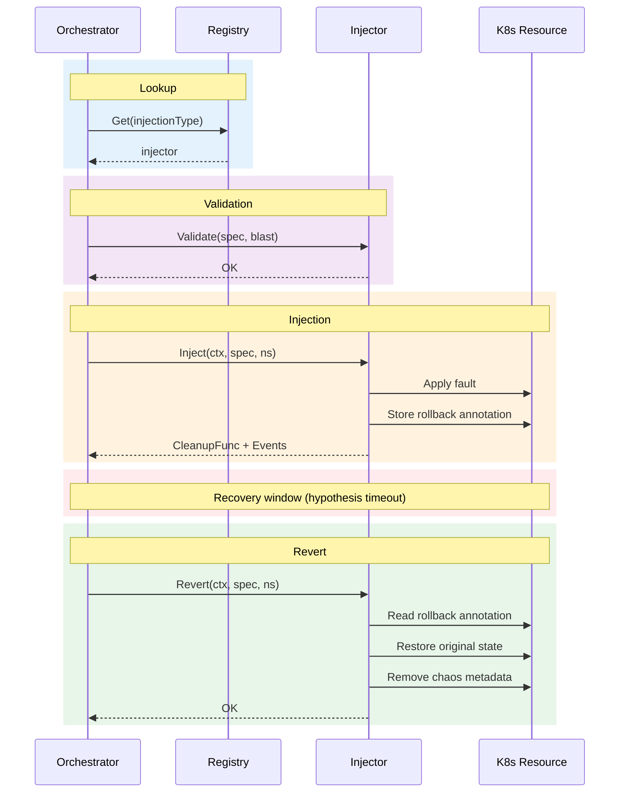

# Injection Engine

The injection engine is a pluggable system for executing fault injections. It provides a registry pattern for managing injection types, a standardized interface for injectors, and crash-safe cleanup mechanisms.

## Core Interface

All injection types implement the `Injector` interface:

```go
type Injector interface {
    Validate(spec v1alpha1.InjectionSpec, blast v1alpha1.BlastRadiusSpec) error
    Inject(ctx context.Context, spec v1alpha1.InjectionSpec, namespace string) (CleanupFunc, []v1alpha1.InjectionEvent, error)
    Revert(ctx context.Context, spec v1alpha1.InjectionSpec, namespace string) error
}
```

### Injection Lifecycle



### Method Contracts

#### `Validate(spec, blast) error`

Pre-flight validation before injection:

- **Required parameters** — Check that all required parameters are present
- **Parameter format** — Validate label selectors, resource names, field paths
- **Blast radius** — Verify injection respects `maxPodsAffected`, `allowedNamespaces`
- **Danger level** — Ensure high-danger injections have `allowDangerous: true`

**Returns:** Error if validation fails, preventing injection execution

**Example (PodKill):**

```go
func (p *PodKillInjector) Validate(spec v1alpha1.InjectionSpec, blast v1alpha1.BlastRadiusSpec) error {
    if spec.Parameters["labelSelector"] == "" {
        return fmt.Errorf("labelSelector parameter is required")
    }

    selector, err := labels.Parse(spec.Parameters["labelSelector"])
    if err != nil {
        return fmt.Errorf("invalid labelSelector: %w", err)
    }

    if spec.Count <= 0 {
        return fmt.Errorf("count must be positive")
    }

    return nil
}
```

#### `Inject(ctx, spec, namespace) (CleanupFunc, []InjectionEvent, error)`

Execute the fault injection:

- **Perform injection** — Apply the fault (create NetworkPolicy, delete Pod, etc.)
- **Record events** — Return structured logs of what was injected
- **Return cleanup** — Function to reverse the injection (or no-op if not reversible)

**Returns:**

- `CleanupFunc` — Function to undo injection (may be no-op)
- `[]InjectionEvent` — List of injection events for audit log
- `error` — If injection failed

**Example (NetworkPartition):**

```go
func (n *NetworkPartitionInjector) Inject(ctx context.Context, spec v1alpha1.InjectionSpec, namespace string) (CleanupFunc, []v1alpha1.InjectionEvent, error) {
    selector, _ := labels.Parse(spec.Parameters["labelSelector"])

    // Create deny-all NetworkPolicy
    policy := &networkingv1.NetworkPolicy{
        ObjectMeta: metav1.ObjectMeta{
            Name:      "odh-chaos-np-" + sanitizeName(spec.Parameters["labelSelector"]),
            Namespace: namespace,
            Labels:    safety.ChaosLabels(string(v1alpha1.NetworkPartition)),
        },
        Spec: networkingv1.NetworkPolicySpec{
            PodSelector: metav1.LabelSelector{MatchLabels: matchLabels(selector)},
            PolicyTypes: []networkingv1.PolicyType{
                networkingv1.PolicyTypeIngress,
                networkingv1.PolicyTypeEgress,
            },
            // Empty ingress/egress = deny all
        },
    }

    if err := n.client.Create(ctx, policy); err != nil {
        return nil, nil, fmt.Errorf("creating NetworkPolicy: %w", err)
    }

    events := []v1alpha1.InjectionEvent{
        injection.NewEvent(v1alpha1.NetworkPartition, policy.Name, "created",
            map[string]string{"namespace": namespace, "selector": spec.Parameters["labelSelector"]}),
    }

    cleanup := func(ctx context.Context) error {
        return n.client.Delete(ctx, policy)
    }

    return cleanup, events, nil
}
```

#### `Revert(ctx, spec, namespace) error`

Stateless cleanup that can run after controller restarts:

- **Read rollback annotation** — Retrieve original state from resource annotations
- **Restore original state** — Apply rollback data
- **Remove chaos metadata** — Clean up labels and annotations
- **Idempotent** — Safe to call multiple times (return nil if already reverted)

**Returns:** Error if revert failed

**Example (ConfigDrift):**

```go
func (d *ConfigDriftInjector) Revert(ctx context.Context, spec v1alpha1.InjectionSpec, namespace string) error {
    key := types.NamespacedName{Name: spec.Parameters["name"], Namespace: namespace}
    cm := &corev1.ConfigMap{}

    if err := d.client.Get(ctx, key, cm); err != nil {
        if apierrors.IsNotFound(err) {
            return nil  // Already gone, nothing to revert
        }
        return err
    }

    // Check for rollback annotation
    rollbackStr, ok := cm.GetAnnotations()[safety.RollbackAnnotationKey]
    if !ok {
        return nil  // No chaos metadata, already reverted
    }

    var rollbackInfo map[string]string
    if err := safety.UnwrapRollbackData(rollbackStr, &rollbackInfo); err != nil {
        return err
    }

    // Restore original value
    dataKey := spec.Parameters["key"]
    if rollbackInfo["keyExists"] == "false" {
        delete(cm.Data, dataKey)
    } else {
        cm.Data[dataKey] = rollbackInfo["originalValue"]
    }

    // Remove chaos metadata
    safety.RemoveChaosMetadata(cm, string(v1alpha1.ConfigDrift))

    return d.client.Update(ctx, cm)
}
```

## Registry Pattern

The `Registry` manages all registered injectors:

```go
type Registry struct {
    injectors map[v1alpha1.InjectionType]Injector
}

func NewRegistry() *Registry {
    return &Registry{injectors: make(map[v1alpha1.InjectionType]Injector)}
}

func (r *Registry) Register(t v1alpha1.InjectionType, i Injector) {
    r.injectors[t] = i
}

func (r *Registry) Get(t v1alpha1.InjectionType) (Injector, error) {
    if inj, ok := r.injectors[t]; ok {
        return inj, nil
    }
    return nil, fmt.Errorf("unknown injection type %q", t)
}
```

### Initializing the Registry

```go
func NewDefaultRegistry(client client.Client) *injection.Registry {
    registry := injection.NewRegistry()

    registry.Register(v1alpha1.PodKill, injection.NewPodKillInjector(client))
    registry.Register(v1alpha1.NetworkPartition, injection.NewNetworkPartitionInjector(client))
    registry.Register(v1alpha1.ConfigDrift, injection.NewConfigDriftInjector(client))
    registry.Register(v1alpha1.CRDMutation, injection.NewCRDMutationInjector(client))
    registry.Register(v1alpha1.WebhookDisrupt, injection.NewWebhookDisruptInjector(client))
    registry.Register(v1alpha1.RBACRevoke, injection.NewRBACRevokeInjector(client))
    registry.Register(v1alpha1.FinalizerBlock, injection.NewFinalizerBlockInjector(client))
    registry.Register(v1alpha1.ClientFault, injection.NewClientFaultInjector(client))

    return registry
}
```

## Crash-Safe Cleanup

All injectors use a standardized rollback annotation pattern to enable cleanup after controller restarts.

### Rollback Annotation Format

```yaml
annotations:
  chaos.opendatahub.io/rollback: |
    {"data":"<base64-json>","checksum":"sha256:abcd1234..."}
```

The `data` field contains base64-encoded JSON with injection-specific rollback information. The `checksum` provides integrity verification.

### Safety Helper Functions

```go
import "github.com/opendatahub-io/odh-platform-chaos/pkg/safety"

// Store rollback data with integrity checksum
rollbackInfo := map[string]string{"originalValue": "foo"}
rollbackStr, _ := safety.WrapRollbackData(rollbackInfo)
safety.ApplyChaosMetadata(resource, rollbackStr, "ConfigDrift")

// Retrieve and verify rollback data
rollbackStr := resource.GetAnnotations()[safety.RollbackAnnotationKey]
var rollbackInfo map[string]string
safety.UnwrapRollbackData(rollbackStr, &rollbackInfo)

// Remove chaos metadata
safety.RemoveChaosMetadata(resource, "ConfigDrift")
```

### Chaos Labels

All chaos-managed resources are labeled for traceability:

```go
labels := safety.ChaosLabels("PodKill")
// Returns:
// {
//   "chaos.opendatahub.io/managed": "true",
//   "chaos.opendatahub.io/type": "PodKill",
// }
```

Query resources managed by chaos:

```bash
kubectl get all -l chaos.opendatahub.io/managed=true
```

## Injection Type Taxonomy

### Reversible vs. Irreversible

| Type | Reversible | Cleanup Strategy |
|------|-----------|------------------|
| PodKill | No | No-op (Kubernetes recreates pods) |
| NetworkPartition | Yes | Delete NetworkPolicy |
| ConfigDrift | Yes | Restore from annotation |
| CRDMutation | Yes | Restore via merge patch |
| WebhookDisrupt | Yes | Restore original policies |
| RBACRevoke | Yes | Restore subjects |
| FinalizerBlock | Yes | Remove finalizer |
| ClientFault | Yes | Delete/restore ConfigMap |

### Stateful vs. Stateless Cleanup

**Stateful (CleanupFunc):**

- Uses closure variables from `Inject()`
- Valid only for immediate cleanup in standalone mode
- Example: Deleting a NetworkPolicy by reference

```go
cleanup := func(ctx context.Context) error {
    return client.Delete(ctx, policy)  // 'policy' captured from Inject scope
}
```

**Stateless (Revert):**

- Reads rollback data from annotations
- Works after controller restarts
- Example: Restoring ConfigMap data

```go
func Revert(ctx, spec, namespace) error {
    // Re-fetch resource, read annotation, restore state
}
```

!!! warning "Controller Mode Requirement"
    Controllers MUST use `Revert()` for cleanup, not `CleanupFunc`, since they can restart between injection and cleanup.

## TTL-Based Auto-Cleanup

Injections can specify a TTL for automatic cleanup:

```yaml
injection:
  type: NetworkPartition
  ttl: 5m
```

### TTL Annotation

```yaml
annotations:
  chaos.opendatahub.io/ttl-expiry: "2024-03-30T10:05:00Z"
```

### Cleanup Controller

A background controller scans for expired resources:

```go
func (c *CleanupController) Reconcile(ctx context.Context, req reconcile.Request) (reconcile.Result, error) {
    // List all resources with TTL annotation
    list := &unstructured.UnstructuredList{}
    c.client.List(ctx, list, client.MatchingLabels{
        "chaos.opendatahub.io/managed": "true",
    })

    now := time.Now()
    for _, item := range list.Items {
        expiryStr := item.GetAnnotations()["chaos.opendatahub.io/ttl-expiry"]
        if expiryStr == "" {
            continue
        }

        expiry, _ := time.Parse(time.RFC3339, expiryStr)
        if now.After(expiry) {
            // TTL expired, delete resource
            c.client.Delete(ctx, &item)
        }
    }

    return reconcile.Result{RequeueAfter: 30 * time.Second}, nil
}
```

## Safety Mechanisms

### 1. Parameter Validation

All injectors validate parameters before execution:

```go
func validatePodKillParams(spec v1alpha1.InjectionSpec, blast v1alpha1.BlastRadiusSpec) error {
    if spec.Parameters["labelSelector"] == "" {
        return errors.New("labelSelector is required")
    }

    selector, err := labels.Parse(spec.Parameters["labelSelector"])
    if err != nil {
        return fmt.Errorf("invalid labelSelector: %w", err)
    }

    if spec.Count > blast.MaxPodsAffected {
        return fmt.Errorf("count %d exceeds maxPodsAffected %d", spec.Count, blast.MaxPodsAffected)
    }

    return nil
}
```

### 2. Danger Level Enforcement

High-danger injections require explicit acknowledgment:

```go
if spec.Injection.DangerLevel == v1alpha1.DangerLevelHigh {
    if !blast.AllowDangerous {
        return fmt.Errorf("dangerLevel 'high' requires allowDangerous: true")
    }
}
```

### 3. Namespace Restrictions

```go
forbiddenNamespaces := []string{"kube-system", "kube-public", "default"}
for _, ns := range forbiddenNamespaces {
    if namespace == ns {
        return fmt.Errorf("namespace %q is forbidden", ns)
    }
}
```

### 4. Dry Run Support

All injectors skip execution in dry-run mode:

```go
if blast.DryRun {
    return nil, []v1alpha1.InjectionEvent{}, nil  // No-op
}
```

## Event Logging

Injectors return structured events for audit trails:

```go
event := injection.NewEvent(
    v1alpha1.PodKill,
    "pod-abc123",
    "deleted",
    map[string]string{
        "namespace": "opendatahub",
        "node":      "worker-1",
    },
)
```

Events are stored in the CRD status:

```yaml
status:
  injectionLog:
    - timestamp: "2024-03-30T10:00:00Z"
      type: PodKill
      target: pod-abc123
      action: deleted
      details:
        namespace: opendatahub
        node: worker-1
```

## Best Practices

### 1. Idempotent Cleanup

Always make `Revert()` idempotent:

```go
func (i *MyInjector) Revert(ctx, spec, namespace) error {
    // Check if rollback annotation exists
    rollbackStr, ok := resource.GetAnnotations()[safety.RollbackAnnotationKey]
    if !ok {
        return nil  // Already reverted, nothing to do
    }

    // Perform cleanup...
}
```

### 2. Descriptive Error Messages

```go
if err != nil {
    return fmt.Errorf("creating NetworkPolicy %q in namespace %q: %w", policyName, namespace, err)
}
```

### 3. Resource Naming

Use deterministic naming for created resources:

```go
policyName := "odh-chaos-np-" + sanitizeName(spec.Parameters["labelSelector"])
```

This allows `Revert()` to reconstruct resource names without stored state.

### 4. Label Selectors

Parse and validate label selectors early:

```go
selector, err := labels.Parse(spec.Parameters["labelSelector"])
if err != nil {
    return fmt.Errorf("parsing labelSelector: %w", err)
}
```

## Next Steps

- [Observer Blackboard Pattern](observer-blackboard.md) — How observations are collected
- [Contributing: Adding Injection Types](../contributing/adding-injection-types.md) — Implement a new injector
- [Failure Modes Reference](../failure-modes/index.md) — See all 8 injection types in action
