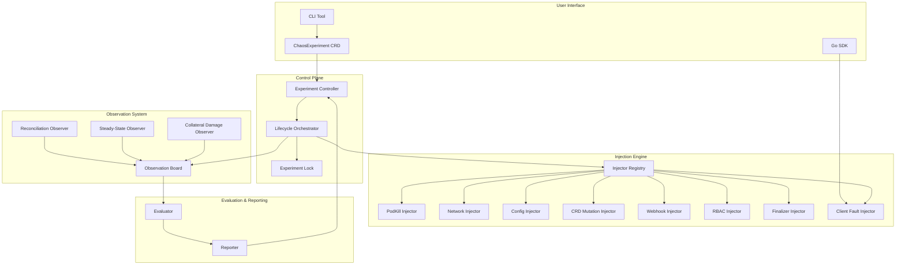

# Architecture Overview

ODH Platform Chaos is a chaos engineering framework designed specifically for testing Kubernetes operator resilience. It combines declarative experiment definitions (CRDs) with a pluggable injection engine and observation-based evaluation.

## Design Principles

1. **Declarative Experiments** — Experiments are Kubernetes resources, versioned in Git and applied with `kubectl`
2. **Safety First** — Multi-layer blast radius controls, danger level gating, and automatic rollback
3. **Crash-Safe Cleanup** — All injections store rollback data in annotations, enabling recovery after controller restarts
4. **Blackboard Pattern** — Multiple observers contribute evidence to a shared board for holistic evaluation
5. **Operator-Aware** — Built-in knowledge of ODH operators (resource ownership, dependencies)

## System Architecture



## Component Breakdown

### 1. Control Plane

#### Experiment Controller

Kubernetes controller that watches `ChaosExperiment` CRDs and manages their lifecycle.

**Responsibilities:**

- Watch CRD creation/updates
- Validate experiments before execution
- Update CRD status with phase, verdict, and findings
- Coordinate with orchestrator for execution
- Handle cleanup on experiment deletion

**Key Phases:**

```
Pending → SteadyStatePre → Injecting → Observing →
SteadyStatePost → Evaluating → Complete
```

Errors transition to `Aborted`.

#### Lifecycle Orchestrator

Coordinates the experiment state machine and delegates work to specialized engines.

**Key Methods:**

- `ValidateExperiment()` — Pre-flight checks (blast radius, danger level, namespace restrictions)
- `RunPreCheck()` — Verify baseline steady state
- `InjectFault()` — Lookup injector and execute injection
- `RunPostCheck()` — Run observation board with multiple contributors
- `EvaluateExperiment()` — Compute verdict from findings
- `RevertFault()` — Stateless cleanup via injector

#### Experiment Lock

Prevents concurrent experiments targeting the same operator. Implemented as Kubernetes Lease resources.

**Features:**

- Operator-scoped locking (not namespace-scoped)
- Configurable lease duration (default: 2x recovery timeout)
- Automatic renewal during experiment execution
- Force-override with `--force` flag

### 2. Injection Engine

Pluggable architecture for fault injection. Each injection type implements the `Injector` interface:

```go
type Injector interface {
    Validate(spec InjectionSpec, blast BlastRadiusSpec) error
    Inject(ctx context.Context, spec InjectionSpec, namespace string) (CleanupFunc, []InjectionEvent, error)
    Revert(ctx context.Context, spec InjectionSpec, namespace string) error
}
```

**Registry Pattern:**

```go
registry := injection.NewRegistry()
registry.Register(v1alpha1.PodKill, injection.NewPodKillInjector(client))
registry.Register(v1alpha1.NetworkPartition, injection.NewNetworkPartitionInjector(client))
// ... register all 8 injection types
```

**Crash-Safe Cleanup:**

All injectors store rollback data in resource annotations with integrity checksums:

```yaml
annotations:
  chaos.opendatahub.io/rollback: |
    {"data":"<base64-encoded-rollback-info>","checksum":"sha256:..."}
```

This enables `Revert()` to be called after controller restarts without relying on in-memory state.

### 3. Observation System (Blackboard Pattern)

The observation system uses the **Blackboard architectural pattern** to collect evidence from multiple independent observers.

**Core Components:**

- **ObservationBoard** — Thread-safe shared data structure where observers write findings
- **ObservationContributor** — Interface for observers (`Observe(ctx, board) error`)
- **Finding** — Structured evidence (source, passed/failed, details)

**Contributors:**

1. **ReconciliationContributor** (Phase 1, blocking)
    - Monitors target operator's reconciliation behavior
    - Counts reconcile cycles during recovery window
    - Detects stuck or thrashing reconcilers

2. **SteadyStateContributor** (Phase 2, concurrent)
    - Runs user-defined steady-state checks (conditions, resource existence)
    - Verifies system returned to baseline

3. **CollateralContributor** (Phase 2, concurrent)
    - Checks dependent operators/components
    - Detects cascading failures

**Execution Flow:**

```go
board := observer.NewObservationBoard()

// Phase 1: Reconciliation (blocking)
reconContributor.Observe(ctx, board)

// Phase 2: Steady-state + collateral (concurrent)
observer.RunContributors(ctx, board, []ObservationContributor{
    steadyStateContributor,
    collateralContributor,
})

findings := board.Findings()  // All evidence collected
```

### 4. Evaluation & Reporting

#### Evaluator

Computes experiment verdict from collected findings using a decision tree:

```
Pre-check failed? → INCONCLUSIVE (system not ready)
Post-check failed? → FAILED (did not recover)
Reconciliation < 3 cycles? → DEGRADED (slow recovery)
Collateral damage? → DEGRADED (cascade)
All checks passed? → RESILIENT
```

**Confidence Levels:** `high`, `medium`, `low` based on observation quality.

#### Reporter

Generates structured reports in JSON format:

```json
{
  "experiment": "kill-operator-pod",
  "timestamp": "2024-03-30T10:00:00Z",
  "target": {"operator": "opendatahub-operator", "component": "controller"},
  "injection": {"type": "PodKill", "targets": ["pod-abc123"]},
  "steadyState": {"pre": {...}, "post": {...}},
  "evaluation": {"verdict": "Resilient", "confidence": "high"},
  "reconciliation": {"cycles": 5, "duration": "12.3s"},
  "collateral": []
}
```

Reports are stored:

- As ConfigMaps in the cluster (`chaos-result-<experiment-name>`)
- As JSON files (if `--report-dir` specified in CLI mode)

## Execution Modes

### 1. Controller Mode (CRD-Driven)

```bash
# Deploy controller
kubectl apply -f deploy/controller.yaml

# Submit experiment
kubectl apply -f experiments/my-test.yaml

# Watch progress
kubectl get chaosexperiment my-test -w
```

**Use Case:** GitOps workflows, CI/CD integration, scheduled experiments

### 2. CLI Mode (Standalone)

```bash
chaos-cli run experiments/my-test.yaml --report-dir=./reports
```

**Use Case:** Local development, one-off tests, debugging

### 3. SDK Mode (Programmatic)

```go
orchestrator := orchestrator.New(orchestrator.OrchestratorConfig{...})
result, err := orchestrator.Run(ctx, experiment)
```

**Use Case:** Custom test harnesses, fuzzing frameworks

## Safety Mechanisms

### Multi-Layer Blast Radius Control

1. **Namespace Restrictions**
    - Forbidden namespaces: `kube-system`, `kube-public`, `default`, `openshift-*`
    - Experiments must explicitly list `allowedNamespaces`

2. **Resource Limits**
    - `maxPodsAffected` enforced per experiment
    - Forbidden resources (e.g., etcd, API server) blocked by default

3. **Danger Level Gating**
    - `low`, `medium`, `high` levels
    - High-danger injections require `allowDangerous: true`

4. **Dry Run Mode**
    - Validates experiment without executing injection
    - Useful for CI pre-flight checks

### TTL-Based Auto-Cleanup

Injections can specify a TTL for automatic cleanup:

```yaml
injection:
  type: NetworkPartition
  ttl: 5m  # Auto-cleanup after 5 minutes
```

A background cleanup controller scans for expired resources marked with TTL annotations.

### Experiment Locking

Only one experiment per operator can run at a time, preventing:

- Conflicting injections
- Observer confusion (which fault caused which behavior?)
- Cascading failures

## Dependency Graph

The framework maintains a dependency graph of ODH components:

```yaml
components:
  - name: dashboard
    operator: opendatahub-operator
    dependsOn:
      - {operator: opendatahub-operator, component: model-controller}
      - {operator: opendatahub-operator, component: notebook-controller}
```

This enables:

- **Collateral damage detection** — Did a fault on component A break dependent component B?
- **Targeted testing** — Focus on high-impact components with many dependents
- **Root cause analysis** — Trace failures back to dependencies

## Operator Knowledge Base

Built-in knowledge of ODH operators:

```yaml
operators:
  - name: opendatahub-operator
    components:
      - name: controller-manager
        labelSelector: control-plane=controller-manager
        reconcilationResource:
          apiVersion: opendatahub.io/v1
          kind: DataScienceCluster
```

Used for:

- Auto-detecting reconciliation targets
- Validating experiment targets
- Suggesting experiments based on operator structure

## Next Steps

- [Injection Engine Deep Dive](injection-engine.md) — How injectors work
- [Observer Blackboard Pattern](observer-blackboard.md) — Observation architecture
- [Development Setup](../contributing/development-setup.md) — Build from source
