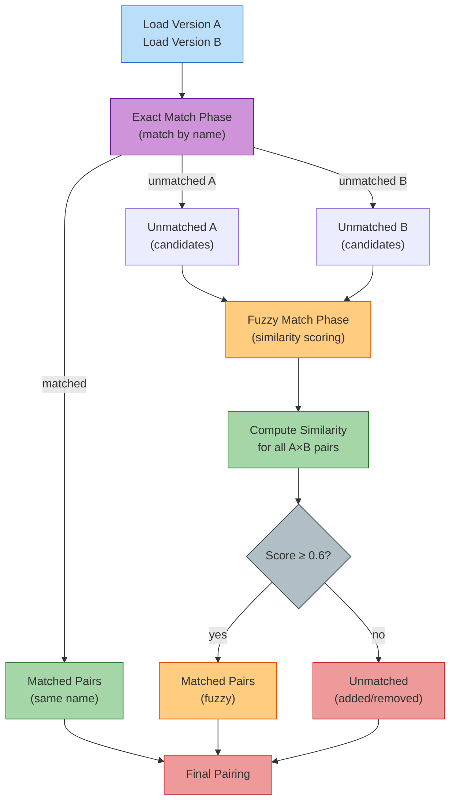

# Upgrade Diff Engine

The upgrade diff engine analyzes structural changes between operator releases by comparing versioned knowledge models. It detects breaking CRD schema changes, resource ownership shifts, and dependency graph mutations, then auto-generates targeted chaos experiments to test upgrade resilience.

## Overview

The diff engine operates in three stages:

1. **Matching**: Pair components across versions using exact match by name, then fuzzy match via weighted similarity scoring
2. **Diffing**: Compare CRD schemas, managed resources, webhooks, finalizers, and dependencies to identify structural changes
3. **Experiment Generation**: Map detected changes to targeted injection types that test the specific failure modes introduced by the upgrade

The engine produces a structured diff report with severity classifications (breaking, warning, info) and a suite of auto-generated experiments ready to run against a cluster.

## Matching Algorithm

Before diffing can occur, the engine must pair components from the old version with components from the new version. This is non-trivial because components may be renamed, split, merged, or have their resource footprints changed.



### Exact Match (Pass 1)

All components with identical names across versions are paired immediately. This handles the common case where component names remain stable.

**Example:**

```yaml
# v2.20/kserve.yaml
components:
  - name: kserve-controller-manager

# v2.21/kserve.yaml
components:
  - name: kserve-controller-manager
```

Result: exact match, paired for diffing.

### Fuzzy Match (Pass 2)

For unmatched components, compute a similarity score for all candidate pairs using weighted signals:

| Signal | Weight | Description |
|--------|--------|-------------|
| Resource Kind overlap | 0.4 | Jaccard similarity of resource Kinds (e.g., Deployment, Service, ConfigMap) |
| Label key overlap | 0.3 | Jaccard similarity of label keys across all managed resources |
| Controller match | 0.2 | 1.0 if both components use the same controller type, 0.0 otherwise |
| Resource count | 0.1 | 1 - \|countA - countB\| / max(countA, countB) |

**Threshold:** 0.6 (pairs below this are considered unmatched).

**Jaccard Similarity Formula:**

```
J(A, B) = |A ∩ B| / |A ∪ B|
```

Applied to sets of resource Kinds and label keys.

**Example Scenario:**

```yaml
# v2.20/kserve.yaml
components:
  - name: llm-controller
    controller: KServe
    managedResources:
      - kind: Deployment
        labels: {app: llm-controller, tier: control-plane}
      - kind: Service
        labels: {app: llm-controller}

# v2.21/kserve.yaml (renamed)
components:
  - name: llmisvc-controller-manager
    controller: KServe
    managedResources:
      - kind: Deployment
        labels: {app: llmisvc, tier: control-plane, version: v2}
      - kind: Service
        labels: {app: llmisvc}
      - kind: ConfigMap
        labels: {app: llmisvc}
```

**Similarity Calculation:**

- **Resource Kind overlap**: {Deployment, Service} vs {Deployment, Service, ConfigMap}
  - Jaccard = 2 / 3 = 0.667
- **Label key overlap**: {app, tier} vs {app, tier, version}
  - Jaccard = 2 / 3 = 0.667
- **Controller match**: "KServe" == "KServe" → 1.0
- **Resource count**: |2 - 3| / max(2, 3) = 1/3 = 0.333
  - Normalized: 1 - 0.333 = 0.667

**Final Score:**

```
0.4 × 0.667 + 0.3 × 0.667 + 0.2 × 1.0 + 0.1 × 0.667 = 0.734
```

Score > 0.6, so these components are fuzzy matched.

## CRD Schema Walker

The diff engine performs deep schema analysis on CRD OpenAPI v3 schemas to detect breaking changes, warnings, and safe migrations.

### Schema Traversal

The walker recursively descends the schema tree, comparing corresponding nodes:

```go
func walkSchema(pathPrefix string, oldSchema, newSchema *apiextv1.JSONSchemaProps) []SchemaDiff {
    var diffs []SchemaDiff
    
    // Compare properties
    for key := range oldSchema.Properties {
        path := pathPrefix + "." + key
        newProp := newSchema.Properties[key]
        
        if newProp == nil {
            diffs = append(diffs, SchemaDiff{
                Path: path,
                Type: FieldRemoved,
                Severity: Breaking,
            })
        } else {
            // Recurse into nested objects
            diffs = append(diffs, walkSchema(path, &oldSchema.Properties[key], &newProp)...)
            
            // Check type changes
            if oldSchema.Properties[key].Type != newProp.Type {
                diffs = append(diffs, SchemaDiff{
                    Path: path,
                    Type: TypeChanged,
                    Severity: Breaking,
                })
            }
        }
    }
    
    // Check for new required fields
    for _, req := range newSchema.Required {
        if !contains(oldSchema.Required, req) {
            diffs = append(diffs, SchemaDiff{
                Path: pathPrefix + "." + req,
                Type: RequiredAdded,
                Severity: Breaking,
            })
        }
    }
    
    return diffs
}
```

### Severity Rules

Each detected change is classified by severity:

#### Breaking Changes

Changes that can cause immediate upgrade failures or data loss:

- **Field Removal**: A previously present field is gone (path exists in old, not in new)
- **Type Change**: Field type changes (string → int, object → array)
- **Required Added**: A field becomes required that was previously optional
- **Enum Value Removed**: An enum constraint removes a previously valid value
- **API Version Removed**: An API version is no longer served (from CRD `spec.versions`)

**Example:**

```yaml
# v2.20 CRD schema
spec:
  properties:
    replicas:
      type: integer
    storage:
      type: object

# v2.21 CRD schema
spec:
  properties:
    replicas:
      type: string  # BREAKING: type changed
  required:
    - replicas      # BREAKING: new required field
# storage field removed  # BREAKING: field removed
```

#### Warnings

Changes that may cause issues but won't immediately break:

- **Default Value Changed**: A field's default changes (may alter behavior for resources that don't explicitly set the field)

**Example:**

```yaml
# v2.20
replicas:
  type: integer
  default: 1

# v2.21
replicas:
  type: integer
  default: 3  # WARNING: default changed
```

#### Info

Safe changes that expand compatibility:

- **Field Added**: New optional field
- **Enum Value Added**: Enum constraint allows a new value
- **Required Removed**: A previously required field is now optional

**Example:**

```yaml
# v2.20
spec:
  properties:
    region:
      type: string
      enum: [us-east, us-west]

# v2.21
spec:
  properties:
    region:
      type: string
      enum: [us-east, us-west, eu-central]  # INFO: enum value added
    timeout:
      type: integer  # INFO: field added
```

## Experiment Generation

The diff engine maps detected changes to targeted chaos injections that test the specific failure modes introduced by the upgrade.

### Diff-to-Injection Mapping

| Detected Change | Generated Injection | Why This Tests the Right Thing |
|-----------------|---------------------|--------------------------------|
| **Component Added** | `PodKill` on new component | Verify new component recovers from crashes |
| **Component Removed** | (Manual review warning) | Operator must handle cleanup; no auto-experiment |
| **Managed Resource Added** | `ConfigDrift` or `CRDMutation` on new resource | Test reconciliation for new resource types |
| **Managed Resource Removed** | (Manual review warning) | Operator should stop managing; verify no orphaned resources |
| **CRD Breaking Change** | `CRDMutation` targeting affected field | Simulate upgrade-time schema violations |
| **Webhook Added** | `WebhookDisrupt` on new webhook | Test failure policy and timeout handling |
| **Finalizer Added** | `FinalizerBlock` using new finalizer | Verify cleanup logic handles stuck resources |
| **Dependency Added** | `PodKill` on dependency + collateral check | Test cascading failure detection |
| **Recovery Timeout Changed** | Adjust experiment `recoveryTimeout` | Match new SLO expectations |

### Example: CRD Breaking Change

**Detected Diff:**

```json
{
  "path": "spec.storage",
  "type": "FieldRemoved",
  "severity": "Breaking",
  "oldSchema": {"type": "object"},
  "newSchema": null
}
```

**Generated Experiment:**

```yaml
apiVersion: chaos.opendatahub.io/v1alpha1
kind: ChaosExperiment
metadata:
  name: upgrade-test-storage-field-removed
  annotations:
    chaos.opendatahub.io/generated-by: diff-engine
    chaos.opendatahub.io/upgrade-version: v2.20-to-v2.21
spec:
  target:
    operator: kserve-operator
    component: kserve-controller-manager
  injection:
    type: CRDMutation
    parameters:
      apiVersion: serving.kserve.io/v1beta1
      kind: InferenceService
      name: test-isvc
      field: storage  # Field that will be removed in v2.21
      value: '{"type": "s3", "bucket": "models"}'
  hypothesis:
    description: "Operator should handle removal of spec.storage field during upgrade without data loss"
    recoveryTimeout: 300s
  blastRadius:
    maxPodsAffected: 1
    allowedNamespaces: [kserve]
```

**Why This Works:**

1. The experiment mutates the `storage` field on an existing CR instance
2. During upgrade, the new CRD version no longer recognizes this field
3. Tests whether the operator:
   - Migrates data to new field structure
   - Preserves configuration across the upgrade
   - Handles schema validation errors gracefully
   - Does not enter crash-loop due to unrecognized fields

### Example: Webhook Added

**Detected Diff:**

```json
{
  "componentName": "llmisvc-controller-manager",
  "changeType": "WebhookAdded",
  "webhook": {
    "name": "validating.llmisvc.kserve.io",
    "type": "validating",
    "path": "/validate-llmisvc-v1alpha1"
  }
}
```

**Generated Experiment:**

```yaml
apiVersion: chaos.opendatahub.io/v1alpha1
kind: ChaosExperiment
metadata:
  name: upgrade-test-llmisvc-webhook-added
  annotations:
    chaos.opendatahub.io/generated-by: diff-engine
    chaos.opendatahub.io/upgrade-version: v2.20-to-v2.21
spec:
  target:
    operator: kserve-operator
    component: llmisvc-controller-manager
  injection:
    type: WebhookDisrupt
    parameters:
      webhookName: validating.llmisvc.kserve.io
      value: Fail  # Force webhook failures to block requests
    dangerLevel: high
  hypothesis:
    description: "New webhook should fail fast when unavailable, not timeout"
    recoveryTimeout: 60s
  blastRadius:
    maxPodsAffected: 0
    allowDangerous: true
```

**Why This Works:**

1. New webhooks often have misconfigured failure policies or timeouts
2. The experiment forces the webhook to fail (simulating unavailability)
3. Tests whether:
   - API server times are reasonable (not default 30s)
   - Failure policy is set correctly (Ignore vs Fail)
   - Operator retries admission requests appropriately
   - No cluster-wide denial-of-service from webhook timeout

## CLI Integration

The diff engine is exposed via four CLI commands:

### `odh-chaos diff`

Compares two versioned knowledge model directories and produces a structured diff report.

```bash
odh-chaos diff \
  --old knowledge/v2.20/ \
  --new knowledge/v2.21/ \
  --output diff-report.json
```

**Output:**

```json
{
  "summary": {
    "componentsAdded": 1,
    "componentsRemoved": 0,
    "componentsModified": 3,
    "breakingChanges": 2,
    "warnings": 1,
    "infoChanges": 5
  },
  "componentChanges": [
    {
      "componentName": "kserve-controller-manager",
      "matchType": "exact",
      "changes": [
        {
          "type": "CRDSchemaChange",
          "severity": "breaking",
          "path": "spec.storage",
          "message": "Field removed"
        }
      ]
    }
  ]
}
```

### `odh-chaos diff-crds`

CRD-only diff for deep schema analysis without knowledge models.

```bash
odh-chaos diff-crds \
  --old crds/v2.20/inferenceservice.yaml \
  --new crds/v2.21/inferenceservice.yaml \
  --output schema-diff.json
```

### `odh-chaos validate-version`

Validates versioned knowledge model directory structure and metadata.

```bash
odh-chaos validate-version knowledge/v2.21/
```

Checks:

- All knowledge models have `version`, `platform`, `olmChannel` fields
- CRD files exist in `crds/` subdirectory
- Directory name matches knowledge model versions
- No conflicting operator names

### `odh-chaos simulate-upgrade`

Generates and optionally runs a full upgrade test suite.

```bash
# Generate only
odh-chaos simulate-upgrade \
  --from knowledge/v2.20/ \
  --to knowledge/v2.21/ \
  --output experiments/upgrade-suite/

# Generate and run
odh-chaos simulate-upgrade \
  --from knowledge/v2.20/ \
  --to knowledge/v2.21/ \
  --execute \
  --report-dir reports/upgrade-v2.20-to-v2.21/
```

**Generated Suite Structure:**

```
experiments/upgrade-suite/
├── component-added-llmisvc.yaml
├── crd-breaking-storage-removed.yaml
├── webhook-added-llmisvc-validator.yaml
├── dependency-added-modelregistry.yaml
└── suite-manifest.yaml
```

## Next Steps

- [Upgrade Testing Guide](../guides/upgrade-testing.md) — Step-by-step workflow for testing operator upgrades
- [Knowledge Models Guide](../guides/knowledge-models.md) — How to write versioned knowledge models
- [CLI Commands Reference](../reference/cli-commands.md) — Full command syntax for diff engine tools
