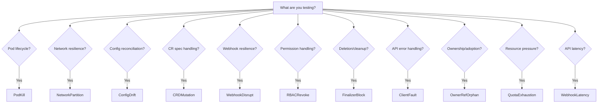

# Failure Modes Overview

Overview of all failure injection types available in Operator Chaos.

## Quick Reference

| Type | Danger | Description |
|------|--------|-------------|
| [CRDMutation](crd-mutation.md) | :material-shield-alert: Medium | Mutates a spec field on a custom resource instance to test reconciliation of CR state. |
| [ClientFault](client-fault.md) | :material-shield-check: Low | Injects errors, latency, or throttling into operator API calls via SDK integration. |
| [ConfigDrift](config-drift.md) | :material-shield-check: Low | Modifies a key in a ConfigMap or Secret to test configuration reconciliation. |
| [FinalizerBlock](finalizer-block.md) | :material-shield-alert: Medium | Adds a stuck finalizer to a resource to test deletion handling and cleanup logic. |
| [LabelStomping](label-stomping.md) | :material-shield-alert: Medium | Modifies or removes labels on operator-managed resources to test label-based reconciliation. |
| [NamespaceDeletion](namespace-deletion.md) | :material-shield-remove: High | Deletes an entire namespace to test whether the operator recreates it and its managed resources. |
| [NetworkPartition](network-partition.md) | :material-shield-alert: Medium | Creates a deny-all NetworkPolicy isolating pods matching a label selector from all ingress and egress traffic. |
| [OwnerRefOrphan](ownerref-orphan.md) | :material-shield-alert: Medium | Removes ownerReferences from operator-managed resources to test re-adoption logic. |
| [PodKill](podkill.md) | :material-shield-check: Low | Force-deletes pods matching a label selector with zero grace period. |
| [QuotaExhaustion](quota-exhaustion.md) | :material-shield-alert: Medium | Creates a restrictive ResourceQuota to test operator behavior under resource pressure. |
| [RBACRevoke](rbac-revoke.md) | :material-shield-remove: High | Clears all subjects from a ClusterRoleBinding or RoleBinding to test RBAC resilience. |
| [WebhookDisrupt](webhook-disrupt.md) | :material-shield-remove: High | Modifies failure policies on a ValidatingWebhookConfiguration to test webhook resilience. |
| [WebhookLatency](webhook-latency.md) | :material-shield-remove: High | Deploys a slow admission webhook to add latency to API server requests for specific resources. |

## Decision Tree

Which failure mode should I use?

## Coverage by Component

| Component | CRDMutation | ClientFault | ConfigDrift | FinalizerBlock | LabelStomping | NamespaceDeletion | NetworkPartition | OwnerRefOrphan | PodKill | QuotaExhaustion | RBACRevoke | WebhookDisrupt | WebhookLatency | Total |
|-----------|--------|--------|--------|--------|--------|--------|--------|--------|--------|--------|--------|--------|--------|-------|
| codeflare | - | - | :material-check: | - | - | - | :material-check: | - | :material-check: | - | :material-check: | - | - | 4 |
| dashboard | :material-check: | - | :material-check: | - | - | - | :material-check: | - | :material-check: | :material-check: | :material-check: | - | - | 6 |
| data-science-pipelines | - | - | - | :material-check: | - | - | :material-check: | - | :material-check: | - | :material-check: | :material-check: | - | 5 |
| feast | - | - | - | - | - | - | :material-check: | - | :material-check: | - | :material-check: | - | - | 3 |
| kserve | :material-check: | - | :material-check: | - | - | - | :material-check: | :material-check: | :material-check: | - | - | :material-check: | - | 6 |
| kueue | - | - | - | :material-check: | - | - | :material-check: | - | :material-check: | - | :material-check: | :material-check: | - | 5 |
| llamastack | - | - | :material-check: | - | - | - | :material-check: | - | :material-check: | - | :material-check: | - | - | 4 |
| model-registry | :material-check: | - | - | :material-check: | - | - | :material-check: | - | :material-check: | - | :material-check: | :material-check: | - | 6 |
| modelmesh | - | - | :material-check: | - | - | - | :material-check: | - | :material-check: | - | :material-check: | :material-check: | - | 5 |
| odh-model-controller | :material-check: | :material-check: | :material-check: | :material-check: | :material-check: | :material-check: | :material-check: | :material-check: | :material-check: | :material-check: | :material-check: | :material-check: | :material-check: | 13 |
| opendatahub-operator | - | - | - | :material-check: | - | - | :material-check: | - | :material-check: | - | :material-check: | :material-check: | - | 5 |
| ray | - | - | - | :material-check: | - | - | :material-check: | - | :material-check: | - | :material-check: | - | - | 4 |
| training-operator | - | - | - | :material-check: | - | - | :material-check: | - | :material-check: | - | :material-check: | - | - | 4 |
| trustyai | - | - | - | - | - | - | :material-check: | - | :material-check: | - | :material-check: | - | - | 3 |
| workbenches | - | - | - | - | - | - | :material-check: | - | :material-check: | - | :material-check: | :material-check: | - | 4 |

<!-- custom-start: notes -->
<!-- custom-end: notes -->
