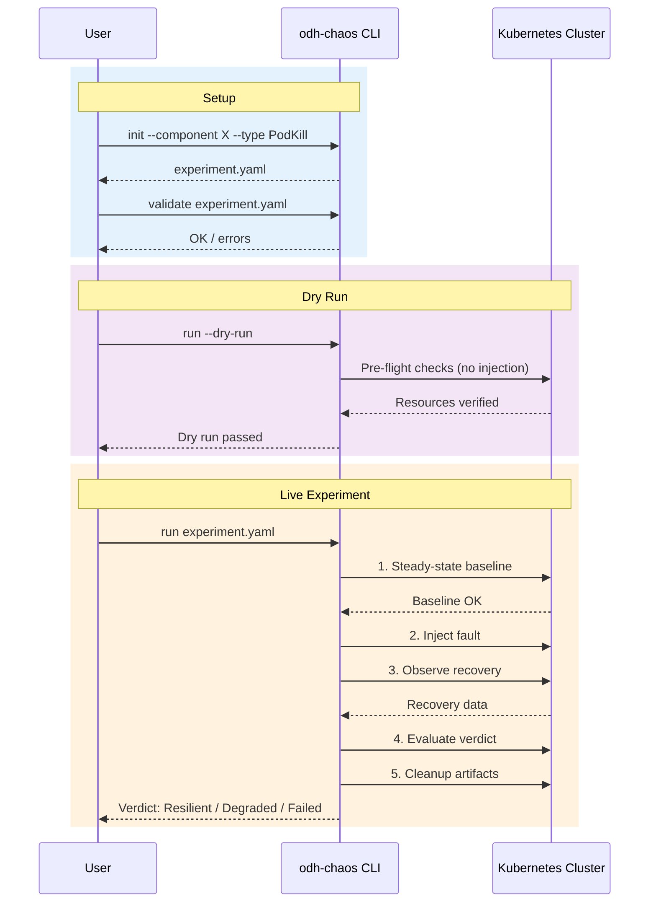

# CLI Quickstart

Run structured chaos experiments against a live cluster. The CLI orchestrates the full experiment lifecycle: establish steady state, inject fault, observe recovery, evaluate verdict.

!!! tip "When to Use CLI Experiments"
    Use this when you need to verify that a real operator recovers correctly on a real cluster — the definitive resilience test before shipping.

## Prerequisites

- Kubernetes/OpenShift cluster access
- cluster-admin RBAC permissions
- Knowledge model for your operator (see below)

## Workflow



### 1. Generate an Experiment Skeleton

Create a basic experiment configuration:

```bash
odh-chaos init --component odh-model-controller --type PodKill > experiment.yaml
```

This generates a skeleton experiment YAML that you can customize.

### 2. Validate the Experiment

Validate your experiment configuration:

```bash
odh-chaos validate experiment.yaml
```

### 3. Dry Run

Test the experiment without injecting faults:

```bash
odh-chaos run experiment.yaml --dry-run --knowledge knowledge.yaml
```

The dry run validates the full experiment lifecycle without performing destructive operations.

### 4. Execute

Run the experiment against your live cluster:

```bash
odh-chaos run experiment.yaml --knowledge knowledge.yaml
```

The framework will:

1. Establish steady state baseline
2. Inject the configured fault
3. Observe operator recovery
4. Evaluate verdict (Resilient, Degraded, Failed, or Inconclusive)
5. Clean up chaos artifacts

#### Running on RHOAI Clusters

Experiment YAML files default to the `opendatahub` namespace. When running on RHOAI clusters (which use `redhat-ods-applications`), use the `--namespace` flag to override all namespace references in the experiment:

```bash
odh-chaos run experiment.yaml \
  --knowledge knowledge.yaml \
  --namespace redhat-ods-applications
```

The `--namespace` flag overrides the experiment's metadata namespace, steady-state check namespaces, blast radius `allowedNamespaces`, and reconciliation checker namespace. This means you can use the same experiment YAML files for both ODH and RHOAI clusters without modification.

## Example: Experiment YAML

Here's a complete example of a PodKill experiment:

```yaml
apiVersion: chaos.opendatahub.io/v1alpha1
kind: ChaosExperiment
metadata:
  name: podkill-odh-model-controller
  namespace: opendatahub
spec:
  target:
    operator: opendatahub-operator
    component: odh-model-controller
    resource: "Deployment/odh-model-controller"
  injection:
    type: PodKill
    parameters:
      labelSelector: "control-plane=odh-model-controller"
    count: 1
    ttl: "300s"
    dangerLevel: low
  hypothesis:
    description: "odh-model-controller should recover within 60s after pod deletion"
    recoveryTimeout: "60s"
  steadyState:
    checks:
      - type: conditionTrue
        apiVersion: apps/v1
        kind: Deployment
        name: odh-model-controller
        namespace: opendatahub
        conditionType: Available
    timeout: "60s"
  blastRadius:
    maxPodsAffected: 1
    allowedNamespaces:
      - opendatahub
```

## Example: Knowledge YAML

A knowledge model describes what your operator manages:

```yaml
operator:
  name: opendatahub-operator
  namespace: opendatahub

components:
  - name: odh-model-controller
    controller: DataScienceCluster
    managedResources:
      - apiVersion: apps/v1
        kind: Deployment
        name: odh-model-controller
        namespace: opendatahub
        labels:
          control-plane: odh-model-controller
        expectedSpec:
          replicas: 1
      - apiVersion: v1
        kind: ServiceAccount
        name: odh-model-controller
        namespace: opendatahub
    webhooks:
      - name: validating.odh-model-controller.opendatahub.io
        type: validating
        path: /validate
    steadyState:
      checks:
        - type: conditionTrue
          apiVersion: apps/v1
          kind: Deployment
          name: odh-model-controller
          namespace: opendatahub
          conditionType: Available
      timeout: "60s"

recovery:
  reconcileTimeout: "300s"
  maxReconcileCycles: 10
```

## Available Injection Types

The CLI supports multiple fault injection types:

| Type | Description | Danger Level |
|------|-------------|--------------|
| `PodKill` | Delete pods matching a label selector | Low |
| `ConfigDrift` | Modify ConfigMap/Secret data | Medium |
| `NetworkPartition` | Create deny-all NetworkPolicy | Medium |
| `CRDMutation` | Mutate fields on any Kubernetes resource | Medium |
| `FinalizerBlock` | Add blocking finalizer to prevent deletion | Medium |
| `WebhookDisrupt` | Change webhook failure policy | High |
| `RBACRevoke` | Revoke RBAC binding subjects | High |
| `ClientFault` | Inject API-level faults into client operations | Medium |

List all types with:

```bash
odh-chaos types
```

## Next Steps

- Learn about all [injection types and parameters](../reference/experiment-types.md)
- Understand [knowledge models](../guides/knowledge-models.md)
