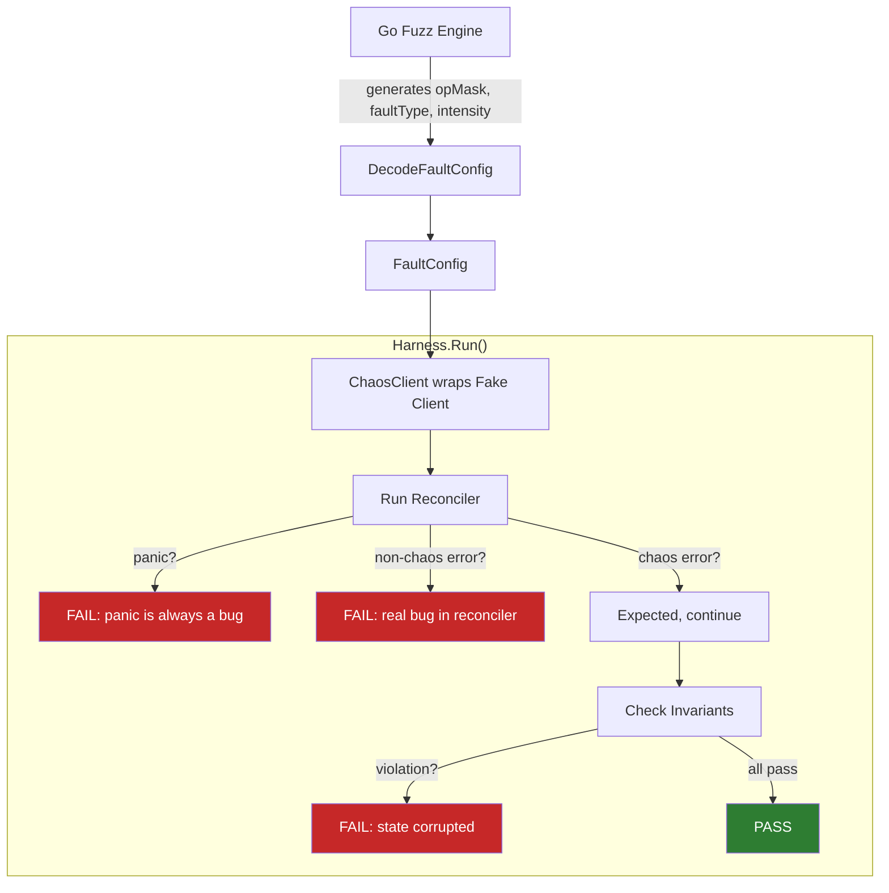

# Fuzz Quickstart

Use Go's native fuzz engine to automatically explore fault combinations your reconciler might encounter. The `pkg/sdk/fuzz` package provides a harness that:

1. Creates a fresh fake client with seed objects
2. Wraps it with `ChaosClient` using fuzz-generated fault configurations
3. Runs your reconciler and catches panics
4. Distinguishes chaos-injected errors (expected) from real bugs
5. Checks post-reconcile invariants

!!! tip "When to Use Fuzz Testing"
    Use this when you want to find edge cases in your reconciler's error handling during development. The fuzz engine explores thousands of fault combinations automatically, finding panics and logic bugs that manual tests miss.

## Auto-Generate from Knowledge Models

If you have an [operator knowledge model](../guides/knowledge-models.md), you can generate a complete fuzz test file automatically:

```bash
# Generate to stdout
odh-chaos generate fuzz-targets --knowledge knowledge/kserve.yaml

# Generate to a file
odh-chaos generate fuzz-targets --knowledge knowledge/kserve.yaml --output fuzz_kserve_test.go
```

The generated file contains:

- One `FuzzXxx` function per component (e.g., `FuzzKserveControllerManager`)
- Seed objects from `managedResources` (Deployments, ConfigMaps, RBAC, etc.)
- Invariants from `steadyState.checks` and Deployment replicas
- Seed corpus entries derived from architectural traits (webhooks, finalizers, leader election, dependencies)

You only need to replace the placeholder `reconcilerFactory` function with your actual reconciler constructor.

!!! tip "When to use auto-generation vs manual"
    Use `generate fuzz-targets` when you already have a knowledge model. It gives the fuzzer architecturally relevant starting points. Write tests manually when you need custom invariants or want to target specific reconciler paths.

## How It Works



## Prerequisites

- Go 1.18+ (for native fuzzing support)
- controller-runtime v0.23+
- No Kubernetes cluster needed (uses fake client)

## Writing a Fuzz Test (Manual)

### Step 1: Implement a ReconcilerFactory

This constructs your reconciler with a given `client.Client`:

```go
import (
    "sigs.k8s.io/controller-runtime/pkg/client"
    "sigs.k8s.io/controller-runtime/pkg/reconcile"
)

func myFactory(c client.Client) reconcile.Reconciler {
    return &MyReconciler{client: c}
}
```

### Step 2: Write the Fuzz Test

```go
package mycontroller_test

import (
    "testing"

    corev1 "k8s.io/api/core/v1"
    metav1 "k8s.io/apimachinery/pkg/apis/meta/v1"
    "k8s.io/apimachinery/pkg/runtime"
    "k8s.io/apimachinery/pkg/types"
    "sigs.k8s.io/controller-runtime/pkg/client"
    "sigs.k8s.io/controller-runtime/pkg/reconcile"

    "github.com/opendatahub-io/odh-platform-chaos/pkg/sdk/fuzz"
)

// Step 1: Implement a ReconcilerFactory.
// This constructs your reconciler with a given client.Client.
func myFactory(c client.Client) reconcile.Reconciler {
    return &MyReconciler{client: c}
}

// Step 2: Write the fuzz test.
func FuzzMyReconciler(f *testing.F) {
    // Seed corpus: the fuzz engine starts with these values and mutates them.
    f.Add(uint16(0x01FF), uint8(0), uint16(32768))
    f.Add(uint16(0), uint8(3), uint16(65535))

    scheme := runtime.NewScheme()
    _ = corev1.AddToScheme(scheme)

    f.Fuzz(func(t *testing.T, opMask uint16, faultType uint8, intensity uint16) {
        // Seed objects: the initial cluster state before reconciliation.
        cm := &corev1.ConfigMap{
            ObjectMeta: metav1.ObjectMeta{Name: "my-config", Namespace: "default"},
            Data:       map[string]string{"key": "value"},
        }
        req := reconcile.Request{
            NamespacedName: types.NamespacedName{Name: "my-config", Namespace: "default"},
        }

        // Create harness with factory, scheme, request, and seed objects.
        h := fuzz.NewHarness(myFactory, scheme, req, cm)

        // Add invariants: conditions that must hold after every reconciliation.
        h.AddInvariant(fuzz.ObjectExists(
            types.NamespacedName{Name: "my-config", Namespace: "default"},
            &corev1.ConfigMap{},
        ))

        // DecodeFaultConfig maps fuzz bytes to a valid FaultConfig:
        //   opMask:    bitmask selecting which operations get faults
        //              0x01FF enables all 9 operations, 0x0001 enables only Get
        //   faultType: selects error message from 11 realistic K8s errors
        //   intensity: maps to error rate (0 = never, 65535 = always fire)
        fc := fuzz.DecodeFaultConfig(opMask, faultType, intensity)

        // Run returns an error only for REAL bugs:
        //   - Panics (always a bug)
        //   - Non-chaos errors (reconciler returned an error not from ChaosClient)
        //   - Invariant violations (post-reconcile state is wrong)
        // Chaos-injected errors (sdk.ChaosError) are expected and silently ignored.
        if err := h.Run(t, fc); err != nil {
            t.Fatal(err)
        }
    })
}
```

## Running Fuzz Tests

```bash
# Run for 30 seconds (quick smoke test)
go test ./pkg/mycontroller/ -fuzz=FuzzMyReconciler -fuzztime=30s

# Run for 5 minutes (thorough exploration)
go test ./pkg/mycontroller/ -fuzz=FuzzMyReconciler -fuzztime=5m

# Run indefinitely until a failure is found
go test ./pkg/mycontroller/ -fuzz=FuzzMyReconciler
```

Failures are saved to `testdata/fuzz/FuzzMyReconciler/` and automatically replayed on subsequent `go test` runs.

## DecodeFaultConfig Reference

The `DecodeFaultConfig` function maps three fuzz primitives to a valid `*sdk.FaultConfig`:

| Parameter | Type | Mapping |
|-----------|------|---------|
| `opMask` | `uint16` | Bitmask: bit 0 = Get, bit 1 = List, bit 2 = Create, bit 3 = Update, bit 4 = Delete, bit 5 = Patch, bit 6 = DeleteAllOf, bit 7 = Reconcile, bit 8 = Apply |
| `faultType` | `uint8` | Index into 11 realistic K8s error messages (conflict, not found, timeout, server error, etcd, throttle, connection refused, gone, webhook denied, quota exceeded, unavailable) |
| `intensity` | `uint16` | Error rate: 0 = never fire, 65535 = always fire |

### Operation Bitmask

The `opMask` parameter uses individual bits to enable/disable faults for each operation:

```go
0x0001  // Only Get
0x0002  // Only List
0x0004  // Only Create
0x0008  // Only Update
0x0010  // Only Delete
0x0020  // Only Patch
0x0040  // Only DeleteAllOf
0x0080  // Only Reconcile
0x0100  // Only Apply
0x01FF  // All operations (all 9 bits set)
```

### Fault Types

The `faultType` parameter selects from these realistic Kubernetes error messages:

| Index | Error Message |
|-------|--------------|
| 0 | "the object has been modified; please apply your changes to the latest version and try again" |
| 1 | "not found" |
| 2 | "context deadline exceeded" |
| 3 | "Internal error occurred: unexpected response: 500" |
| 4 | "etcdserver: request timed out" |
| 5 | "rate limit exceeded, retry after 5s" |
| 6 | "connection refused" |
| 7 | "the server could not find the requested resource (HTTP 410: Gone)" |
| 8 | "admission webhook denied the request" |
| 9 | "exceeded quota" |
| 10 | "Service Unavailable" |

## Built-in Invariants

Invariants are conditions that must hold after every reconciliation. The framework provides two built-in invariants:

### ObjectExists

Checks that a specific object still exists after reconciliation:

```go
h.AddInvariant(fuzz.ObjectExists(
    types.NamespacedName{Name: "my-config", Namespace: "default"},
    &corev1.ConfigMap{},
))
```

### ObjectCount

Checks that the count of objects of a given type matches `n`:

```go
list := &corev1.ConfigMapList{}
h.AddInvariant(fuzz.ObjectCount(list, 3))

// With label selector
opts := []client.ListOption{
    client.MatchingLabels{"app": "my-app"},
}
h.AddInvariant(fuzz.ObjectCount(list, 1, opts...))
```

## Custom Invariants

You can define custom invariants as functions that check post-reconcile state:

```go
customInvariant := func(ctx context.Context, c client.Client) error {
    cm := &corev1.ConfigMap{}
    key := types.NamespacedName{Name: "my-config", Namespace: "default"}
    if err := c.Get(ctx, key, cm); err != nil {
        return fmt.Errorf("ConfigMap missing: %w", err)
    }
    if cm.Data["key"] != "value" {
        return fmt.Errorf("ConfigMap data corrupted: got %q", cm.Data["key"])
    }
    return nil
}

h.AddInvariant(customInvariant)
```

## Understanding Fuzz Failures

When the fuzz engine finds a bug, it reports:

1. **The fuzz inputs** that triggered the failure (saved to `testdata/fuzz/`)
2. **The failure type**:
   - **Panic**: Your reconciler panicked (always a bug)
   - **Non-chaos error**: Your reconciler returned an error that wasn't injected by ChaosClient
   - **Invariant violation**: Post-reconcile state doesn't match expectations

3. **The failure output** including stack trace

Example failure output:

```
--- FAIL: FuzzMyReconciler (0.03s)
    --- FAIL: FuzzMyReconciler (0.00s)
        harness.go:123: reconciler panicked: runtime error: invalid memory address or nil pointer dereference

        Fuzz inputs:
            opMask:    0x0001 (Get only)
            faultType: 1 (not found)
            intensity: 65535 (100% error rate)
```

## Integration with CI/CD

Add fuzz tests to your CI pipeline:

```yaml
# GitHub Actions example
- name: Fuzz test reconcilers
  run: |
    go test ./pkg/... -fuzz=. -fuzztime=2m
```

For regression testing, commit the `testdata/fuzz/` directory to ensure discovered bugs are always re-tested.

## Next Steps

- Learn about [reconciler error handling patterns](../concepts/error-handling.md)
- Integrate with [SDK middleware](sdk-quickstart.md)
- Set up [continuous fuzzing in CI](../guides/continuous-fuzzing.md)
- Explore [advanced invariants](../guides/custom-invariants.md)
