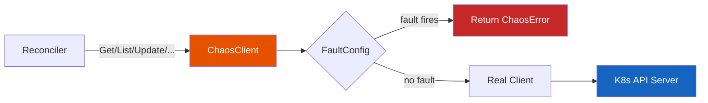

# SDK Quickstart

Wrap a controller-runtime `client.Client` with fault injection. The `ChaosClient` intercepts CRUD operations and injects errors, delays, or disconnections based on a `FaultConfig`. No code changes to your reconciler are needed.

!!! tip "When to Use SDK Middleware"
    Use this when you want to test how your reconciler handles API-level failures (timeouts, conflicts, connection errors) in integration tests or staging, without needing the full experiment lifecycle.



## Prerequisites

- controller-runtime v0.23+
- Access to your operator's reconciler code

## Basic Usage: ChaosClient Wrapper

Wrap an existing client with chaos fault injection:

```go
import "github.com/opendatahub-io/odh-platform-chaos/pkg/sdk"

// Wrap an existing client with chaos fault injection.
// FaultSpec fields:
//   ErrorRate float64       - probability of injecting an error (0.0-1.0)
//   Error     string        - error message to return
//   Delay     time.Duration - fixed delay before each operation
//   MaxDelay  time.Duration - random delay up to this value (jitter)
faults := sdk.NewFaultConfig(map[sdk.Operation]sdk.FaultSpec{
    sdk.OpGet: {ErrorRate: 0.3, Error: "connection refused"},
    sdk.OpList: {MaxDelay: 2 * time.Second}, // random jitter up to 2s, no errors
})
chaosClient := sdk.NewChaosClient(realClient, faults)

// Use chaosClient wherever you'd use the real client.
// 30% of Get calls will return "connection refused".
// All List calls will have random delay up to 2s.
```

## Wrapping a Reconciler

Inject faults at the reconcile-entry level (before your reconciler code runs):

```go
// Using the faults variable from above:
wrapped := sdk.WrapReconciler(myReconciler, sdk.WithFaultConfig(faults))
```

## FaultSpec Configuration

Each operation can be configured with different fault behaviors:

| Field | Type | Description |
|-------|------|-------------|
| `ErrorRate` | `float64` | Probability of injecting an error (0.0-1.0) |
| `Error` | `string` | Error message to return when fault fires |
| `Delay` | `time.Duration` | Fixed delay before each operation |
| `MaxDelay` | `time.Duration` | Random delay up to this value (jitter) |

### Supported Operations

```go
sdk.OpGet        // Get operations
sdk.OpList       // List operations
sdk.OpCreate     // Create operations
sdk.OpUpdate     // Update operations
sdk.OpDelete     // Delete operations
sdk.OpPatch      // Patch operations
sdk.OpDeleteAllOf // DeleteAllOf operations
sdk.OpReconcile  // Reconcile entry point
sdk.OpApply      // Apply operations
```

## Testing with Fake Clients

Use the `TestChaos` helper for Go tests (auto-cleans up via `t.Cleanup`):

```go
func TestMyReconciler(t *testing.T) {
    tc := sdk.NewForTest(t, "my-component")
    tc.Activate(sdk.OpGet, sdk.FaultSpec{ErrorRate: 1.0, Error: "not found"})

    // Works with both real clients and fake clients (no cluster needed)
    fakeClient := fake.NewClientBuilder().WithScheme(scheme).Build()
    chaosClient := sdk.NewChaosClient(fakeClient, tc.Config())
    // ... test your reconciler with the chaos client
}
```

## Distinguishing Chaos Errors from Real Errors

When using `ChaosClient`, injected faults return `*sdk.ChaosError`. Use `errors.As` to tell them apart:

```go
var chaosErr *sdk.ChaosError
if errors.As(err, &chaosErr) {
    // This error was injected by ChaosClient -- expected behavior
} else {
    // This is a real error from the Kubernetes API or your reconciler
}
```

This is important for test assertions — you may want to verify that your reconciler handles both chaos-injected errors (expected) and real errors differently.

## Loading Faults from ConfigMap

You can load fault configuration from a Kubernetes ConfigMap at runtime:

```go
// ConfigMap "odh-chaos-config" with key "config" containing JSON:
// {"active": true, "faults": {"get": {"errorRate": 0.5, "error": "not found"}}}
fc, err := sdk.ParseFaultConfigFromData(configMap.Data)
chaosClient := sdk.NewChaosClient(realClient, fc)
```

## Runtime Introspection

The SDK provides an HTTP admin handler for runtime introspection:

```go
adminHandler := sdk.NewAdminHandler(faults)
// Exposes:
//   GET /chaos/health      - health check
//   GET /chaos/status       - active state + fault count
//   GET /chaos/faultpoints  - all configured fault injection points
```

Mount this handler in your operator's HTTP server (typically the metrics server) to monitor active chaos faults.

## Example: Integration Test

Here's a complete example of using the SDK in an integration test:

```go
package mycontroller_test

import (
    "context"
    "testing"
    "time"

    corev1 "k8s.io/api/core/v1"
    metav1 "k8s.io/apimachinery/pkg/apis/meta/v1"
    "k8s.io/apimachinery/pkg/runtime"
    "k8s.io/apimachinery/pkg/types"
    "sigs.k8s.io/controller-runtime/pkg/client/fake"
    "sigs.k8s.io/controller-runtime/pkg/reconcile"

    "github.com/opendatahub-io/odh-platform-chaos/pkg/sdk"
)

func TestReconcilerWithConnectionErrors(t *testing.T) {
    scheme := runtime.NewScheme()
    _ = corev1.AddToScheme(scheme)

    // Create test chaos configuration
    tc := sdk.NewForTest(t, "my-component")
    tc.Activate(sdk.OpGet, sdk.FaultSpec{
        ErrorRate: 0.5,
        Error:     "connection refused",
    })

    // Create fake client wrapped with chaos
    fakeClient := fake.NewClientBuilder().WithScheme(scheme).Build()
    chaosClient := sdk.NewChaosClient(fakeClient, tc.Config())

    // Create reconciler with chaos client
    r := &MyReconciler{client: chaosClient}

    // Run reconciliation
    req := reconcile.Request{
        NamespacedName: types.NamespacedName{
            Name:      "test-resource",
            Namespace: "default",
        },
    }
    result, err := r.Reconcile(context.Background(), req)

    // Verify behavior under chaos
    if err != nil {
        var chaosErr *sdk.ChaosError
        if errors.As(err, &chaosErr) {
            // Expected chaos error - reconciler should retry
            if result.RequeueAfter == 0 {
                t.Error("Expected requeue on chaos error")
            }
        } else {
            t.Errorf("Unexpected error: %v", err)
        }
    }
}
```

## Next Steps

- Explore [predefined fault scenarios](../guides/fault-scenarios.md)
- Integrate with [fuzz testing](fuzz-quickstart.md)
- Learn about [reconciler patterns](../concepts/reconciler-patterns.md)
- Set up [continuous chaos testing](../guides/continuous-chaos.md)
