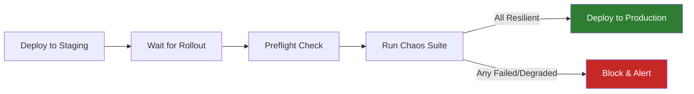

# CI Integration Guide

This guide describes how to integrate `odh-chaos` into continuous integration pipelines. It covers GitHub Actions and Tekton, including JUnit report generation, exit code conventions, and patterns for gating deployments on chaos experiment results.

## Exit Code Conventions

`odh-chaos` uses standard Unix exit codes. Any non-zero exit causes the CI step to fail.

| Command | Exit 0 | Non-zero exit |
|---------|--------|---------------|
| `odh-chaos preflight --knowledge <path>` | All declared resources found and healthy | Resources missing or unreachable (`%d resources missing, %d resources could not be checked`) |
| `odh-chaos preflight --knowledge <path> --local` | Knowledge YAML is structurally valid | Validation or cross-reference errors |
| `odh-chaos run <experiment.yaml>` | Experiment verdict is `Resilient` | Non-Resilient verdict (`experiment verdict: Degraded\|Failed\|Inconclusive`) or infrastructure error |
| `odh-chaos suite <dir>` | All experiments pass | One or more experiments failed (`%d experiment(s) failed`) |
| `odh-chaos validate <file.yaml>` | YAML is valid | Validation errors found |

Because the main entrypoint calls `os.Exit(1)` on any error, CI tools that check process exit codes will correctly detect failures without additional scripting.

## GitHub Actions

### Basic Chaos Suite Workflow

The following workflow runs the full chaos suite on every push to `main` and on pull requests. It uses the `quay.io/opendatahub/odh-chaos` container image.

```yaml
name: Chaos Suite

on:
  push:
    branches: [main]
  pull_request:
    branches: [main]

permissions:
  contents: read

jobs:
  chaos-suite:
    runs-on: ubuntu-latest
    container:
      image: quay.io/opendatahub/odh-chaos:latest
      options: --user 65532:65532

    steps:
      - name: Checkout experiments
        uses: actions/checkout@v4

      - name: Preflight check
        run: |
          /odh-chaos preflight \
            --knowledge knowledge/operator-knowledge.yaml

      - name: Run chaos suite
        run: |
          /odh-chaos suite experiments/ \
            --knowledge knowledge/operator-knowledge.yaml \
            --report-dir /tmp/chaos-reports \
            --timeout 10m

      - name: Upload JUnit results
        if: always()
        uses: actions/upload-artifact@v4
        with:
          name: chaos-junit-results
          path: /tmp/chaos-reports/suite-results.xml

      - name: Publish test results
        if: always()
        uses: mikepenz/action-junit-report@v4
        with:
          report_paths: /tmp/chaos-reports/suite-results.xml
          check_name: Chaos Experiment Results
          fail_on_failure: true
```

#### Key points

- The container runs as non-root (`65532:65532`) matching the distroless base image.
- `preflight` runs first to fail fast if cluster resources are missing.
- `--report-dir` causes the suite to write `suite-results.xml` in JUnit format.
- The `if: always()` condition ensures reports are uploaded even when experiments fail.

### Running individual experiments

To run a single experiment instead of a full suite:

```yaml
      - name: Run single experiment
        run: |
          /odh-chaos run experiments/pod-kill-controller.yaml \
            --knowledge knowledge/operator-knowledge.yaml \
            --report-dir /tmp/chaos-reports \
            --timeout 5m
```

> **Note:** The `run` command's `--report-dir` produces JSON result files, not JUnit XML. To convert to JUnit, run `odh-chaos report --format junit --output /tmp/chaos-reports /tmp/chaos-reports` afterward. The `suite` command generates JUnit XML automatically when `--report-dir` is specified.

### Dry-run validation in PRs

Use `--dry-run` to validate experiment definitions without executing them:

```yaml
      - name: Validate experiments (dry-run)
        run: |
          /odh-chaos suite experiments/ \
            --knowledge knowledge/operator-knowledge.yaml \
            --dry-run
```

### Gating Deployments

Use chaos experiments as a quality gate before promoting a deployment. The workflow below runs the chaos suite after deploying to staging and only proceeds to production if all experiments pass.



```yaml
name: Deploy with Chaos Gate

on:
  push:
    branches: [main]

permissions:
  contents: read

jobs:
  deploy-staging:
    runs-on: ubuntu-latest
    steps:
      - uses: actions/checkout@v4
      - name: Deploy to staging
        run: |
          # Your staging deployment commands here
          kubectl apply -k deploy/overlays/staging/

  chaos-gate:
    needs: deploy-staging
    runs-on: ubuntu-latest
    steps:
      - uses: actions/checkout@v4

      - name: Wait for rollout
        run: |
          kubectl rollout status deployment/my-operator -n opendatahub --timeout=300s

      - name: Preflight
        uses: docker://quay.io/opendatahub/odh-chaos:latest
        with:
          args: preflight --knowledge knowledge/operator-knowledge.yaml

      - name: Run chaos gate suite
        uses: docker://quay.io/opendatahub/odh-chaos:latest
        with:
          args: >-
            suite experiments/
            --knowledge knowledge/operator-knowledge.yaml
            --report-dir /tmp/chaos-reports
            --timeout 15m
            --parallel 2

      - name: Upload results
        if: always()
        uses: actions/upload-artifact@v4
        with:
          name: chaos-gate-results
          path: /tmp/chaos-reports/suite-results.xml

  deploy-production:
    needs: chaos-gate
    runs-on: ubuntu-latest
    steps:
      - uses: actions/checkout@v4
      - name: Deploy to production
        run: |
          # Only runs if chaos-gate succeeded (all experiments passed)
          kubectl apply -k deploy/overlays/production/
```

The `deploy-production` job has `needs: chaos-gate`, so it will only execute if every chaos experiment passed. A single failed experiment causes a non-zero exit from `odh-chaos suite`, which fails the `chaos-gate` job and blocks the production deployment.

## Tekton

### Chaos Experiment Task

A reusable Tekton Task that runs a chaos experiment suite and produces JUnit output.

```yaml
apiVersion: tekton.dev/v1
kind: Task
metadata:
  name: odh-chaos-suite
  labels:
    app.kubernetes.io/component: chaos-testing
spec:
  description: >
    Run odh-chaos experiments against a target cluster and produce
    JUnit XML reports.
  params:
    - name: knowledge-path
      type: string
      description: Path to operator knowledge YAML inside the workspace
    - name: experiments-dir
      type: string
      description: Directory containing experiment YAML files
    - name: timeout
      type: string
      default: "10m"
      description: Timeout per experiment
    - name: parallel
      type: string
      default: "1"
      description: Number of concurrent experiments
    - name: image-tag
      type: string
      default: "latest"
      description: Tag for the odh-chaos container image
  workspaces:
    - name: source
      description: Workspace containing experiments and knowledge files
    - name: reports
      description: Workspace for JUnit report output
  steps:
    - name: preflight
      image: quay.io/opendatahub/odh-chaos:$(params.image-tag)
      workingDir: $(workspaces.source.path)
      args:
        - preflight
        - --knowledge
        - $(params.knowledge-path)
      securityContext:
        runAsUser: 65532
        runAsGroup: 65532
        runAsNonRoot: true

    - name: run-suite
      image: quay.io/opendatahub/odh-chaos:$(params.image-tag)
      workingDir: $(workspaces.source.path)
      args:
        - suite
        - $(params.experiments-dir)
        - --knowledge
        - $(params.knowledge-path)
        - --report-dir
        - $(workspaces.reports.path)
        - --timeout
        - $(params.timeout)
        - --parallel
        - $(params.parallel)
      securityContext:
        runAsUser: 65532
        runAsGroup: 65532
        runAsNonRoot: true
```

### Preflight-only Task

A lightweight task for validating operator readiness before running experiments:

```yaml
apiVersion: tekton.dev/v1
kind: Task
metadata:
  name: odh-chaos-preflight
spec:
  description: Validate operator knowledge YAML and check cluster readiness.
  params:
    - name: knowledge-path
      type: string
      description: Path to operator knowledge YAML
    - name: image-tag
      type: string
      default: "latest"
  workspaces:
    - name: source
  steps:
    - name: preflight
      image: quay.io/opendatahub/odh-chaos:$(params.image-tag)
      workingDir: $(workspaces.source.path)
      args:
        - preflight
        - --knowledge
        - $(params.knowledge-path)
      securityContext:
        runAsUser: 65532
        runAsGroup: 65532
        runAsNonRoot: true
```

### Chaos Suite Pipeline

A Pipeline that combines preflight, suite execution, and report generation:

```yaml
apiVersion: tekton.dev/v1
kind: Pipeline
metadata:
  name: odh-chaos-pipeline
  labels:
    app.kubernetes.io/component: chaos-testing
spec:
  description: >
    End-to-end chaos testing pipeline: preflight checks, suite execution,
    and JUnit report generation.
  params:
    - name: repo-url
      type: string
      description: Git repository URL containing experiments
    - name: revision
      type: string
      default: main
      description: Git revision to checkout
    - name: knowledge-path
      type: string
      default: knowledge/operator-knowledge.yaml
    - name: experiments-dir
      type: string
      default: experiments/
    - name: timeout
      type: string
      default: "10m"
    - name: parallel
      type: string
      default: "1"
    - name: image-tag
      type: string
      default: "latest"
  workspaces:
    - name: shared-workspace
    - name: report-workspace

  tasks:
    - name: fetch-source
      taskRef:
        name: git-clone
      params:
        - name: url
          value: $(params.repo-url)
        - name: revision
          value: $(params.revision)
      workspaces:
        - name: output
          workspace: shared-workspace

    - name: preflight
      runAfter:
        - fetch-source
      taskRef:
        name: odh-chaos-preflight
      params:
        - name: knowledge-path
          value: $(params.knowledge-path)
        - name: image-tag
          value: $(params.image-tag)
      workspaces:
        - name: source
          workspace: shared-workspace

    - name: run-suite
      runAfter:
        - preflight
      taskRef:
        name: odh-chaos-suite
      params:
        - name: knowledge-path
          value: $(params.knowledge-path)
        - name: experiments-dir
          value: $(params.experiments-dir)
        - name: timeout
          value: $(params.timeout)
        - name: parallel
          value: $(params.parallel)
        - name: image-tag
          value: $(params.image-tag)
      workspaces:
        - name: source
          workspace: shared-workspace
        - name: reports
          workspace: report-workspace

  finally:
    - name: publish-report
      taskRef:
        name: odh-chaos-report
      params:
        - name: image-tag
          value: $(params.image-tag)
      workspaces:
        - name: reports
          workspace: report-workspace
```

> **Note:** The `publish-report` task is in the `finally` block so it runs even when the suite fails. The `suite` command writes JUnit XML to `--report-dir` *before* returning a non-zero exit on experiment failures, so the report file exists in the workspace when experiments were executed. If the suite fails during setup (e.g., bad kubeconfig), no report is generated. The `publish-report` task is only needed if you want to regenerate reports from raw JSON files.

### Report Generation Task

A standalone task for converting JSON results to JUnit XML (useful when the suite was run externally or you want to regenerate reports):

```yaml
apiVersion: tekton.dev/v1
kind: Task
metadata:
  name: odh-chaos-report
spec:
  description: Generate JUnit XML from chaos experiment JSON results.
  params:
    - name: image-tag
      type: string
      default: "latest"
    - name: format
      type: string
      default: "junit"
      description: Report format (summary or junit)
  workspaces:
    - name: reports
      description: Workspace containing JSON result files
  steps:
    - name: generate-report
      image: quay.io/opendatahub/odh-chaos:$(params.image-tag)
      args:
        - report
        - --format
        - $(params.format)
        - --output
        - $(workspaces.reports.path)
        - $(workspaces.reports.path)
      securityContext:
        runAsUser: 65532
        runAsGroup: 65532
        runAsNonRoot: true
```

### Gating with Tekton

To gate a deployment on chaos results in Tekton, place a deployment task after `run-suite` in the pipeline using `runAfter`. Because Tekton will not execute downstream tasks when an upstream task fails, a non-zero exit from `odh-chaos suite` automatically blocks the deployment:

```yaml
    - name: deploy-production
      runAfter:
        - run-suite
      taskRef:
        name: your-deploy-task
      params:
        - name: environment
          value: production
```

## JUnit Report Integration

`odh-chaos` produces JUnit XML in two ways:

1. **Suite command** -- Use `--report-dir <dir>` to automatically generate `<dir>/suite-results.xml` at the end of a suite run.

2. **Report command** -- Use `odh-chaos report --format junit --output <dir> <results-dir>` to generate `<dir>/chaos-results.xml` from previously saved JSON result files.

### JUnit output structure

The generated XML follows the standard JUnit schema:

- Each experiment maps to a `<testcase>` element.
- The suite name is derived from the experiments directory name.
- Failed experiments include a `<failure>` element with the verdict and error details.
- Skipped experiments (inconclusive verdict) include a `<skipped>` element.

### Integration with CI report tools

**GitHub Actions** -- Use the `mikepenz/action-junit-report` action (shown in the GitHub Actions section above) or the built-in test reporting in GitHub Actions to render results.

**Jenkins** -- Use the JUnit post-build action:
```groovy
post {
    always {
        junit 'chaos-reports/suite-results.xml'
    }
}
```

**Tekton with OpenShift** -- The JUnit XML file in the report workspace can be collected by the OpenShift CI system or retrieved from the PVC after the pipeline run completes.

**GitLab CI** -- Declare the report as a JUnit artifact:
```yaml
chaos-suite:
  artifacts:
    reports:
      junit: chaos-reports/suite-results.xml
```

## Troubleshooting

### Preflight fails with "resources missing"

The `preflight` command checks that all resources declared in the operator knowledge YAML exist on the cluster. Common causes:

- The operator has not been deployed yet. Run your deployment step before `preflight`.
- The knowledge file references resources in a namespace that does not exist. Use `--namespace` if the default namespace is incorrect.
- RBAC permissions are insufficient. The service account running the chaos container needs `get` permissions on the declared resource types.

### Suite exits non-zero but individual experiments show SKIP

Skipped experiments do not count as failures. Check the suite summary line for the failure count. An experiment may be skipped due to:

- Invalid YAML that fails validation.
- An `Inconclusive` verdict (the system could not determine pass or fail).

Only experiments with a `fail` status contribute to the non-zero exit.

### Container permission denied errors

The `odh-chaos` image runs as non-root user `65532:65532` (distroless/static:nonroot). Ensure:

- Workspaces and volumes are writable by this UID/GID.
- The `--report-dir` path is writable.
- In GitHub Actions, use `options: --user 65532:65532` on the container definition.

### Timeout-related failures

The default timeout per experiment is 10 minutes. For experiments that involve slow recovery (such as operator redeployment), increase the timeout:

```
/odh-chaos suite experiments/ --timeout 20m
```

In Tekton, pass the timeout as a parameter to the task.

### Distributed locking conflicts

When running multiple chaos suites concurrently against the same cluster, use `--distributed-lock` to enable Kubernetes Lease-based locking. This prevents concurrent experiments from interfering with each other:

```
/odh-chaos suite experiments/ --distributed-lock --lock-namespace opendatahub
```

### JUnit report not generated

The JUnit report is only written when `--report-dir` is specified on the `suite` command. Verify:

- The `--report-dir` flag is present in your CI configuration.
- The directory path is writable by the container user.
- Check stderr for the message `JUnit report written to <path>` to confirm the report was generated.
