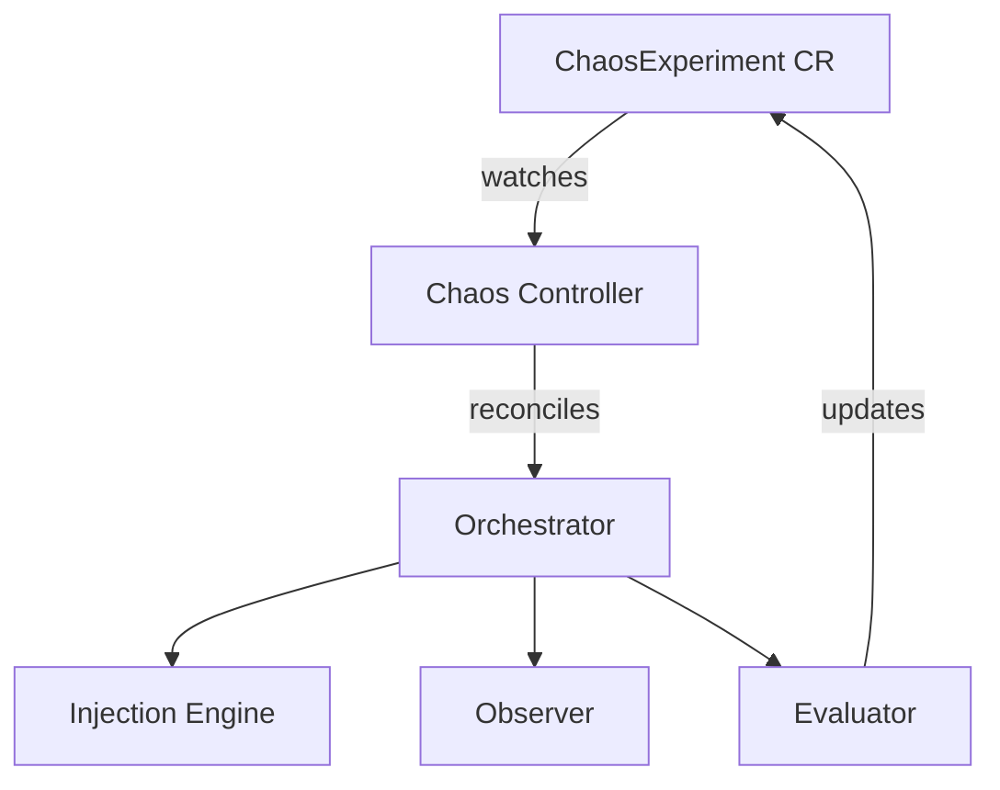
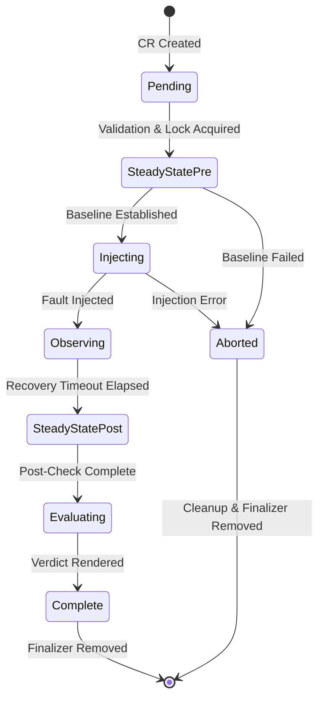

# Controller Mode

Controller mode runs chaos experiments as Kubernetes Custom Resources (CRs), managed by a dedicated reconciler. Instead of running one-shot experiments via the CLI, you create `ChaosExperiment` CRs that the controller drives through the experiment lifecycle.

## Why Controller Mode?

**CLI mode** (via `odh-chaos run`) is great for:

- Local development and testing
- CI/CD pipelines with ephemeral clusters
- One-off experiments with immediate results

**Controller mode** is better for:

- Continuous chaos testing in long-lived clusters
- Scheduled experiments via Kubernetes CronJobs
- Multi-tenant environments where teams manage their own experiments
- Integration with GitOps workflows (Argo CD, Flux)
- Auditable experiment history stored as CRs

In controller mode, experiments are **declarative**: you define the desired experiment as a CR, and the controller reconciles it to completion. The controller enforces safety mechanisms, manages distributed locking, and provides Kubernetes-native integrations (events, conditions, metrics).

## Architecture



The controller uses the **phase-per-reconcile** pattern: each reconcile loop advances the experiment by exactly one phase, updating `.status.phase` and `.status.conditions`. This ensures crash safety—if the controller restarts, it resumes from the last completed phase.

## Experiment Lifecycle

Each `ChaosExperiment` CR progresses through these phases:



| Phase | Description | Requeue Behavior |
|-------|-------------|------------------|
| `Pending` | Validates experiment spec, loads knowledge model, acquires distributed lock | Immediate requeue on validation success |
| `SteadyStatePre` | Runs pre-injection steady-state checks to establish baseline | Immediate requeue on check success; abort on failure |
| `Injecting` | Applies the fault (kills pod, mutates config, etc.) | Immediate requeue on successful injection |
| `Observing` | Waits for recovery timeout, monitors reconciliation | Requeues every 30s until timeout elapsed |
| `SteadyStatePost` | Runs post-recovery steady-state checks | Immediate requeue on check completion |
| `Evaluating` | Renders verdict based on findings | Immediate requeue after verdict set |
| `Complete` | Experiment finished successfully | Terminal state, no requeue |
| `Aborted` | Experiment aborted due to validation error or baseline failure | Terminal state, cleanup performed, no requeue |

**Status conditions** track progress:

- `SteadyStateEstablished`: Pre-check passed
- `FaultInjected`: Fault applied successfully
- `RecoveryObserved`: Recovery timeout elapsed
- `Complete`: Experiment finished

The controller emits Kubernetes **events** at each phase transition for observability.

## Prerequisites

1. **Kubernetes cluster** (v1.25+) or OpenShift (4.12+)
2. **cluster-admin RBAC** (controller needs permissions to create/delete/mutate arbitrary resources)
3. **ChaosExperiment CRD** installed (comes with `kubectl apply -k config/default`)
4. **Knowledge models** loaded (see [Knowledge Models](knowledge-models.md))

!!! warning "RBAC Permissions"
    The controller has broad RBAC permissions to support dynamic experiment targets. It can delete pods, mutate ConfigMaps, revoke RBAC bindings, and modify webhook configurations. Deploy in a dedicated namespace and review CRs before approval.

## Installation

### Deploy the Controller

```bash
# Clone the repository
git clone https://github.com/opendatahub-io/odh-platform-chaos.git
cd odh-platform-chaos

# Install CRD and controller
kubectl apply -k config/default
```

This creates:

- Namespace: `odh-chaos-system`
- CRD: `chaosexperiments.chaos.opendatahub.io`
- ServiceAccount: `odh-chaos-controller`
- ClusterRole/ClusterRoleBinding: RBAC for controller
- Deployment: `odh-chaos-controller` (1 replica)

**Verify deployment:**

```bash
kubectl get deployment -n odh-chaos-system
# NAME                   READY   UP-TO-DATE   AVAILABLE   AGE
# odh-chaos-controller   1/1     1            1           30s

kubectl get crd chaosexperiments.chaos.opendatahub.io
# NAME                                    CREATED AT
# chaosexperiments.chaos.opendatahub.io   2024-03-30T12:00:00Z
```

### Load Knowledge Models

The controller needs knowledge models to validate experiments and perform steady-state checks. Mount them as a ConfigMap or volume:

**Option 1: ConfigMap**

```bash
# Create ConfigMap from knowledge/ directory
kubectl create configmap operator-knowledge \
  -n odh-chaos-system \
  --from-file=knowledge/

# Update controller deployment to mount ConfigMap
kubectl patch deployment odh-chaos-controller -n odh-chaos-system --type=json -p='[
  {
    "op": "add",
    "path": "/spec/template/spec/containers/0/args/-",
    "value": "--knowledge-dir=/knowledge"
  },
  {
    "op": "add",
    "path": "/spec/template/spec/volumes/-",
    "value": {"name": "knowledge", "configMap": {"name": "operator-knowledge"}}
  },
  {
    "op": "add",
    "path": "/spec/template/spec/containers/0/volumeMounts/-",
    "value": {"name": "knowledge", "mountPath": "/knowledge", "readOnly": true}
  }
]'
```

**Option 2: PersistentVolume**

```yaml
apiVersion: v1
kind: PersistentVolumeClaim
metadata:
  name: knowledge-pvc
  namespace: odh-chaos-system
spec:
  accessModes: [ReadOnlyMany]
  resources:
    requests:
      storage: 1Gi
---
# Update deployment to mount PVC at /knowledge
# Add --knowledge-dir=/knowledge to container args
```

**Verify knowledge models loaded:**

```bash
kubectl logs -n odh-chaos-system deployment/odh-chaos-controller | grep "Loaded knowledge"
# Loaded knowledge models: kserve, odh-model-controller, dashboard
```

## Creating Experiments

### ChaosExperiment CR Structure

```yaml
apiVersion: chaos.opendatahub.io/v1alpha1
kind: ChaosExperiment
metadata:
  name: my-experiment
  namespace: my-namespace
spec:
  target:
    operator: odh-model-controller
    component: odh-model-controller
    resource: Deployment/odh-model-controller  # optional

  injection:
    type: PodKill
    parameters:
      labelSelector: control-plane=odh-model-controller
    count: 1
    ttl: "300s"

  hypothesis:
    description: "Pod kill should recover within 120s"
    recoveryTimeout: 120s

  steadyState:
    checks:
      - type: conditionTrue
        apiVersion: apps/v1
        kind: Deployment
        name: odh-model-controller
        namespace: opendatahub
        conditionType: Available
    timeout: "30s"

  blastRadius:
    maxPodsAffected: 1
    allowedNamespaces:
      - opendatahub
```

**Key fields:**

- **`target`**: Which operator/component to fault
- **`injection`**: Fault type and parameters (see [Injection Types](../reference/injection-types.md))
- **`hypothesis`**: Expected behavior and recovery timeout
- **`steadyState`**: Checks to run pre/post injection
- **`blastRadius`**: Safety constraints

### Example: PodKill Experiment

```yaml
apiVersion: chaos.opendatahub.io/v1alpha1
kind: ChaosExperiment
metadata:
  name: odh-model-controller-pod-kill
  namespace: odh-chaos-experiments
spec:
  target:
    operator: odh-model-controller
    component: odh-model-controller

  injection:
    type: PodKill
    parameters:
      labelSelector: control-plane=odh-model-controller
    count: 1

  hypothesis:
    description: >-
      When the odh-model-controller pod is killed, Kubernetes should
      recreate it within the recovery timeout and the controller should
      resume reconciling InferenceService resources without data loss.
    recoveryTimeout: 120s

  steadyState:
    checks:
      - type: conditionTrue
        apiVersion: apps/v1
        kind: Deployment
        name: odh-model-controller
        namespace: opendatahub
        conditionType: Available
    timeout: "30s"

  blastRadius:
    maxPodsAffected: 1
    allowedNamespaces:
      - opendatahub
```

**Apply the experiment:**

```bash
kubectl apply -f experiment.yaml
```

**Watch progress:**

```bash
kubectl get chaosexperiment odh-model-controller-pod-kill -w
# NAME                              PHASE           VERDICT   TYPE      TARGET                 AGE
# odh-model-controller-pod-kill     Pending                   PodKill   odh-model-controller   1s
# odh-model-controller-pod-kill     SteadyStatePre            PodKill   odh-model-controller   2s
# odh-model-controller-pod-kill     Injecting                 PodKill   odh-model-controller   5s
# odh-model-controller-pod-kill     Observing                 PodKill   odh-model-controller   6s
# odh-model-controller-pod-kill     SteadyStatePost           PodKill   odh-model-controller   126s
# odh-model-controller-pod-kill     Evaluating                PodKill   odh-model-controller   127s
# odh-model-controller-pod-kill     Complete        Resilient PodKill   odh-model-controller   128s
```

### Example: ConfigDrift Experiment

```yaml
apiVersion: chaos.opendatahub.io/v1alpha1
kind: ChaosExperiment
metadata:
  name: inferenceservice-config-drift
  namespace: odh-chaos-experiments
spec:
  target:
    operator: odh-model-controller
    component: odh-model-controller

  injection:
    type: ConfigDrift
    parameters:
      name: inferenceservice-config
      key: deploy
      value: "corrupted-config-data"
    ttl: "300s"

  hypothesis:
    description: >-
      When the inferenceservice-config ConfigMap is corrupted, the
      controller should detect and restore the correct configuration.
    recoveryTimeout: 180s

  steadyState:
    checks:
      - type: conditionTrue
        apiVersion: apps/v1
        kind: Deployment
        name: odh-model-controller
        namespace: opendatahub
        conditionType: Available
    timeout: "30s"

  blastRadius:
    maxPodsAffected: 1
    allowedNamespaces:
      - opendatahub
    allowDangerous: true  # ConfigDrift is medium danger
```

### Example: RBACRevoke Experiment (High Danger)

```yaml
apiVersion: chaos.opendatahub.io/v1alpha1
kind: ChaosExperiment
metadata:
  name: rbac-revoke-test
  namespace: odh-chaos-experiments
spec:
  target:
    operator: odh-model-controller
    component: odh-model-controller

  injection:
    type: RBACRevoke
    parameters:
      bindingName: odh-model-controller-rolebinding-opendatahub
      bindingType: ClusterRoleBinding
    ttl: "300s"

  hypothesis:
    description: >-
      When the controller's RBAC binding is revoked, it should detect
      permission errors and recover when RBAC is restored.
    recoveryTimeout: 240s

  steadyState:
    checks:
      - type: conditionTrue
        apiVersion: apps/v1
        kind: Deployment
        name: odh-model-controller
        namespace: opendatahub
        conditionType: Available
    timeout: "30s"

  blastRadius:
    maxPodsAffected: 1
    allowedNamespaces:
      - opendatahub
    allowDangerous: true  # RBACRevoke is high danger
```

!!! danger "High-Danger Injections"
    Injection types like `RBACRevoke` and `WebhookDisrupt` are high-danger. You must set `blastRadius.allowDangerous: true` or the controller will reject the experiment.

## Viewing Results

### Status Fields

The controller updates `.status` with experiment results:

```yaml
status:
  phase: Complete
  verdict: Resilient
  observedGeneration: 1
  message: "Experiment completed successfully"
  startTime: "2024-03-30T12:00:00Z"
  endTime: "2024-03-30T12:02:15Z"
  injectionStartedAt: "2024-03-30T12:00:05Z"

  steadyStatePre:
    passed: true
    checksRun: 1
    checksPassed: 1
    details:
      - check:
          type: conditionTrue
          apiVersion: apps/v1
          kind: Deployment
          name: odh-model-controller
          namespace: opendatahub
          conditionType: Available
        passed: true
        value: "True"
    timestamp: "2024-03-30T12:00:02Z"

  steadyStatePost:
    passed: true
    checksRun: 1
    checksPassed: 1
    details: [...]
    timestamp: "2024-03-30T12:02:06Z"

  injectionLog:
    - timestamp: "2024-03-30T12:00:05Z"
      type: PodKill
      target: opendatahub/odh-model-controller-5c7d8f9b-xz4k2
      action: deleted
      details:
        signal: SIGTERM

  evaluationResult:
    verdict: Resilient
    confidence: high
    recoveryTime: 115s
    reconcileCycles: 2
    deviations: []

  conditions:
    - type: SteadyStateEstablished
      status: "True"
      lastTransitionTime: "2024-03-30T12:00:02Z"
      reason: PreCheckPassed
      message: "Baseline steady-state established"
    - type: FaultInjected
      status: "True"
      lastTransitionTime: "2024-03-30T12:00:05Z"
      reason: InjectionSucceeded
      message: "Fault injected successfully"
    - type: RecoveryObserved
      status: "True"
      lastTransitionTime: "2024-03-30T12:02:05Z"
      reason: RecoveryComplete
      message: "Recovery timeout elapsed, all resources reconciled"
    - type: Complete
      status: "True"
      lastTransitionTime: "2024-03-30T12:02:15Z"
      reason: EvaluationComplete
      message: "Experiment complete, verdict: Resilient"
```

**Key status fields:**

| Field | Type | Description |
|-------|------|-------------|
| `phase` | string | Current phase (see lifecycle diagram) |
| `verdict` | string | Experiment verdict: `Resilient`, `Degraded`, `Failed`, `Inconclusive` |
| `message` | string | Human-readable status message |
| `startTime` | timestamp | When the experiment started |
| `endTime` | timestamp | When the experiment completed (phase Complete or Aborted) |
| `injectionStartedAt` | timestamp | When the fault was injected |
| `steadyStatePre` | object | Pre-injection check results |
| `steadyStatePost` | object | Post-recovery check results |
| `injectionLog` | array | Detailed log of injection actions |
| `evaluationResult` | object | Verdict, recovery time, reconcile cycles, deviations |
| `conditions` | array | Kubernetes-native status conditions |

### Query Experiments

```bash
# List all experiments
kubectl get chaosexperiments -A

# Filter by verdict
kubectl get chaosexperiments -A -o json | \
  jq '.items[] | select(.status.verdict == "Failed") | .metadata.name'

# Show experiments in progress
kubectl get chaosexperiments -A -o json | \
  jq '.items[] | select(.status.phase != "Complete" and .status.phase != "Aborted")'

# Get detailed results
kubectl get chaosexperiment my-experiment -o yaml
```

### Events

The controller emits events at each phase transition:

```bash
kubectl get events --field-selector involvedObject.kind=ChaosExperiment

# LAST SEEN   TYPE      REASON              OBJECT
# 2m          Normal    PhaseTransition     chaosexperiment/my-experiment   Phase: Pending → SteadyStatePre
# 2m          Normal    PhaseTransition     chaosexperiment/my-experiment   Phase: SteadyStatePre → Injecting
# 2m          Normal    FaultInjected       chaosexperiment/my-experiment   Deleted pod odh-model-controller-5c7d8f9b-xz4k2
# 30s         Normal    PhaseTransition     chaosexperiment/my-experiment   Phase: Injecting → Observing
# 5s          Normal    PhaseTransition     chaosexperiment/my-experiment   Phase: Observing → SteadyStatePost
# 3s          Normal    PhaseTransition     chaosexperiment/my-experiment   Phase: SteadyStatePost → Evaluating
# 2s          Normal    VerdictRendered     chaosexperiment/my-experiment   Verdict: Resilient (recovery: 115s, cycles: 2)
# 1s          Normal    PhaseTransition     chaosexperiment/my-experiment   Phase: Evaluating → Complete
```

## Safety Mechanisms

### Distributed Locking

The controller uses Kubernetes Leases to prevent concurrent experiments on the same operator:

1. Before injecting, controller acquires a lease for the target operator
2. Lease name: `chaos-lock-<operator-name>`
3. Lease namespace: `odh-chaos-system` (configurable via `--lock-namespace`)
4. If another experiment holds the lease, the controller requeues with backoff

**View active locks:**

```bash
kubectl get leases -n odh-chaos-system
# NAME                              HOLDER                          AGE
# chaos-lock-odh-model-controller   my-experiment                   45s
```

The lock is released when the experiment reaches `Complete` or `Aborted`.

### Finalizers

The controller adds a finalizer (`chaos.opendatahub.io/cleanup`) during the `Injecting` phase. This ensures:

- If the CR is deleted mid-experiment, the controller reverts the fault before deleting
- If the controller crashes, the finalizer prevents orphaned faults

**Crash recovery**: If the controller crashes during an experiment, on restart it:

1. Resumes from the last recorded phase
2. Re-runs cleanup logic if phase is `Aborted`
3. Removes the finalizer on terminal phases

### TTL-Based Auto-Cleanup

Faults have a time-to-live (`injection.ttl`). Even if the controller crashes, the framework's TTL cleanup logic (running in the `Observer`) will eventually revert the fault.

### Blast Radius Limits

The controller enforces blast radius constraints before injection:

- **`maxPodsAffected`**: Maximum pods that can be affected
- **`allowedNamespaces`**: Injection restricted to these namespaces
- **`forbiddenResources`**: Resources that must not be touched
- **`allowDangerous`**: High-danger injections require explicit opt-in

Experiments that violate constraints are rejected with phase `Aborted` and message explaining the violation.

## Advanced Usage

### Scheduled Experiments with CronJobs

Run experiments on a schedule using Kubernetes CronJobs:

```yaml
apiVersion: batch/v1
kind: CronJob
metadata:
  name: nightly-chaos
  namespace: odh-chaos-experiments
spec:
  schedule: "0 2 * * *"  # 2 AM daily
  jobTemplate:
    spec:
      template:
        spec:
          serviceAccountName: chaos-job-runner
          containers:
            - name: create-experiment
              image: bitnami/kubectl:latest
              command:
                - /bin/sh
                - -c
                - |
                  cat <<EOF | kubectl apply -f -
                  apiVersion: chaos.opendatahub.io/v1alpha1
                  kind: ChaosExperiment
                  metadata:
                    generateName: nightly-podkill-
                    namespace: odh-chaos-experiments
                  spec:
                    target:
                      operator: odh-model-controller
                      component: odh-model-controller
                    injection:
                      type: PodKill
                      parameters:
                        labelSelector: control-plane=odh-model-controller
                    hypothesis:
                      description: "Nightly pod kill test"
                      recoveryTimeout: 120s
                    steadyState:
                      checks:
                        - type: conditionTrue
                          apiVersion: apps/v1
                          kind: Deployment
                          name: odh-model-controller
                          namespace: opendatahub
                          conditionType: Available
                      timeout: "30s"
                    blastRadius:
                      maxPodsAffected: 1
                      allowedNamespaces:
                        - opendatahub
                  EOF
          restartPolicy: OnFailure
```

**Note**: The ServiceAccount needs RBAC to create ChaosExperiment CRs.

### GitOps Integration

Store experiments in Git and sync with Argo CD or Flux:

```yaml
# argocd-application.yaml
apiVersion: argoproj.io/v1alpha1
kind: Application
metadata:
  name: chaos-experiments
  namespace: argocd
spec:
  project: default
  source:
    repoURL: https://github.com/my-org/chaos-experiments
    path: experiments/odh-model-controller
    targetRevision: main
  destination:
    server: https://kubernetes.default.svc
    namespace: odh-chaos-experiments
  syncPolicy:
    automated:
      prune: true
      selfHeal: false  # Don't auto-heal to preserve experiment history
```

### Dashboard Integration

The [Dashboard](../dashboard-guide.md) watches ChaosExperiment CRs in real time and provides:

- Live experiment progress via Server-Sent Events
- Experiment history and trend analysis
- Verdict timeline and recovery metrics
- Component health visualization

```bash
# Run the dashboard (assumes knowledge models in knowledge/)
bin/chaos-dashboard \
  -addr :8080 \
  -db dashboard.db \
  -knowledge-dir knowledge/

# Open http://localhost:8080
```

The dashboard auto-discovers ChaosExperiment CRs across all namespaces and displays them in a filterable, sortable table.

## Cleanup

### Delete a Single Experiment

```bash
# This triggers finalizer cleanup (reverts fault if still active)
kubectl delete chaosexperiment my-experiment
```

### Uninstall the Controller

```bash
# Delete all experiments first (ensures cleanup runs)
kubectl delete chaosexperiments --all -A

# Uninstall controller and CRD
kubectl delete -k config/default
```

!!! warning "CRD Deletion"
    Deleting the CRD deletes all ChaosExperiment CRs immediately, **bypassing finalizers**. Always delete experiments individually to ensure faults are reverted.

### Emergency Stop

If experiments are stuck or the controller is misbehaving:

```bash
# Delete the controller deployment (stops new experiments)
kubectl delete deployment odh-chaos-controller -n odh-chaos-system

# Use the CLI to clean up faults manually
odh-chaos clean --namespace <namespace>
```

## Troubleshooting

### Experiment stuck in Pending

**Check controller logs:**

```bash
kubectl logs -n odh-chaos-system deployment/odh-chaos-controller
```

**Common causes:**

- Validation error (missing knowledge model, unknown injection type)
- Failed to acquire lock (another experiment is running on same operator)
- RBAC permissions missing

### Experiment stuck in Observing

The controller is waiting for the recovery timeout to elapse. Check:

```bash
kubectl get chaosexperiment my-experiment -o jsonpath='{.spec.hypothesis.recoveryTimeout}'
# 120s

# Check how long we've been observing
kubectl get chaosexperiment my-experiment -o jsonpath='{.status.injectionStartedAt}'
```

### Verdict is Inconclusive

The pre-injection steady-state check failed. Check:

```bash
kubectl get chaosexperiment my-experiment -o jsonpath='{.status.steadyStatePre}'
# {"passed":false,"checksRun":1,"checksPassed":0,"details":[...]}
```

Verify the target resource is healthy before running the experiment.

### Finalizer not removed

If an experiment is stuck deleting with a finalizer:

```bash
# Check phase
kubectl get chaosexperiment my-experiment -o jsonpath='{.status.phase}'

# If phase is Complete or Aborted, force-remove finalizer
kubectl patch chaosexperiment my-experiment -p '{"metadata":{"finalizers":[]}}' --type=merge
```

## Next Steps

- Learn about [Knowledge Models](knowledge-models.md) to define operator semantics
- See [Injection Types](../reference/injection-types.md) for all available fault types
- Explore [Dashboard Guide](../dashboard-guide.md) for visualization and monitoring
- Read [CI Integration Guide](../ci-integration-guide.md) for pipeline integration
