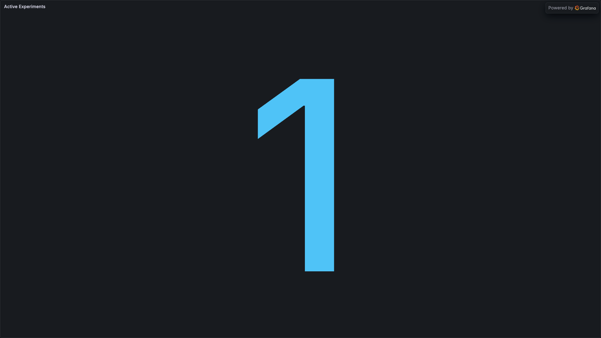
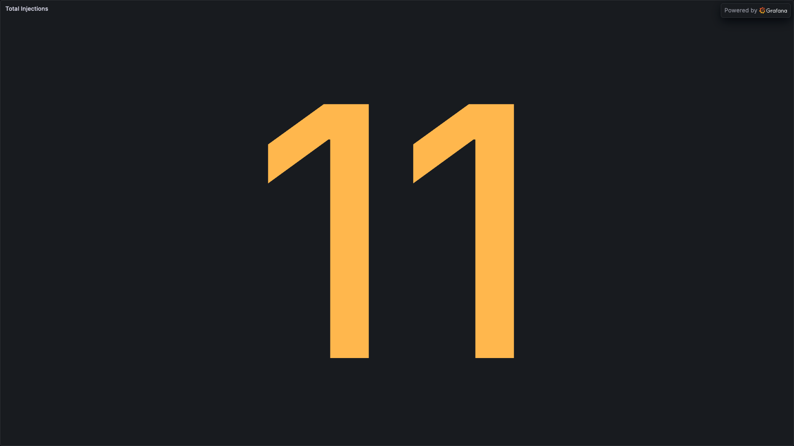
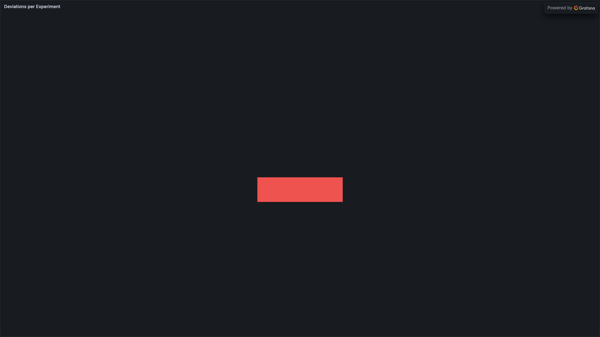
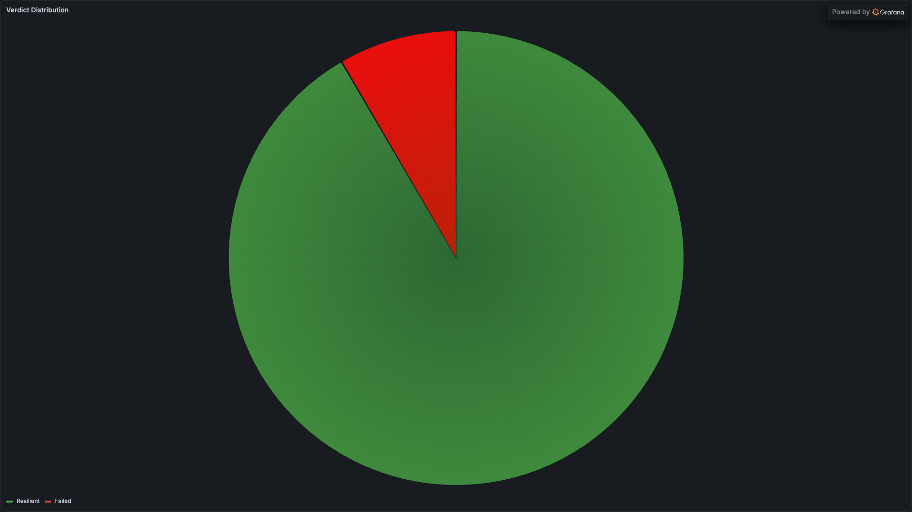
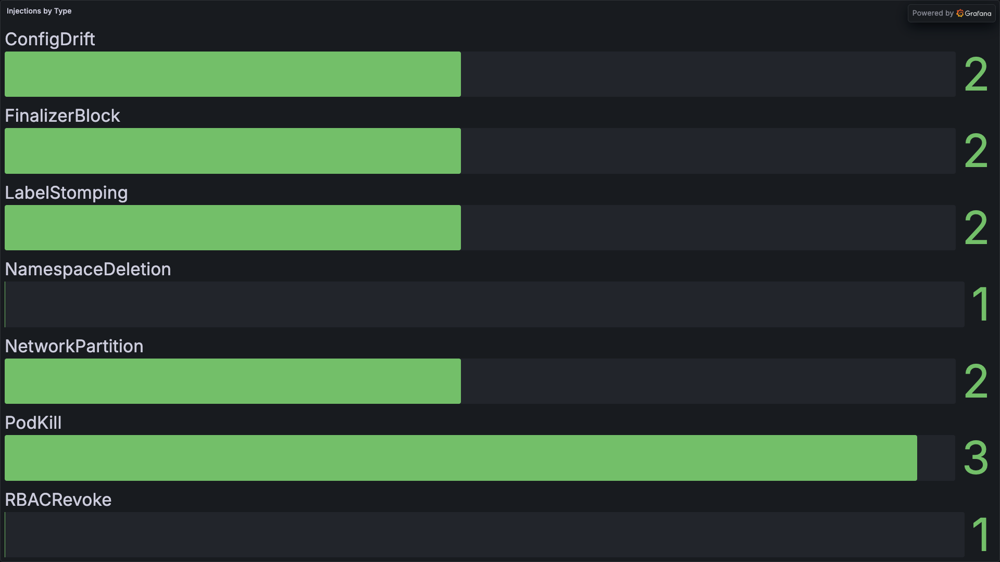
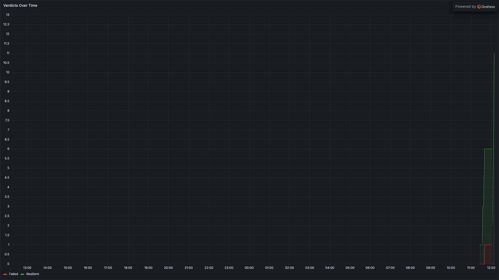
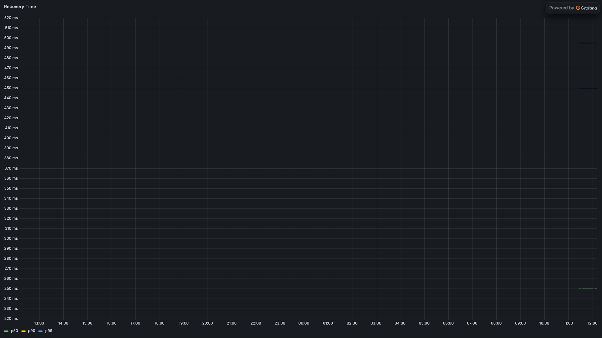
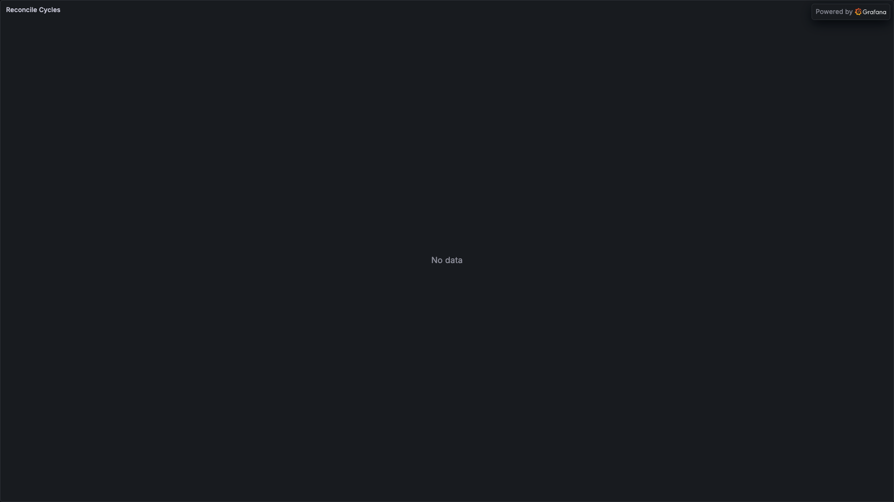

# Dashboard (Grafana)

The Grafana dashboard provides monitoring for chaos experiments via Prometheus metrics exported by the chaos controller. It includes 9 panels tracking experiment verdicts, recovery times, injections, and deviations.

## Overview

The dashboard visualizes five Prometheus metric families exposed by the chaos controller:

- Active experiment count
- Verdict distribution over time
- Injection counts by type
- Recovery time percentiles
- Reconcile cycle percentiles
- Deviation tracking by type

## Prerequisites

- Grafana Operator or Grafana instance
- Prometheus with ServiceMonitor configured for the chaos controller metrics endpoint
- Chaos controller running with metrics server enabled (default: `:8080/metrics`)

## Installation

Deploy the dashboard via Kustomize:

```bash
oc apply -k config/grafana/
```

This creates a `GrafanaDashboard` CR that the Grafana Operator will sync to your Grafana instance. If you're not using the Grafana Operator, you can manually import `config/grafana/dashboard.json` via the Grafana UI.

## Metrics Reference

The chaos controller exposes the following Prometheus metrics:

### `chaosexperiment_verdicts`

**Type:** Counter

**Labels:**
- `verdict`: Resilient, Degraded, Failed, Inconclusive

**Description:** Total count of experiments by verdict. Incremented when an experiment transitions to the Complete phase.

### `chaosexperiment_deviations`

**Type:** Counter

**Labels:**
- `deviation_type`: The type of deviation detected during the post-check phase

**Description:** Total count of deviations detected across all experiments. A single experiment can contribute multiple deviations.

### `chaosexperiment_injections`

**Type:** Counter

**Labels:**
- `injection_type`: PodKill, ConfigDrift, NetworkLatency, etc.

**Description:** Total count of injection events. Incremented when an experiment transitions to the Injecting phase.

### `chaosexperiment_active_experiments`

**Type:** Gauge

**Description:** Number of experiments currently in a non-terminal phase (Pending, Pre-check, Injecting, Observing, Post-check, Evaluating).

### `chaosexperiment_recovery_seconds`

**Type:** Histogram

**Buckets:** [1, 5, 10, 30, 60, 120, 300, 600, 1200, 1800]

**Description:** Time in seconds from injection start to recovery (post-check pass). Only recorded for experiments with a Resilient or Degraded verdict.

### `chaosexperiment_recovery_cycles`

**Type:** Histogram

**Buckets:** [1, 2, 3, 5, 10, 20, 50, 100]

**Description:** Number of reconcile cycles required for recovery. Only recorded for experiments with a Resilient or Degraded verdict.

## Panels

The dashboard includes 9 panels arranged in a 3-row grid:

### Active Experiments

**Type:** Stat

**Query:**
```promql
sum(chaosexperiment_active_experiments)
```

**Description:** Current count of running experiments. Shows the last non-null value.

{: .glightbox }

### Total Injections

**Type:** Stat

**Query:**
```promql
sum(chaosexperiment_injections)
```

**Description:** Total injection count across all experiments. Shows the last non-null value.

{: .glightbox }

### Deviations per Experiment

**Type:** Stat

**Query:**
```promql
sum(chaosexperiment_deviations) / sum(chaosexperiment_verdicts)
```

**Description:** Average number of deviations per experiment. Shows `-` if no experiments have completed.

{: .glightbox }

### Verdict Distribution

**Type:** Pie chart

**Query:**
```promql
sum by (verdict)(chaosexperiment_verdicts)
```

**Description:** Proportion of experiments by verdict (Resilient, Degraded, Failed, Inconclusive). Legend shows verdict labels. Color overrides:
- Resilient: green (#4caf50)
- Degraded: orange (#ff9800)
- Failed: red (#f44336)
- Inconclusive: gray (#9e9e9e)

{: .glightbox }

### Injections by Type

**Type:** Bar gauge (horizontal)

**Query:**
```promql
sum by (injection_type)(chaosexperiment_injections)
```

**Description:** Total injections grouped by type (PodKill, ConfigDrift, etc.). Bars show gradient fill with unfilled track.

{: .glightbox }

### Verdicts Over Time

**Type:** Time series (stacked area)

**Query:**
```promql
sum by (verdict)(chaosexperiment_verdicts)
```

**Description:** Stacked area chart showing verdict counts over time. Uses the same color overrides as the pie chart. Stacking mode: normal.

{: .glightbox }

### Deviations by Type

**Type:** Time series (stacked area)

**Query:**
```promql
sum by (deviation_type)(chaosexperiment_deviations)
```

**Description:** Stacked area chart showing deviation counts over time, grouped by type.

{: .glightbox }

### Recovery Time

**Type:** Time series

**Queries:**
```promql
# p50
histogram_quantile(0.50, sum by (le)(chaosexperiment_recovery_seconds_bucket))

# p90
histogram_quantile(0.90, sum by (le)(chaosexperiment_recovery_seconds_bucket))

# p99
histogram_quantile(0.99, sum by (le)(chaosexperiment_recovery_seconds_bucket))
```

**Description:** Recovery time percentiles (p50, p90, p99) in seconds. Shows how long it takes for operators to recover from chaos injections.

{: .glightbox }

### Reconcile Cycles

**Type:** Time series

**Queries:**
```promql
# p50
histogram_quantile(0.50, sum by (le)(chaosexperiment_recovery_cycles_bucket))

# p90
histogram_quantile(0.90, sum by (le)(chaosexperiment_recovery_cycles_bucket))

# p99
histogram_quantile(0.99, sum by (le)(chaosexperiment_recovery_cycles_bucket))
```

**Description:** Reconcile cycle percentiles (p50, p90, p99). Shows how many reconciliation loops are required for recovery.

{: .glightbox }

## Alerting Examples

Sample Prometheus alerting rules based on the metrics:

```yaml
groups:
  - name: chaos_experiments
    interval: 1m
    rules:
      - alert: HighFailureRate
        expr: |
          sum(rate(chaosexperiment_verdicts{verdict="Failed"}[1h])) /
          sum(rate(chaosexperiment_verdicts[1h])) > 0.2
        for: 10m
        labels:
          severity: warning
        annotations:
          summary: "Chaos experiment failure rate above 20%"
          description: "{{ $value | humanizePercentage }} of experiments failed in the last hour"

      - alert: SlowRecovery
        expr: |
          histogram_quantile(0.90,
            sum by (le)(rate(chaosexperiment_recovery_seconds_bucket[1h]))
          ) > 300
        for: 15m
        labels:
          severity: warning
        annotations:
          summary: "90th percentile recovery time exceeds 5 minutes"
          description: "p90 recovery time is {{ $value | humanizeDuration }}"

      - alert: HighDeviationRate
        expr: |
          sum(rate(chaosexperiment_deviations[1h])) /
          sum(rate(chaosexperiment_verdicts[1h])) > 3
        for: 10m
        labels:
          severity: info
        annotations:
          summary: "High deviation rate detected"
          description: "Average {{ $value | humanize }} deviations per experiment"

      - alert: StaleExperiments
        expr: chaosexperiment_active_experiments > 0
        for: 2h
        labels:
          severity: warning
        annotations:
          summary: "Experiments stuck in non-terminal phase"
          description: "{{ $value }} experiments have been running for over 2 hours"
```

## Customization

To modify the dashboard:

1. Edit `config/grafana/dashboard.json` directly
2. Or import into Grafana UI, make changes, and export back to JSON

### Adding Panels

When adding new panels, ensure you:

- Set `datasource.uid` to `${datasource}` (uses the dashboard variable)
- Place in the `panels` array with appropriate `gridPos` (h/w/x/y)
- Assign a unique `id` (current max is 9)

### Recording Rules

For high-cardinality queries (e.g., per-component recovery time), consider using Prometheus recording rules:

```yaml
groups:
  - name: chaos_recording_rules
    interval: 1m
    rules:
      - record: chaos:recovery_seconds:p90
        expr: |
          histogram_quantile(0.90,
            sum by (le, component)(rate(chaosexperiment_recovery_seconds_bucket[5m]))
          )

      - record: chaos:verdict_rate:1h
        expr: |
          sum by (verdict)(rate(chaosexperiment_verdicts[1h]))
```

Then reference the recorded metrics in the dashboard to improve query performance.
