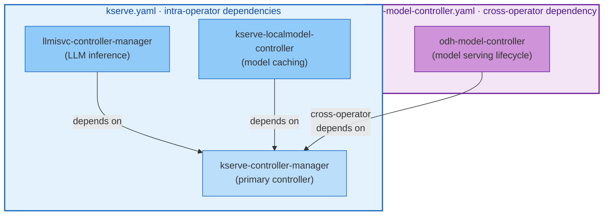

# Knowledge Models

Knowledge models are YAML files that describe what an operator manages. The chaos framework uses these models to understand which resources to monitor during experiments, what "healthy" looks like, and how to validate recovery.

## Why Knowledge Models Matter

Traditional chaos tools test infrastructure resilience: kill a pod, verify it restarts. But Kubernetes operators manage complex resource graphs—Deployments, Services, ConfigMaps, CRDs, webhooks, RBAC bindings—where the real question is:

**"When something breaks, does the operator restore everything to its intended state?"**

Knowledge models answer this by encoding:

- **Component inventory**: What resources does this operator manage?
- **Steady-state definition**: What conditions indicate the component is healthy?
- **Dependency graph**: Which components depend on each other?
- **Recovery expectations**: How long should the operator take to reconcile?

Without a knowledge model, the chaos framework can't distinguish between:

- A pod that's intentionally scaled to zero
- A pod that failed to recover from chaos
- A resource that doesn't exist yet because the operator hasn't reconciled

Knowledge models provide the semantic layer that makes operator-aware chaos testing possible.

## YAML Schema

### Top-Level Structure

```yaml
operator:
  name: string          # required: operator name
  namespace: string     # required: namespace where the operator runs
  repository: string    # optional: source repository URL
  version: string       # optional: operator version (e.g., "2.21.0") - required for versioned knowledge models
  platform: string      # optional: platform name (e.g., "OpenShift", "Kubernetes") - required for versioned knowledge models
  olmChannel: string    # optional: OLM channel (e.g., "stable", "fast") - required for versioned knowledge models

components:
  - name: string        # required: unique component name
    controller: string  # required: controller that manages this component
    managedResources: [] # required: at least one resource
    dependencies: []     # optional: other component names
    webhooks: []         # optional: webhook configurations
    finalizers: []       # optional: finalizers this component manages
    steadyState: {}      # optional: steady-state checks

recovery:
  reconcileTimeout: string    # required: e.g. "300s"
  maxReconcileCycles: int     # required: e.g. 10
```

### Operator Metadata

The `operator` section identifies the operator being modeled:

```yaml
operator:
  name: odh-model-controller
  namespace: opendatahub
  repository: https://github.com/opendatahub-io/odh-model-controller
  version: "2.21.0"
  platform: "OpenShift"
  olmChannel: "stable"
```

| Field | Required | Description |
|-------|----------|-------------|
| `name` | Yes | Operator name (must be unique across knowledge files) |
| `namespace` | Yes | Namespace where the operator's control plane runs |
| `repository` | No | Source repository URL for documentation purposes |
| `version` | No* | Operator version (e.g., "2.21.0") - **required for versioned knowledge models** |
| `platform` | No* | Platform name (e.g., "OpenShift", "Kubernetes") - **required for versioned knowledge models** |
| `olmChannel` | No* | OLM channel (e.g., "stable", "fast") - **required for versioned knowledge models** |

\* **Versioned knowledge models** (used with the upgrade diff engine) require `version`, `platform`, and `olmChannel` fields.

### Components

Each component represents a logical unit managed by the operator:

```yaml
components:
  - name: odh-model-controller
    controller: DataScienceCluster
    managedResources:
      - apiVersion: apps/v1
        kind: Deployment
        name: odh-model-controller
        namespace: opendatahub
```

| Field | Required | Description |
|-------|----------|-------------|
| `name` | Yes | Unique component identifier |
| `controller` | Yes | Controller that reconciles this component (e.g., CRD name or controller type) |
| `managedResources` | Yes | List of Kubernetes resources managed by this component (at least one) |
| `dependencies` | No | Other components this component depends on (see [Dependencies](#dependencies)) |
| `webhooks` | No | Admission webhooks managed by this component |
| `finalizers` | No | Finalizers this component adds to resources |
| `steadyState` | No | Steady-state verification checks |

### Managed Resources

Managed resources describe the Kubernetes objects the component creates and maintains:

```yaml
managedResources:
  - apiVersion: apps/v1
    kind: Deployment
    name: odh-model-controller
    namespace: opendatahub
    labels:
      control-plane: odh-model-controller
      app: odh-model-controller
    expectedSpec:
      replicas: 1

  - apiVersion: v1
    kind: ConfigMap
    name: inferenceservice-config
    namespace: opendatahub

  - apiVersion: rbac.authorization.k8s.io/v1
    kind: ClusterRoleBinding
    name: odh-model-controller-rolebinding-opendatahub
```

| Field | Required | Description |
|-------|----------|-------------|
| `apiVersion` | Yes | Kubernetes API version (e.g., "apps/v1", "v1") |
| `kind` | Yes | Resource kind (e.g., "Deployment", "ConfigMap") |
| `name` | Yes | Resource name |
| `namespace` | No | Resource namespace (omit for cluster-scoped resources) |
| `labels` | No | Expected labels (used for pod selection in fault injection) |
| `ownerRef` | No | Expected owner reference kind |
| `expectedSpec` | No | Expected spec fields (checked during steady-state verification) |

The framework uses `labels` to target resources for injection types like `PodKill` and `NetworkPartition`. It uses `expectedSpec` to verify the operator restored the correct configuration after chaos.

### Webhooks

Webhook configurations are critical for testing admission control resilience:

```yaml
webhooks:
  - name: mutating.pod.odh-model-controller.opendatahub.io
    type: mutating
    path: /mutate--v1-pod

  - name: validating.isvc.odh-model-controller.opendatahub.io
    type: validating
    path: /validate-serving-kserve-io-v1beta1-inferenceservice
```

| Field | Required | Description |
|-------|----------|-------------|
| `name` | Yes | Webhook configuration name (matches `ValidatingWebhookConfiguration` or `MutatingWebhookConfiguration` object) |
| `type` | Yes | Webhook type: `validating` or `mutating` |
| `path` | Yes | HTTP path the webhook server listens on |

These are used by the `WebhookDisrupt` injection type to test how the operator handles admission control failures.

### Finalizers

Document finalizers the component manages:

```yaml
finalizers:
  - odh.inferenceservice.finalizers
  - modelregistry.opendatahub.io/finalizer
  - runtimes.opendatahub.io/nim-cleanup-finalizer
```

The `FinalizerBlock` injection type uses this list to test finalizer handling by adding blocking finalizers to resources.

### Dependencies

Dependencies define the relationship between components, enabling collateral damage detection:

```yaml
components:
  - name: odh-model-controller
    controller: DataScienceCluster
    dependencies:
      - kserve  # cross-operator dependency (operator name)
    managedResources: [...]

  # In the kserve knowledge model:
  - name: llmisvc-controller-manager
    controller: KServe
    dependencies:
      - kserve-controller-manager  # intra-operator dependency (component name)
    managedResources: [...]
```

**Two dependency types:**



1. **Intra-operator**: Component name within the same knowledge file (e.g., `llmisvc-controller-manager` depends on `kserve-controller-manager`)
2. **Cross-operator**: Operator name across knowledge files (e.g., `odh-model-controller` depends on `kserve`)

When you inject chaos into a component, the framework automatically checks the steady state of all dependent components after recovery. If a dependent component fails its checks, the verdict downgrades from `Resilient` to `Degraded` (never to `Failed`, since collateral damage is a side effect, not the target's failure).

To enable dependency tracking, load multiple knowledge files:

```bash
# Load all knowledge files from a directory
odh-chaos run experiment.yaml --knowledge-dir knowledge/

# Or load multiple individual files
odh-chaos run experiment.yaml --knowledge kserve.yaml --knowledge odh-model-controller.yaml
```

### Steady State

Steady-state checks define what "healthy" means for this component:

```yaml
steadyState:
  checks:
    - type: conditionTrue
      apiVersion: apps/v1
      kind: Deployment
      name: odh-model-controller
      namespace: opendatahub
      conditionType: Available

    - type: resourceExists
      apiVersion: v1
      kind: ConfigMap
      name: inferenceservice-config
      namespace: opendatahub
  timeout: "60s"
```

**Check types:**

| Type | Description | Required Fields |
|------|-------------|----------------|
| `conditionTrue` | Verify a Kubernetes resource condition is `True` | `apiVersion`, `kind`, `name`, `namespace`, `conditionType` |
| `resourceExists` | Verify a resource exists | `apiVersion`, `kind`, `name`, `namespace` (if namespaced) |

The framework runs these checks:

- **Pre-injection**: Establish baseline (if checks fail, experiment is `Inconclusive`)
- **Post-recovery**: Verify the operator restored the component (if checks fail, verdict is `Failed` or `Degraded`)

### Recovery Expectations

Recovery expectations define how long the framework should wait for the operator to reconcile:

```yaml
recovery:
  reconcileTimeout: "300s"    # Maximum time to wait for full recovery
  maxReconcileCycles: 10       # Maximum reconcile cycles to tolerate
```

| Field | Required | Description |
|-------|----------|-------------|
| `reconcileTimeout` | Yes | Maximum time for the operator to restore all resources (e.g., "300s", "5m") |
| `maxReconcileCycles` | Yes | Maximum reconcile cycles before verdict downgrades to `Degraded` |

If the operator takes longer than `reconcileTimeout`, the verdict is `Failed`. If recovery completes but takes more than `maxReconcileCycles`, the verdict is `Degraded` (recovered, but inefficiently).

## Complete Example: odh-model-controller

```yaml
operator:
  name: odh-model-controller
  namespace: opendatahub
  repository: https://github.com/opendatahub-io/odh-model-controller

components:
  - name: odh-model-controller
    controller: DataScienceCluster
    managedResources:
      - apiVersion: apps/v1
        kind: Deployment
        name: odh-model-controller
        namespace: opendatahub
        labels:
          control-plane: odh-model-controller
          app: odh-model-controller
        expectedSpec:
          replicas: 1

      - apiVersion: v1
        kind: ConfigMap
        name: inferenceservice-config
        namespace: opendatahub

      - apiVersion: v1
        kind: ServiceAccount
        name: odh-model-controller
        namespace: opendatahub

      - apiVersion: v1
        kind: Secret
        name: odh-model-controller-webhook-cert
        namespace: opendatahub

      - apiVersion: rbac.authorization.k8s.io/v1
        kind: ClusterRoleBinding
        name: odh-model-controller-rolebinding-opendatahub

      - apiVersion: coordination.k8s.io/v1
        kind: Lease
        name: odh-model-controller.opendatahub.io
        namespace: opendatahub

    webhooks:
      - name: mutating.pod.odh-model-controller.opendatahub.io
        type: mutating
        path: /mutate--v1-pod

      - name: minferencegraph-v1alpha1.odh-model-controller.opendatahub.io
        type: mutating
        path: /mutate-serving-kserve-io-v1alpha1-inferencegraph

      - name: minferenceservice-v1beta1.odh-model-controller.opendatahub.io
        type: mutating
        path: /mutate-serving-kserve-io-v1beta1-inferenceservice

      - name: validating.nim.account.odh-model-controller.opendatahub.io
        type: validating
        path: /validate-nim-opendatahub-io-v1-account

      - name: validating.llmisvc.odh-model-controller.opendatahub.io
        type: validating
        path: /validate-serving-kserve-io-v1alpha1-llminferenceservice

      - name: vinferencegraph-v1alpha1.odh-model-controller.opendatahub.io
        type: validating
        path: /validate-serving-kserve-io-v1alpha1-inferencegraph

      - name: validating.isvc.odh-model-controller.opendatahub.io
        type: validating
        path: /validate-serving-kserve-io-v1beta1-inferenceservice

    finalizers:
      - odh.inferenceservice.finalizers
      - modelregistry.opendatahub.io/finalizer
      - runtimes.opendatahub.io/nim-cleanup-finalizer

    dependencies:
      - kserve

    steadyState:
      checks:
        - type: conditionTrue
          apiVersion: apps/v1
          kind: Deployment
          name: odh-model-controller
          namespace: opendatahub
          conditionType: Available
      timeout: "60s"

recovery:
  reconcileTimeout: "300s"
  maxReconcileCycles: 10
```

## Writing a Knowledge Model

### 1. Identify Components

Start by identifying the logical components your operator manages. For most operators, this maps to:

- Controllers (one component per controller binary)
- Webhooks (may be part of the controller component or separate)
- Optional components (features that can be enabled/disabled)

**Example**: KServe has 4 components:

- `kserve-controller-manager` (main controller)
- `llmisvc-controller-manager` (LLM inference controller)
- `kserve-localmodel-controller-manager` (local model caching)
- `kserve-localmodelnode-agent` (node-level DaemonSet)

### 2. Enumerate Managed Resources

For each component, list all resources it creates:

```bash
# Find Deployments
kubectl get deployments -n <namespace> -l app.kubernetes.io/part-of=<operator>

# Find ConfigMaps
kubectl get configmaps -n <namespace> -l app.kubernetes.io/managed-by=<operator>

# Find RBAC (cluster-wide)
kubectl get clusterrolebindings | grep <operator>

# Find webhooks
kubectl get validatingwebhookconfigurations,mutatingwebhookconfigurations | grep <operator>
```

Document each resource's:

- API version and kind
- Name and namespace
- Expected labels (for pod selection during chaos)
- Expected spec fields (for post-recovery validation)

### 3. Define Steady State

Choose checks that prove the component is functional:

**For controllers with Deployments:**

```yaml
steadyState:
  checks:
    - type: conditionTrue
      apiVersion: apps/v1
      kind: Deployment
      name: my-controller
      namespace: my-namespace
      conditionType: Available
  timeout: "60s"
```

**For DaemonSets or optional resources:**

```yaml
steadyState:
  checks:
    - type: resourceExists
      apiVersion: apps/v1
      kind: DaemonSet
      name: my-agent
      namespace: my-namespace
  timeout: "60s"
```

**For CRD-managed resources:**

```yaml
steadyState:
  checks:
    - type: conditionTrue
      apiVersion: myapi.io/v1
      kind: MyCustomResource
      name: my-instance
      namespace: my-namespace
      conditionType: Ready
  timeout: "60s"
```

!!! tip "Steady-state timeout"
    Set `timeout` to the maximum time you expect the resource to become ready after creation. For most Deployments, 60 seconds is sufficient. For CRDs with complex initialization, use longer timeouts.

### 4. Document Dependencies

Map out which components depend on each other:

```yaml
# Component A provides an API that Component B consumes
- name: component-b
  dependencies:
    - component-a  # intra-operator dependency
```

```yaml
# Component depends on another operator
- name: my-component
  dependencies:
    - other-operator  # cross-operator dependency (operator name, not component)
```

### 5. Set Recovery Expectations

Base these on your operator's SLO:

```yaml
recovery:
  reconcileTimeout: "300s"      # 5 minutes for full recovery
  maxReconcileCycles: 10         # Tolerate up to 10 reconcile cycles
```

**Guidelines:**

- `reconcileTimeout`: Set to 2-3x your normal reconcile time for the most complex resource
- `maxReconcileCycles`: Operators should converge in 1-2 cycles normally; allow 10 for chaos scenarios

### 6. Validate

```bash
# Local validation (no cluster access)
odh-chaos validate knowledge.yaml --knowledge

# Pre-flight checks (validates against live cluster)
odh-chaos preflight --knowledge knowledge.yaml
```

## How Knowledge Models Are Used

### During Steady-State Checks

**Pre-injection (baseline):**

1. Framework loads knowledge model for the target operator
2. Finds the component specified in the experiment
3. Runs all `steadyState.checks` for that component
4. If any check fails, experiment is `Inconclusive` (baseline not established)

**Post-recovery:**

1. Waits for `recovery.reconcileTimeout`
2. Runs the same steady-state checks
3. If checks pass, evaluates verdict based on recovery time and reconcile cycles
4. If checks fail, verdict is `Failed`

### During Recovery Validation

The framework uses `managedResources` to verify the operator restored everything:

1. For each managed resource, query the cluster
2. Compare current state to `expectedSpec` fields
3. Count how many reconcile cycles occurred
4. If all resources exist and match expectations within `reconcileTimeout`, mark as recovered

### During Collateral Detection

When multiple knowledge models are loaded:

1. Framework builds a dependency graph
2. During experiment evaluation, resolves which components depend on the faulted target
3. Runs steady-state checks for all dependent components
4. If a dependent component fails, downgrades verdict to `Degraded` and reports collateral findings

**Example scenario:**

```yaml
# odh-model-controller knowledge model
- name: odh-model-controller
  dependencies:
    - kserve  # cross-operator dependency

# Experiment kills kserve-controller-manager pod
# After kserve recovers, framework also checks odh-model-controller
# If odh-model-controller is degraded, verdict: Degraded (collateral damage)
```

## Best Practices

### Do:

✅ **Model reality**: Describe what your operator actually creates, not what you wish it created

✅ **Test incrementally**: Start with one component, validate, add more

✅ **Use specific labels**: Include all identifying labels for accurate pod targeting

✅ **Document webhooks**: Critical for testing admission control resilience

✅ **Version your models**: Keep knowledge models in the operator repo alongside code

### Don't:

❌ **Over-specify**: Only include `expectedSpec` fields that matter for correctness (not cosmetic fields like annotations)

❌ **Assume reconciliation is instant**: Set realistic `reconcileTimeout` values

❌ **Ignore dependencies**: Collateral damage detection only works if dependencies are modeled

❌ **Skip validation**: Always run `validate --knowledge` before using in experiments

## Troubleshooting

### "Unknown dependency: X"

You referenced a component or operator name that doesn't exist in any loaded knowledge model.

**Fix**: Load all required knowledge files:

```bash
odh-chaos run experiment.yaml --knowledge-dir knowledge/
```

### "Steady-state check failed: condition Available not found"

The resource exists but doesn't have the expected condition.

**Fix**: Check the actual resource:

```bash
kubectl get deployment <name> -n <namespace> -o yaml
# Look at .status.conditions[]
```

Adjust your knowledge model to match reality.

### "Resource not found during pre-check"

The resource declared in `managedResources` doesn't exist on the cluster.

**Fix**: Either:

1. Create the resource (if it should exist)
2. Remove it from the knowledge model (if it's optional)
3. Change the check type from `conditionTrue` to `resourceExists` (if existence is sufficient)

### "maxReconcileCycles exceeded"

The operator is reconciling too many times, indicating inefficient recovery.

**Fix**: This is a real finding—investigate why the operator needed so many cycles. Common causes:

- Finalizer loops
- Race conditions in status updates
- Missing owner references causing orphaned resources

## Generating Fuzz Tests from Knowledge Models

Knowledge models can automatically generate fuzz test files that exercise your operator's reconciler with architecturally relevant fault combinations:

```bash
odh-chaos generate fuzz-targets --knowledge knowledge/kserve.yaml --output fuzz_kserve_test.go
```

The generator reads your knowledge model and produces:

- **Seed objects** from `managedResources` (typed Go objects with labels and expected spec)
- **Invariants** from `steadyState.checks` (verify resources survive reconciliation)
- **Seed corpus entries** from architectural traits (webhooks produce webhook-denial seeds, finalizers produce conflict seeds, etc.)

See the [Fuzz Quick Start](../getting-started/fuzz-quickstart.md) for details on the generated test structure, and the [CLI Reference](../reference/cli-commands.md#odh-chaos-generate-fuzz-targets) for command options.

## Versioned Knowledge Models

Versioned knowledge models enable the upgrade diff engine to detect structural changes between operator releases. They follow a directory layout convention with version metadata.

### Directory Layout

```
knowledge/
├── v2.20/
│   ├── kserve.yaml
│   ├── odh-model-controller.yaml
│   └── crds/
│       ├── inferenceservice.yaml
│       └── llminferenceservice.yaml
├── v2.21/
│   ├── kserve.yaml
│   ├── odh-model-controller.yaml
│   └── crds/
│       ├── inferenceservice.yaml
│       └── llminferenceservice.yaml
└── v2.22/
    └── ...
```

**Conventions:**

- Directory name matches the operator version (e.g., `v2.20`, `v2.21`)
- Each directory contains knowledge YAML files for all operators in that release
- CRD definitions live in a `crds/` subdirectory
- All knowledge models in a versioned directory must include `version`, `platform`, and `olmChannel` metadata

### Metadata Fields

Versioned knowledge models require three additional fields in the `operator` section:

```yaml
operator:
  name: kserve-operator
  namespace: kserve
  repository: https://github.com/kserve/kserve
  version: "2.21.0"          # Semantic version matching directory name
  platform: "OpenShift"       # Platform (OpenShift, Kubernetes, etc.)
  olmChannel: "stable"        # OLM channel (stable, fast, candidate)
```

| Field | Format | Description |
|-------|--------|-------------|
| `version` | Semantic version | Operator version (e.g., "2.21.0"). Must match directory name prefix |
| `platform` | String | Target platform (e.g., "OpenShift", "Kubernetes"). Used for platform-specific diffs |
| `olmChannel` | String | OLM channel (e.g., "stable", "fast"). Tracks release stream |

### CRD Files

Place CRD manifests in the `crds/` subdirectory. The diff engine uses these for deep schema analysis.

```yaml
# knowledge/v2.21/crds/inferenceservice.yaml
apiVersion: apiextensions.k8s.io/v1
kind: CustomResourceDefinition
metadata:
  name: inferenceservices.serving.kserve.io
spec:
  versions:
    - name: v1beta1
      schema:
        openAPIV3Schema:
          type: object
          properties:
            spec:
              type: object
              properties:
                predictor:
                  type: object
                # ... full CRD schema
```

### Validation

Validate versioned knowledge models with:

```bash
odh-chaos validate-version knowledge/v2.21/
```

Checks:

- All knowledge models have required metadata fields
- CRD files exist and are valid
- Directory name matches `version` field
- No duplicate operator names

### Using Versioned Models with Diff Engine

```bash
# Compare two versions
odh-chaos diff --old knowledge/v2.20/ --new knowledge/v2.21/

# Generate upgrade test suite
odh-chaos simulate-upgrade \
  --from knowledge/v2.20/ \
  --to knowledge/v2.21/ \
  --output experiments/upgrade-suite/
```

See [Upgrade Testing Guide](upgrade-testing.md) for full workflow.

## Next Steps

- Learn about [Controller Mode](controller-mode.md) to run experiments as CRDs
- Generate fuzz tests with [Fuzz Quick Start](../getting-started/fuzz-quickstart.md)
- Test operator upgrades with [Upgrade Testing Guide](upgrade-testing.md)
- Explore the [knowledge/](https://github.com/opendatahub-io/odh-platform-chaos/tree/main/knowledge) directory for real-world examples
