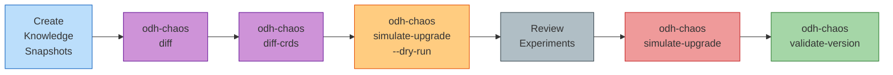

# Upgrade Testing

Test and validate RHOAI/ODH operator upgrades before they hit production. The upgrade testing workflow detects breaking changes between versions and simulates upgrade-like disruptions using the existing chaos injection engine.

## Why Upgrade Testing Matters

Operator upgrades are where architectural assumptions break. RHOAI 2.x to 3.x migrations caused real production incidents:

- **Component renaming**: `odh-dashboard` became `rhods-dashboard`, breaking label selectors and monitoring queries
- **Namespace moves**: Components migrated from `opendatahub` to `redhat-ods-applications`, breaking NetworkPolicies and RBAC bindings
- **CRD schema changes**: Required fields added to InferenceService specs, failing existing workloads
- **Webhook additions**: New validation webhooks rejected previously-valid resources
- **Dependency ordering changes**: KServe initialization timing shifted, causing race conditions in dependent operators

Traditional upgrade testing catches runtime errors (pod crash loops, API server rejections), but misses **resilience degradation**. The upgrade simulation workflow tests what happens when:

- Old-name pods are terminated and only new-name pods exist
- Cross-namespace communication is disrupted during namespace migrations
- Webhooks are suddenly removed or added mid-flight
- New dependencies become unavailable

These are the failure modes that surface in production after the upgrade completes, when chaos occurs naturally.

## Workflow Overview



**Step 1**: Snapshot knowledge models for both versions (source and target)

**Step 2**: Detect architectural differences with `odh-chaos diff`

**Step 3**: Analyze CRD schema changes with `odh-chaos diff-crds`

**Step 4**: Preview upgrade experiments with `--dry-run`

**Step 5**: Review generated experiments for architectural correctness

**Step 6**: Execute upgrade simulation and collect results

**Step 7**: Validate cluster state matches target version

## Versioned Knowledge Models

Knowledge models now support version metadata to enable diff-based upgrade testing. Versioned models live in a structured directory hierarchy:

```
knowledge/
├── odh/
│   └── v2.10/
│       ├── dashboard.yaml
│       ├── kserve.yaml
│       └── odh-model-controller.yaml
└── rhoai/
    └── v3.3/
        ├── dashboard.yaml
        ├── kserve.yaml
        └── odh-model-controller.yaml
```

### Version Metadata Fields

Three new fields in the `operator` section identify the version:

```yaml
operator:
  name: dashboard
  namespace: redhat-ods-applications
  repository: https://github.com/opendatahub-io/odh-dashboard
  version: "3.3.1"           # Operator version
  platform: rhoai             # Platform identifier (rhoai, odh, custom)
  olmChannel: stable-3.3      # OLM subscription channel
```

| Field | Required | Description |
|-------|----------|-------------|
| `version` | Yes | Semantic version string (e.g., "3.3.1", "2.10.0") |
| `platform` | Yes | Platform identifier used in diff output (e.g., "rhoai", "odh") |
| `olmChannel` | No | OLM channel for subscription-based deployments |

### Creating a Version Snapshot

To create a versioned knowledge snapshot from a live cluster:

**1. Copy current knowledge files to a versioned directory:**

```bash
mkdir -p knowledge/rhoai/v3.3
cp knowledge/rhoai/*.yaml knowledge/rhoai/v3.3/
```

**2. Add version metadata to each file:**

```yaml
operator:
  name: dashboard
  namespace: redhat-ods-applications
  version: "3.3.1"
  platform: rhoai
  olmChannel: stable-3.3
```

**3. Validate the snapshot:**

```bash
odh-chaos validate --knowledge-dir knowledge/rhoai/v3.3/
```

!!! tip "Version snapshots are immutable"
    Once created, versioned knowledge directories should not be modified. They represent the architectural state at a specific release. To update for a new version, create a new versioned directory.

## Comparing Versions

The `odh-chaos diff` command detects architectural changes between two knowledge snapshots:

```bash
odh-chaos diff --source knowledge/odh/v2.10/ --target knowledge/rhoai/v3.3/
```

### Example Output

```
Comparing knowledge models:
  Source: knowledge/odh/v2.10/ (platform: odh, 15 operators)
  Target: knowledge/rhoai/v3.3/ (platform: rhoai, 11 operators)

Component Changes:
  dashboard.odh-dashboard → dashboard.rhods-dashboard [BREAKING: Component rename]
    - Deployment: odh-dashboard → rhods-dashboard (namespace: opendatahub → redhat-ods-applications)
    - Service: odh-dashboard → rhods-dashboard (namespace: opendatahub → redhat-ods-applications)
    - ConfigMap: odh-dashboard-config → rhods-dashboard-config (namespace: opendatahub → redhat-ods-applications)

  kserve.kserve-controller-manager [BREAKING: Namespace move]
    - Namespace: opendatahub → redhat-ods-applications

  odh-model-controller.odh-model-controller [BREAKING: Webhook added]
    + Webhook: validating.nim.account.odh-model-controller.opendatahub.io (type: validating)

Operator Changes:
  - codeflare [BREAKING: Operator removed]
  - modelmesh [BREAKING: Operator removed]
  - data-science-pipelines [BREAKING: Operator removed]

Summary:
  15 breaking changes detected
  3 warnings
  8 informational changes
```

### Filtering by Severity

Use `--breaking` to show only breaking changes:

```bash
odh-chaos diff --source knowledge/odh/v2.10/ --target knowledge/rhoai/v3.3/ --breaking
```

### Machine-Readable Output

For CI integration, use JSON format:

```bash
odh-chaos diff --source knowledge/odh/v2.10/ --target knowledge/rhoai/v3.3/ --format json
```

```json
{
  "source": {
    "path": "knowledge/odh/v2.10/",
    "platform": "odh",
    "operatorCount": 15
  },
  "target": {
    "path": "knowledge/rhoai/v3.3/",
    "platform": "rhoai",
    "operatorCount": 11
  },
  "changes": [
    {
      "type": "ComponentRename",
      "severity": "Breaking",
      "operator": "dashboard",
      "source": "odh-dashboard",
      "target": "rhods-dashboard",
      "details": {
        "namespaceChanged": true,
        "sourceNamespace": "opendatahub",
        "targetNamespace": "redhat-ods-applications"
      }
    }
  ],
  "summary": {
    "breaking": 15,
    "warnings": 3,
    "info": 8
  }
}
```

## CRD Schema Diffing

The `odh-chaos diff-crds` command analyzes Custom Resource Definition schema changes between versions:

```bash
# Extract CRDs from source cluster
oc get crd inferenceservices.serving.kserve.io -o yaml > crds-source/inferenceservice.yaml

# Extract CRDs from target cluster
oc get crd inferenceservices.serving.kserve.io -o yaml > crds-target/inferenceservice.yaml

# Diff the schemas
odh-chaos diff-crds --source crds-source/ --target crds-target/
```

### Example Output

```
CRD Schema Changes:
  inferenceservices.serving.kserve.io

    API Version: v1beta1
      spec.predictor.llm [BREAKING: Field removed]
      spec.predictor.runtime [INFO: Field added]
      spec.predictor.serviceAccountName [BREAKING: Required added]
      spec.transformer.timeout [WARNING: Default changed] (60s → 120s)

    API Version: v1alpha1 [BREAKING: API version removed]

Summary:
  3 breaking changes
  1 warning
  1 informational change
```

### Severity Levels

| Severity | Change Type | Impact |
|----------|------------|--------|
| **Breaking** | Field removal | Existing resources with this field will fail validation |
| **Breaking** | Type change | Field type incompatibility (e.g., string → integer) |
| **Breaking** | Required field added | Resources without this field will be rejected |
| **Breaking** | Enum value removed | Resources using removed values will fail |
| **Breaking** | API version removed | Resources using removed version become inaccessible |
| **Warning** | Default value changed | Behavior changes for resources that don't specify the field |
| **Info** | Field added | New optional field available |
| **Info** | Enum value added | New valid option available |

!!! warning "Breaking changes require migration"
    CRD breaking changes typically require updating existing custom resources before or during the upgrade. Plan for migration scripts or admission webhooks that transform old resources to the new schema.

## Simulating Upgrades

The `odh-chaos simulate-upgrade` command generates and executes chaos experiments based on detected architectural differences:

```bash
# Preview experiments without executing
odh-chaos simulate-upgrade \
  --source knowledge/odh/v2.10/ \
  --target knowledge/rhoai/v3.3/ \
  --dry-run

# Execute upgrade simulation
odh-chaos simulate-upgrade \
  --source knowledge/odh/v2.10/ \
  --target knowledge/rhoai/v3.3/
```

### Diff-to-Experiment Mapping

The simulation engine maps architectural changes to chaos injection types that test upgrade resilience:

| Change Type | Injection Type | What It Tests |
|-------------|----------------|---------------|
| Component rename | PodKill | Recovery after old-name pods are terminated |
| Namespace move | NetworkPartition | Cross-namespace communication during migration |
| Webhook removal | WebhookDisrupt | Behavior when validation is removed |
| Webhook addition | WebhookDisrupt | Impact of new validation enforcement |
| Dependency added | PodKill | Resilience when new dependency is unavailable |
| Dependency removed | NetworkPartition | Isolation from removed dependencies |
| Resource moved | PodKill + NetworkPartition | Recovery after resource relocation |

**Example:** For the `odh-dashboard` → `rhods-dashboard` rename, the simulation:

1. Terminates all `odh-dashboard` pods (simulating pod name change)
2. Disrupts network to old namespace `opendatahub` (simulating namespace move)
3. Validates that dependent components recover correctly

### Dry-Run Mode

Use `--dry-run` to preview generated experiments without executing them:

```bash
odh-chaos simulate-upgrade \
  --source knowledge/odh/v2.10/ \
  --target knowledge/rhoai/v3.3/ \
  --dry-run
```

Output:

```
Upgrade Simulation Plan (DRY RUN):

Experiment 1: dashboard-rename-recovery
  Type: PodKill
  Target: dashboard/rhods-dashboard
  Reason: Component rename detected (odh-dashboard → rhods-dashboard)
  Injection: Kill all pods matching label deployment=rhods-dashboard
  Validation: Verify rhods-dashboard Deployment reaches Available=True within 300s

Experiment 2: dashboard-namespace-migration
  Type: NetworkPartition
  Target: dashboard/rhods-dashboard
  Reason: Namespace move detected (opendatahub → redhat-ods-applications)
  Injection: Partition network between opendatahub and redhat-ods-applications
  Validation: Verify cross-namespace communication recovers

Experiment 3: odh-model-controller-webhook-enforcement
  Type: WebhookDisrupt
  Target: odh-model-controller/odh-model-controller
  Reason: Webhook added (validating.nim.account.odh-model-controller.opendatahub.io)
  Injection: Inject webhook failures for 60s
  Validation: Verify resources are validated correctly after webhook recovery

Total experiments: 3
Estimated runtime: 15m
```

Review the experiments for architectural correctness before executing.

!!! tip "Customize generated experiments"
    The `simulate-upgrade` command writes experiment YAML files to `./upgrade-experiments/` by default. Use `--output-dir` to specify a custom location. You can edit these files before execution to adjust timeouts, injection parameters, or validation criteria.

## Validating Cluster Version

The `odh-chaos validate-version` command verifies that a cluster matches a specific knowledge snapshot:

```bash
# Validate pre-upgrade state (cluster should match source version)
odh-chaos validate-version --knowledge-dir knowledge/odh/v2.10/

# Validate post-upgrade state (cluster should match target version)
odh-chaos validate-version --knowledge-dir knowledge/rhoai/v3.3/
```

### Example Output

```
Validating cluster against knowledge snapshot:
  Path: knowledge/rhoai/v3.3/
  Platform: rhoai
  Expected version: 3.3.1

Operator: dashboard (version: 3.3.1) [MATCH]
  Component: rhods-dashboard [OK]
    ✓ Deployment rhods-dashboard exists in redhat-ods-applications
    ✓ Deployment rhods-dashboard is Available
    ✓ Service rhods-dashboard exists

Operator: kserve (version: 0.13.1) [MATCH]
  Component: kserve-controller-manager [OK]
    ✓ Deployment kserve-controller-manager exists in redhat-ods-applications
    ✓ Deployment kserve-controller-manager is Available

Validation: PASS
All components match target version 3.3.1
```

### Use Cases

**Pre-upgrade gate**: Validate that the source cluster is in the expected state before starting an upgrade. If validation fails, the cluster has drifted from the source version and may have unknown state.

**Post-upgrade verification**: Confirm that the upgrade completed successfully and the cluster now matches the target version. Validation failures indicate incomplete upgrades or rollback scenarios.

!!! warning "Version drift detection"
    If `validate-version` fails on a cluster that should match the knowledge snapshot, investigate drift. Common causes: manual changes, partially-applied hotfixes, incomplete rollbacks, or OLM subscription channel mismatches.

## End-to-End Example

Full workflow for testing an ODH 2.10 → RHOAI 3.3 upgrade:

```bash
# Step 1: Compare versions to understand changes
odh-chaos diff \
  --source knowledge/odh/v2.10/ \
  --target knowledge/rhoai/v3.3/

# Step 2: Analyze CRD schema changes
odh-chaos diff-crds \
  --source crds-odh-2.10/ \
  --target crds-rhoai-3.3/

# Step 3: Preview upgrade experiments
odh-chaos simulate-upgrade \
  --source knowledge/odh/v2.10/ \
  --target knowledge/rhoai/v3.3/ \
  --dry-run

# Step 4: Validate pre-upgrade state
odh-chaos validate-version --knowledge-dir knowledge/odh/v2.10/

# Step 5: Run upgrade simulation
odh-chaos simulate-upgrade \
  --source knowledge/odh/v2.10/ \
  --target knowledge/rhoai/v3.3/

# Step 6: Validate post-upgrade state
odh-chaos validate-version --knowledge-dir knowledge/rhoai/v3.3/
```

### Expected Results

**Step 1 (diff)**: Identifies 15 breaking changes, 3 warnings. Key changes are component renames and namespace moves.

**Step 2 (diff-crds)**: Detects 1 breaking CRD change (required field added to InferenceService). Plan to update existing InferenceService resources.

**Step 3 (dry-run)**: Generates 12 experiments covering renames, namespace migrations, and webhook changes. Estimated runtime 45 minutes.

**Step 4 (validate pre-upgrade)**: All components match ODH 2.10 baseline. Ready for upgrade.

**Step 5 (simulate-upgrade)**: Executes 12 experiments. Results:
- 10 experiments: Resilient (components recovered within SLO)
- 2 experiments: Degraded (odh-model-controller required 15 reconcile cycles after webhook addition)

**Step 6 (validate post-upgrade)**: All components match RHOAI 3.3 target. Upgrade successful.

**Findings**: The webhook addition to odh-model-controller causes inefficient reconciliation. Investigate controller logic for optimization before production rollout.

!!! tip "Run simulations in pre-production"
    Upgrade simulations inject real chaos into the cluster. Run them in dedicated test environments that mirror production topology (same namespace layout, RBAC policies, NetworkPolicies). Do not run simulations in production.

## Upgrade Playbooks

Upgrade playbooks automate multi-step upgrade paths by orchestrating OLM channel hops, pre-migration tasks, chaos-based resilience validation, and post-upgrade verification. Instead of manually triggering each step, define a YAML playbook that executes the entire upgrade workflow with resume-on-failure support.

### Playbook Format

An upgrade playbook is a YAML file defining the source version, target version, the OLM channel hop path, and a sequence of steps to execute:

```yaml
apiVersion: chaos.opendatahub.io/v1alpha1
kind: UpgradePlaybook
metadata:
  name: rhoai-2.10-to-3.3
  description: "Upgrade RHOAI from 2.10 to 3.3 with pre-migration and post-validation"

upgrade:
  source:
    knowledgeDir: knowledge/rhoai/v2.10/
    version: "2.10"
  target:
    knowledgeDir: knowledge/rhoai/v3.3/
    version: "3.3"

  path:
    operator: rhods-operator
    namespace: redhat-ods-operator
    hops:
      - channel: stable-2.16
        maxWait: 15m
      - channel: stable-3.0
        maxWait: 20m
      - channel: stable-3.3
        maxWait: 20m

  steps:
    - name: validate-source-version
      type: validate-version
    - name: migrate-dashboard-configmaps
      type: kubectl
      commands:
        - "oc get configmap -n opendatahub -l app=odh-dashboard --no-headers"
    - name: trigger-upgrade
      type: olm
    - name: post-upgrade-resilience
      type: chaos
      experiments:
        - experiments/dashboard/pod-kill.yaml
    - name: validate-target-version
      type: validate-version
```

### Step Types

Playbooks support five step types:

| Step Type | Description | Parameters |
|-----------|-------------|------------|
| `validate-version` | Verify cluster state matches knowledge snapshot | Uses source/target `knowledgeDir` from playbook metadata |
| `kubectl` | Run kubectl/oc commands | `commands` (array of shell commands to execute) |
| `manual` | Pause for operator intervention | `description` (instructions for operator), optional `autoCheck` (command to auto-verify completion) |
| `olm` | Trigger OLM channel hops | Uses `path.hops` from playbook metadata |
| `chaos` | Execute chaos experiments | `experiments` (array of experiment YAML file paths) |

### Running a Playbook

Execute an upgrade playbook with `odh-chaos upgrade run`:

```bash
odh-chaos upgrade run --playbook knowledge/rhoai/upgrades/v2.10-to-v3.3.yaml
```

**What happens:**

1. Creates a state file in `.upgrade-state/` to track progress
2. Executes each step sequentially
3. For `validate-version` steps, compares cluster state to knowledge snapshot
4. For `kubectl` steps, runs commands and captures output
5. For `manual` steps, pauses and waits for operator confirmation (or runs `autoCheck` in CI mode)
6. For `olm` steps, patches Subscription channel and monitors CSV installation
7. For `chaos` steps, runs experiments and collects verdicts
8. Saves state after each step for resume-on-failure

### Discovering Available Channels

Before writing a playbook, discover available OLM channels for an operator:

```bash
odh-chaos upgrade discover \
  --operator rhods-operator \
  --namespace redhat-ods-operator
```

Output:

```
Available channels for rhods-operator:
  stable-2.10 (installed: 2.10.0)
  stable-2.16 (latest: 2.16.3)
  stable-3.0 (latest: 3.0.2)
  stable-3.3 (latest: 3.3.1)

Current subscription: stable-2.10
```

Use `--format json` for machine-readable output.

### Triggering Single Hops

For simple upgrades (single channel hop), use `odh-chaos upgrade trigger` instead of writing a full playbook:

```bash
odh-chaos upgrade trigger \
  --operator rhods-operator \
  --namespace redhat-ods-operator \
  --channel stable-3.3
```

This patches the Subscription and monitors the upgrade until the new CSV is installed or the timeout expires.

### Monitoring In-Progress Upgrades

Attach to an already-running upgrade (triggered externally or by another process):

```bash
odh-chaos upgrade monitor \
  --operator rhods-operator \
  --namespace redhat-ods-operator \
  --timeout 30m
```

The monitor command watches CSV transitions and prints status updates until the upgrade completes or fails.

### Resume on Failure

If an upgrade playbook fails mid-execution, resume from the failed step:

```bash
# Resume from the last failed step
odh-chaos upgrade run --playbook playbook.yaml --resume-from migrate-dashboard-configmaps

# Force resume (skip step validation and start from specified step)
odh-chaos upgrade run --playbook playbook.yaml --force-resume --resume-from trigger-upgrade
```

State files are stored in `.upgrade-state/<playbook-name>/` with timestamps. Use `--state-dir` to customize the location.

### CI Mode

For unattended execution in CI pipelines:

```bash
odh-chaos upgrade run \
  --playbook playbook.yaml \
  --skip-manual \
  --allow-shell
```

**Flags:**

| Flag | Behavior |
|------|----------|
| `--skip-manual` | Auto-proceed through manual steps using `autoCheck` commands |
| `--allow-shell` | Allow shell command execution (kubectl, oc) without prompts |

If a manual step lacks an `autoCheck` command, it is skipped with a warning in `--skip-manual` mode.

### Dry-Run Mode

Preview playbook execution without making changes:

```bash
odh-chaos upgrade run --playbook playbook.yaml --dry-run
```

Dry-run mode prints the execution plan and validates all steps, but does not patch Subscriptions, run kubectl commands, or execute chaos experiments.

### Example Playbook

The following playbook upgrades RHOAI from 2.10 to 3.3 with pre-migration and post-validation:

```yaml
apiVersion: chaos.opendatahub.io/v1alpha1
kind: UpgradePlaybook
metadata:
  name: rhoai-2.10-to-3.3
  description: "Upgrade RHOAI from 2.10 to 3.3 with pre-migration and post-validation"

upgrade:
  source:
    knowledgeDir: knowledge/rhoai/v2.10/
    version: "2.10"
  target:
    knowledgeDir: knowledge/rhoai/v3.3/
    version: "3.3"

  path:
    operator: rhods-operator
    namespace: redhat-ods-operator
    hops:
      - channel: stable-2.16
        maxWait: 15m
      - channel: stable-3.0
        maxWait: 20m
      - channel: stable-3.3
        maxWait: 20m

  steps:
    # Pre-upgrade: verify cluster is at expected source version
    - name: validate-source-version
      type: validate-version

    # Pre-upgrade: migrate dashboard ConfigMaps to new namespace
    - name: migrate-dashboard-configmaps
      type: kubectl
      commands:
        - "oc get configmap -n opendatahub -l app=odh-dashboard --no-headers 2>/dev/null | wc -l | xargs -I{} echo '{} configmaps found in opendatahub namespace'"
      verify:
        type: resourceExists
        apiVersion: v1
        kind: ConfigMap
        namespace: redhat-ods-applications
        labelSelector: app=odh-dashboard

    # Pre-upgrade: verify InferenceServices are healthy before touching kserve
    - name: confirm-inferenceservices-healthy
      type: manual
      description: "Verify all InferenceServices are in Ready state before proceeding. Run: oc get isvc -A"
      autoCheck: "oc get isvc -A -o jsonpath='{.items[*].status.conditions[?(@.type==\"Ready\")].status}' 2>/dev/null | grep -v False || echo 'no InferenceServices found (ok)'"

    # Trigger the OLM upgrade through 3 channel hops
    - name: trigger-upgrade
      type: olm

    # Post-upgrade: run chaos experiments to verify resilience
    - name: post-upgrade-resilience
      type: chaos
      experiments:
        - experiments/dashboard/pod-kill.yaml
        - experiments/kserve/main-controller-kill.yaml
        - experiments/odh-model-controller/pod-kill.yaml

    # Post-upgrade: verify cluster matches target version
    - name: validate-target-version
      type: validate-version
```

## OLM Upgrade Path Considerations

When planning OLM-based upgrade testing, be aware that the RHOAI operator catalog has limited upgrade graph connectivity. Real-world testing on OCP 4.20 with RHOAI revealed:

### Channel Structure

| Channel | Available Versions | Notes |
|---------|-------------------|-------|
| `fast-3.x` | 3.0.0, 3.2.0, 3.2.1, 3.3.0, 3.3.1 | Only channel containing 3.0.0 |
| `stable-3.3` | 3.3.0, 3.3.1 | |
| `stable-3.x` | 3.3.0, 3.3.1 | |

### Upgrade Path Gaps

The RHOAI catalog entries lack explicit `replaces` fields in the package manifest. OLM resolves upgrades using semver ordering within a channel, but this has limitations:

- **Within `fast-3.x`**: OLM resolves 3.0.0 → 3.2.1 automatically (skips 3.2.0). The installed CSV sets `replaces: rhods-operator.3.0.0` at install time, even though the catalog metadata doesn't declare it.
- **3.2.1 → 3.3.x dead-end**: OLM does not propose an upgrade from 3.2.1 to 3.3.x on any channel, because no 3.3.x entry declares `replaces: rhods-operator.3.2.1`.
- **Cross-channel upgrades**: Switching from `fast-3.x` to `stable-3.3` does not trigger an upgrade if the current version (3.2.1) is not in the target channel.

### Workaround: Subscription Recreation

To force upgrade across the gap, delete the Subscription and CSV, then create a new Subscription targeting the desired version:

```bash
# Delete current subscription and CSV
oc delete subscription rhods-operator -n redhat-ods-operator
oc delete csv rhods-operator.3.2.1 -n redhat-ods-operator

# Re-subscribe to target version
cat <<EOF | oc apply -f -
apiVersion: operators.coreos.com/v1alpha1
kind: Subscription
metadata:
  name: rhods-operator
  namespace: redhat-ods-operator
spec:
  channel: stable-3.3
  installPlanApproval: Manual
  name: rhods-operator
  source: redhat-operators
  sourceNamespace: openshift-marketplace
  startingCSV: rhods-operator.3.3.1
EOF

# Approve the install plan
oc get installplan -n redhat-ods-operator
oc patch installplan <plan-name> -n redhat-ods-operator --type merge -p '{"spec":{"approved":true}}'
```

### Validated Upgrade Results

Real cluster validation (OCP 4.20 HyperShift, 2x m5.xlarge) confirmed operator resilience across versions:

| Version | Upgrade Method | PodKill Verdict | Recovery Time |
|---------|---------------|-----------------|---------------|
| RHOAI 3.0.0 | Fresh install (`fast-3.x`) | Resilient | 1.36s |
| RHOAI 3.2.1 | OLM auto-upgrade from 3.0.0 | Resilient | 1.27s |
| RHOAI 3.3.1 | Subscription recreation | Resilient | 1.79s |

!!! warning "Use `--namespace` for RHOAI clusters"
    Experiment YAML files default to the `opendatahub` namespace. When running on RHOAI clusters, always pass `--namespace redhat-ods-applications` to override all namespace references in the experiment, including steady-state checks, blast radius validation, and reconciliation checks.

## Next Steps

- Learn about [Knowledge Models](knowledge-models.md) to create version snapshots
- Integrate upgrade testing into CI with [CI Integration](ci-integration.md)
- Explore example knowledge snapshots in the [knowledge/](https://github.com/opendatahub-io/odh-platform-chaos/tree/main/knowledge) directory
