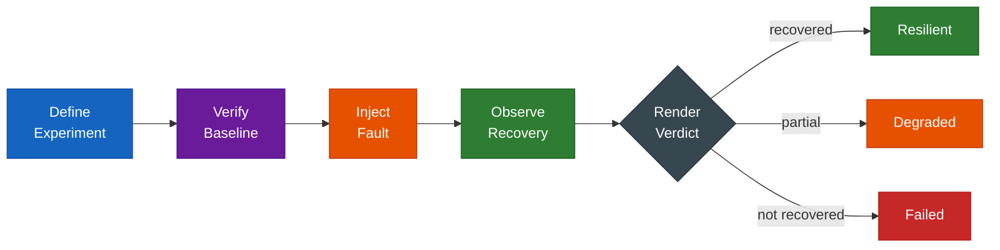

---
hide:
  - navigation
  - toc
---

# ODH Platform Chaos

  

    Chaos engineering for OpenDataHub operators. 
    Test reconciliation semantics, not just pod restarts.
  

  

    <a href="getting-started/installation/" class="md-button md-button--primary">Get Started</a>
    <a href="https://github.com/opendatahub-io/odh-platform-chaos" class="md-button">GitHub</a>
  

## Why ODH Platform Chaos?

Existing chaos tools (Krkn, Litmus, Chaos Mesh) test infrastructure resilience: kill a pod, verify it comes back. But Kubernetes operators manage complex resource graphs — Deployments, Services, ConfigMaps, CRDs — where the real question is:

**"When something breaks, does the operator put everything back the way it should be?"**

ODH Platform Chaos answers this by testing reconciliation: verifying operators restore resources to their intended state after operator-semantic faults like CRD mutation, config drift, and RBAC revocation.

## How It Works

## Three Usage Modes

| Mode | What It Tests | Cluster? | When to Use |
|------|--------------|----------|-------------|
| **CLI Experiments** | Full operator recovery on a live cluster | Yes | Pre-release validation, CI/CD |
| **SDK Middleware** | Operator behavior under API-level faults | Yes (or fake client) | Integration tests |
| **Fuzz Testing** | Reconciler correctness under random faults | No | Development, unit tests, CI |

- :material-console: **CLI Experiments**

    ---

    Run structured chaos experiments against a live cluster. Orchestrates the full lifecycle: steady state, inject, observe, evaluate.

    [:octicons-arrow-right-24: CLI Quick Start](getting-started/cli-quickstart.md)

- :material-code-braces: **SDK Middleware**

    ---

    Wrap a controller-runtime client with fault injection. No code changes to your reconciler needed.

    [:octicons-arrow-right-24: SDK Quick Start](getting-started/sdk-quickstart.md)

- :material-shuffle-variant: **Fuzz Testing**

    ---

    Test reconciler correctness under random faults. No cluster needed — uses fake client.

    [:octicons-arrow-right-24: Fuzz Quick Start](getting-started/fuzz-quickstart.md)

## Verdicts

Every experiment produces a structured verdict:

| Verdict | Meaning |
|---------|---------|
| **Resilient** | Operator restored all resources correctly within the timeout |
| **Degraded** | Operator recovered but with deviations from expected state |
| **Failed** | Operator did not recover within the timeout |
| **Inconclusive** | Baseline check failed, experiment could not run |
