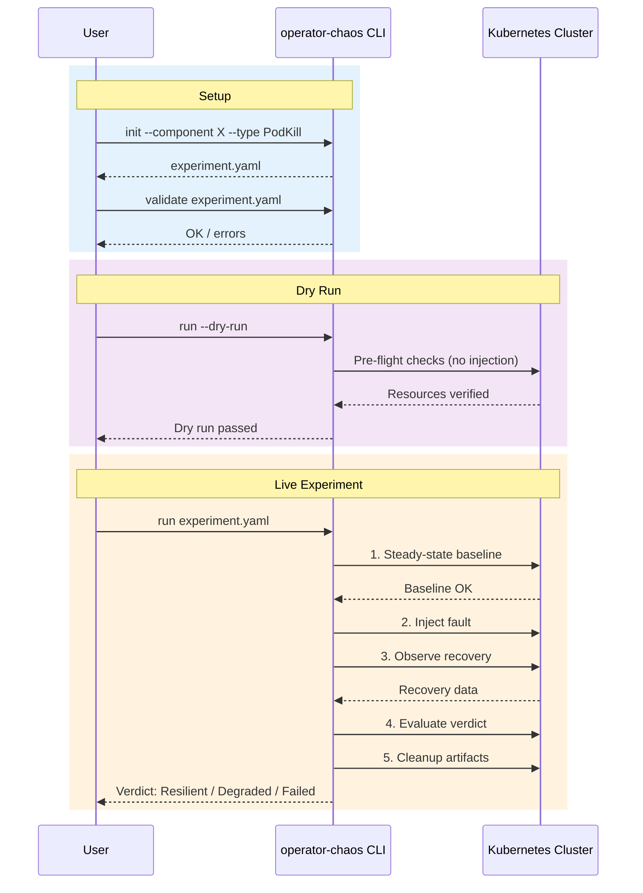

# CLI Mode

Run structured chaos experiments against a live Kubernetes or OpenShift cluster. The CLI orchestrates the full experiment lifecycle: validate configuration, establish steady-state baseline, inject a fault, observe operator recovery, evaluate the verdict, and clean up.

!!! tip "When to use CLI mode"
    Use this when you need to verify that a real operator recovers correctly on a real cluster. This is the primary way to run chaos experiments during development, in CI/CD pipelines, or as one-off validation before shipping.

## Prerequisites

- `operator-chaos` binary installed (see [Installation](../getting-started/installation.md))
- Kubernetes or OpenShift cluster access via kubeconfig
- `cluster-admin` RBAC permissions (experiments perform destructive operations)

Verify your setup:

```bash
$ operator-chaos version
operator-chaos version dev
```

## How It Works



## Step-by-Step Walkthrough

This walkthrough targets the `odh-model-controller` component of OpenDataHub. Replace names and namespaces for your operator.

### Step 1: List available injection types

See what fault types are available:

```bash
$ operator-chaos types
Available injection types:

  PodKill              [low] Delete pods matching a label selector
  NetworkPartition     [medium] Create deny-all NetworkPolicy
  ConfigDrift          [medium] Modify ConfigMap or Secret data
  CRDMutation          [medium] Mutate a field on any Kubernetes resource
  FinalizerBlock       [medium] Add a blocking finalizer to a resource
  WebhookDisrupt       [high] Change webhook failure policy
  RBACRevoke           [high] Revoke RBAC binding subjects
  ClientFault          [medium] Inject API-level faults into controller-runtime client
  OwnerRefOrphan       [medium] Remove ownerReferences to test re-adoption
  QuotaExhaustion      [medium] Create restrictive ResourceQuota
  WebhookLatency       [high] Deploy slow admission webhook
  NamespaceDeletion    [high] Delete namespace to test operator recovery
  LabelStomping        [medium] Modify labels to test reconciliation
```

### Step 2: Generate an experiment skeleton

Create a starting experiment YAML using `init`. This gives you a valid template to customize:

```bash
$ operator-chaos init \
    --operator opendatahub-operator \
    --component odh-model-controller \
    --type PodKill \
    --namespace opendatahub
```

Output:

```yaml
apiVersion: chaos.operatorchaos.io/v1alpha1
kind: ChaosExperiment
metadata:
  name: odh-model-controller-PodKill
  labels:
    component: odh-model-controller
spec:
  target:
    operator: opendatahub-operator
    component: odh-model-controller
    resource: "Deployment/odh-model-controller"
  hypothesis:
    description: "odh-model-controller recovers from PodKill"
    recoveryTimeout: "60s"
  injection:
    type: PodKill
    count: 1
    ttl: "300s"
    parameters:
      labelSelector: "app.kubernetes.io/part-of=odh-model-controller"
  blastRadius:
    maxPodsAffected: 1
    allowedNamespaces:
      - opendatahub
    dryRun: false
```

Save the output to a file and customize it. At minimum, update the `labelSelector` to match your target pods and adjust the `recoveryTimeout` to match your operator's expected recovery time.

```bash
$ operator-chaos init \
    --operator opendatahub-operator \
    --component odh-model-controller \
    --type PodKill \
    --namespace opendatahub > experiment.yaml
```

### Step 3: Create a knowledge model

The knowledge model tells `operator-chaos` what your operator manages, so it can validate experiments and perform steady-state checks. Save this as `knowledge.yaml`:

```yaml
operator:
  name: opendatahub-operator
  namespace: opendatahub

components:
  - name: odh-model-controller
    controller: DataScienceCluster
    managedResources:
      - apiVersion: apps/v1
        kind: Deployment
        name: odh-model-controller
        namespace: opendatahub
        labels:
          control-plane: odh-model-controller
        expectedSpec:
          replicas: 1
      - apiVersion: v1
        kind: ServiceAccount
        name: odh-model-controller
        namespace: opendatahub
    webhooks:
      - name: validating.odh-model-controller.opendatahub.io
        type: validating
        path: /validate
    steadyState:
      checks:
        - type: conditionTrue
          apiVersion: apps/v1
          kind: Deployment
          name: odh-model-controller
          namespace: opendatahub
          conditionType: Available
      timeout: "60s"

recovery:
  reconcileTimeout: "300s"
  maxReconcileCycles: 10
```

See [Knowledge Models](../guides/knowledge-models.md) for a full reference on all fields.

### Step 4: Validate the experiment

Check that the experiment YAML is well-formed before running it:

```bash
$ operator-chaos validate experiment.yaml
Experiment 'odh-model-controller-PodKill' is valid.
```

If there are errors, the output shows each one:

```bash
$ operator-chaos validate bad-experiment.yaml
Validation FAILED:
  - spec.injection.type: unsupported injection type "invalid"
  - spec.steadyState.checks: must have at least one check
2 validation errors
```

You can also validate knowledge models:

```bash
$ operator-chaos validate knowledge.yaml --knowledge
Knowledge 'opendatahub-operator' is valid.
```

### Step 5: Run pre-flight checks

Verify that all resources declared in the knowledge model actually exist on the cluster:

```bash
$ operator-chaos preflight --knowledge knowledge.yaml
Operator:    opendatahub-operator
Namespace:   opendatahub
Components:  1
Resources:   2
Webhooks:    1
Finalizers:  0

--- Cluster Resource Check ---
  COMPONENT              NAME                    KIND          STATUS
  ---------              ----                    ----          ------
  odh-model-controller   odh-model-controller    Deployment    Found
  odh-model-controller   odh-model-controller    ServiceAccount Found

Cluster preflight passed.
```

If a resource is missing, the output shows it clearly:

```bash
  COMPONENT              NAME                    KIND          STATUS
  ---------              ----                    ----          ------
  odh-model-controller   odh-model-controller    Deployment    Found
  odh-model-controller   odh-model-controller    ServiceAccount Missing

1 resources missing, 0 resources could not be checked
```

To validate just the knowledge file structure without connecting to a cluster:

```bash
$ operator-chaos preflight --knowledge knowledge.yaml --local
Operator:    opendatahub-operator
Namespace:   opendatahub
Components:  1
Resources:   2
Webhooks:    1
Finalizers:  0

Local preflight passed.
```

### Step 6: Dry run

Test the full experiment lifecycle without injecting any fault:

```bash
$ operator-chaos run experiment.yaml \
    --knowledge knowledge.yaml \
    --dry-run

Experiment: odh-model-controller-PodKill
Verdict:    Resilient
Confidence: validated (dry-run or pre-execution)
```

The dry run validates experiment loading, steady-state checks, and report generation without performing destructive operations.

### Step 7: Run the experiment

Execute the experiment against your live cluster:

```bash
$ operator-chaos run experiment.yaml \
    --knowledge knowledge.yaml \
    -v
```

The verbose (`-v`) flag shows each phase as it executes. When the experiment completes, you see the result:

```
Experiment: odh-model-controller-PodKill
Verdict:    Resilient
Confidence: high
```

If the operator doesn't recover in time, the verdict changes:

```
Experiment: odh-model-controller-PodKill
Verdict:    Degraded
Confidence: medium
Deviations:
  - [slow_recovery] recovery took 45s, expected < 30s
```

#### Verdicts and exit codes

| Verdict | Meaning | Exit Code |
|---------|---------|-----------|
| **Resilient** | Operator recovered fully within the timeout | 0 |
| **Degraded** | Recovery happened but with issues (slow, collateral damage) | 1 |
| **Failed** | Operator did not recover to steady state | 1 |
| **Inconclusive** | Observation was incomplete or ambiguous | 1 |

Non-zero exit codes on non-Resilient verdicts let you gate CI/CD pipelines on experiment results.

### Step 8: Run a suite of experiments

To run all experiments in a directory sequentially:

```bash
$ operator-chaos suite experiments/odh-model-controller/ \
    --knowledge knowledge.yaml \
    --report-dir /tmp/chaos-results/ \
    --timeout 10m
```

```
Found 7 experiments in experiments/odh-model-controller/

PASS  omc-podkill (Resilient, 12s recovery, 0 deviations)
PASS  omc-configdrift (Resilient, 23s recovery, 0 deviations)
PASS  omc-networkpartition (Resilient, 18s recovery, 0 deviations)
PASS  omc-crdmutation (Resilient, 31s recovery, 0 deviations)
PASS  omc-finalizerblock (Resilient, 8s recovery, 0 deviations)
FAIL  omc-webhookdisrupt (Degraded, 95s recovery, 1 deviations)
PASS  omc-rbacrevoke (Resilient, 42s recovery, 0 deviations)

Suite summary: 6 passed, 1 failed, 0 skipped (total: 7)
JUnit report written to /tmp/chaos-results/suite-results.xml
HTML report written to /tmp/chaos-results/report.html
```

The suite generates JUnit XML (for CI integration) and HTML reports in the `--report-dir`.

### Step 9: Clean up chaos artifacts

If an experiment is interrupted or leaves artifacts behind (NetworkPolicies, finalizers, modified webhooks), use the `clean` command:

```bash
$ operator-chaos clean --namespace opendatahub
```

```
Deleting NetworkPolicy opendatahub/chaos-deny-all-odh-model-controller
Restoring ValidatingWebhookConfiguration "validating.odh-model-controller.opendatahub.io"

--- Clean Summary ---
  NetworkPolicies removed:    1
  Webhooks restored:          1
  Total cleaned:              2
```

If nothing needs cleaning:

```
No chaos artifacts found.
```

For continuous monitoring in shared clusters:

```bash
$ operator-chaos clean --namespace opendatahub --watch --interval 30s
```

This scans for stale artifacts every 30 seconds until you press Ctrl+C.

## RHOAI Clusters

Experiment YAML files default to the `opendatahub` namespace. When running on RHOAI clusters (which use `redhat-ods-applications`), use the `--namespace` flag:

```bash
$ operator-chaos run experiment.yaml \
    --knowledge knowledge.yaml \
    --namespace redhat-ods-applications
```

The `--namespace` flag overrides the experiment's metadata namespace, steady-state check namespaces, blast radius `allowedNamespaces`, and reconciliation checker namespace. You can use the same experiment YAML for both ODH and RHOAI clusters without modification.

## Distributed Locking

When multiple people run experiments on the same cluster, use distributed locking to prevent overlapping experiments:

```bash
$ operator-chaos run experiment.yaml \
    --knowledge knowledge.yaml \
    --distributed-lock \
    --lock-namespace opendatahub
```

This creates a Kubernetes Lease in the target namespace. Only one experiment can hold the lock at a time. Other attempts will wait or fail with a lock conflict.

## Available Injection Types

| Type | Description | Danger Level |
|------|-------------|--------------|
| `PodKill` | Delete pods matching a label selector | Low |
| `NetworkPartition` | Create deny-all NetworkPolicy | Medium |
| `ConfigDrift` | Modify ConfigMap or Secret data | Medium |
| `CRDMutation` | Mutate a field on any Kubernetes resource | Medium |
| `FinalizerBlock` | Add a blocking finalizer to prevent deletion | Medium |
| `ClientFault` | Inject API-level faults into client operations | Medium |
| `OwnerRefOrphan` | Remove ownerReferences to test re-adoption | Medium |
| `QuotaExhaustion` | Create restrictive ResourceQuota | Medium |
| `LabelStomping` | Modify labels to test reconciliation | Medium |
| `WebhookDisrupt` | Change webhook failure policy | High |
| `RBACRevoke` | Revoke RBAC binding subjects | High |
| `WebhookLatency` | Deploy slow admission webhook | High |
| `NamespaceDeletion` | Delete namespace to test operator recovery | High |

High-danger experiments require `allowDangerous: true` in the experiment's `blastRadius` section.

## Next Steps

- Learn about all [failure modes and parameters](../failure-modes/index.md)
- Understand [knowledge models](../guides/knowledge-models.md)
- Set up [CI/CD integration](../guides/ci-integration.md)
- Run experiments as Kubernetes CRs with [Controller mode](controller.md)
