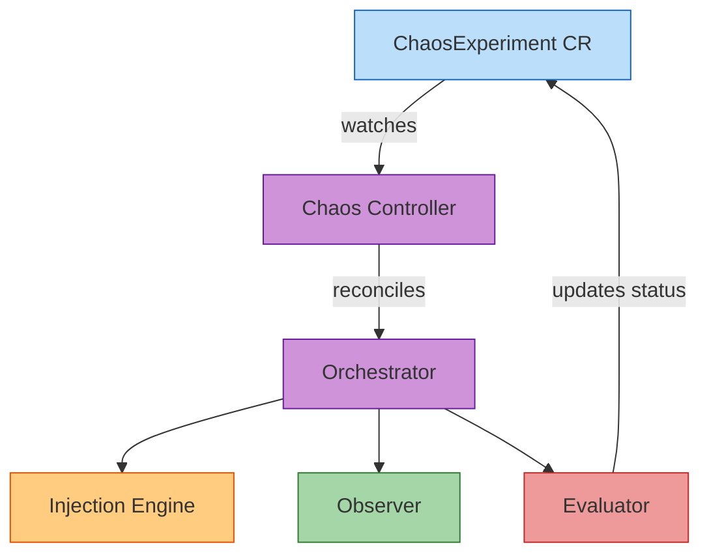
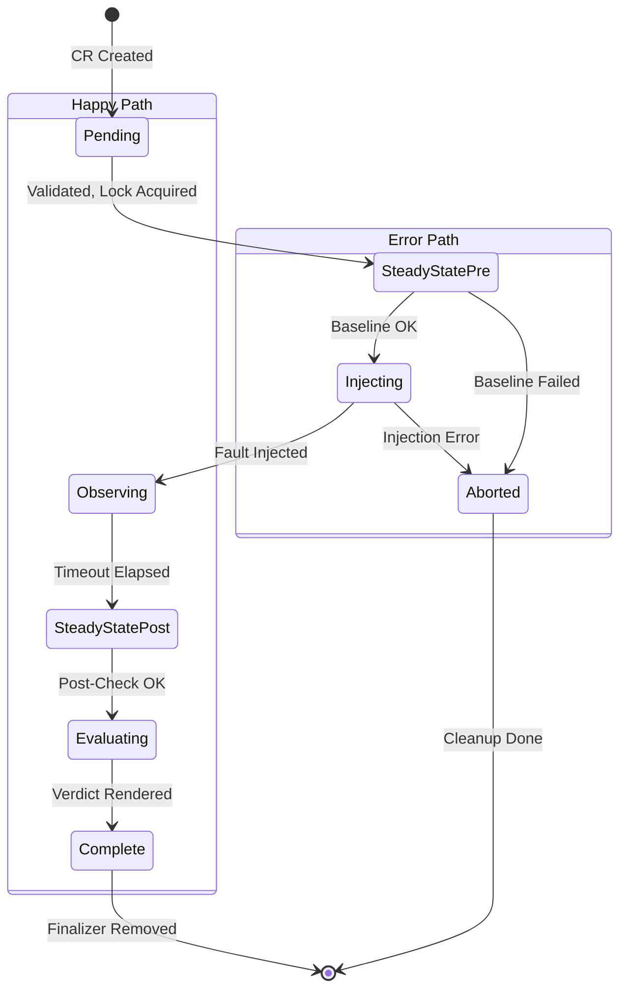

# Controller Mode

Run chaos experiments as Kubernetes Custom Resources (CRs), managed by a dedicated controller. Instead of running one-shot experiments via the CLI, you create `ChaosExperiment` CRs that the controller drives through the experiment lifecycle automatically.

!!! tip "When to use Controller mode"
    Use this for continuous chaos testing in long-lived clusters, scheduled experiments via CronJobs, GitOps-driven experiment management (Argo CD, Flux), or multi-tenant environments where teams manage their own experiments through Kubernetes RBAC.

## CLI vs Controller

| | CLI Mode | Controller Mode |
|--|----------|-----------------|
| **How it runs** | One-shot binary invocation | Kubernetes Deployment watching CRs |
| **Experiment definition** | YAML file on disk | ChaosExperiment CR in the cluster |
| **Lifecycle management** | CLI process manages everything | Controller reconciles phases |
| **Crash recovery** | Experiment lost if process dies | Resumes from last completed phase |
| **Scheduling** | Cron or CI trigger | Kubernetes CronJobs |
| **Multi-tenancy** | N/A | RBAC on ChaosExperiment namespace |
| **Observability** | CLI output, report files | K8s events, conditions, Prometheus metrics |

## Architecture



The controller uses the **phase-per-reconcile** pattern: each reconcile loop advances the experiment by exactly one phase, updating `.status.phase` and `.status.conditions`. If the controller restarts, it resumes from the last completed phase.

## Experiment Lifecycle

Each `ChaosExperiment` CR progresses through these phases:



| Phase | What Happens | Next Step |
|-------|-------------|-----------|
| `Pending` | Validates experiment spec, loads knowledge model, acquires distributed lock | Immediate requeue |
| `SteadyStatePre` | Runs pre-injection steady-state checks to establish baseline | Abort on failure, otherwise requeue |
| `Injecting` | Applies the fault (kills pod, mutates config, etc.) | Immediate requeue |
| `Observing` | Waits for recovery timeout, monitors reconciliation cycles | Requeues every 30s until timeout |
| `SteadyStatePost` | Runs post-recovery steady-state checks | Immediate requeue |
| `Evaluating` | Renders verdict based on all findings | Immediate requeue |
| `Complete` | Experiment finished, verdict set | Terminal state |
| `Aborted` | Experiment aborted due to validation or baseline failure | Terminal state, cleanup performed |

## Step-by-Step Walkthrough

### Step 1: Install the controller

```bash
$ git clone https://github.com/ugiordan/operator-chaos.git
$ cd operator-chaos
$ kubectl apply -k config/default
namespace/operator-chaos-system created
customresourcedefinition.apiextensions.k8s.io/chaosexperiments.chaos.operatorchaos.io created
serviceaccount/operator-chaos-controller created
clusterrole.rbac.authorization.k8s.io/operator-chaos-controller created
clusterrolebinding.rbac.authorization.k8s.io/operator-chaos-controller created
deployment.apps/operator-chaos-controller created
```

### Step 2: Verify the controller is running

```bash
$ kubectl get deployment -n operator-chaos-system
NAME                        READY   UP-TO-DATE   AVAILABLE   AGE
operator-chaos-controller   1/1     1            1           30s

$ kubectl get crd chaosexperiments.chaos.operatorchaos.io
NAME                                      CREATED AT
chaosexperiments.chaos.operatorchaos.io   2025-03-30T12:00:00Z
```

### Step 3: Load knowledge models

The controller needs knowledge models to validate experiments. Mount them as a ConfigMap:

```bash
$ kubectl create configmap operator-knowledge \
    -n operator-chaos-system \
    --from-file=knowledge/
configmap/operator-knowledge created
```

Patch the controller deployment to mount the ConfigMap:

```bash
$ kubectl patch deployment operator-chaos-controller \
    -n operator-chaos-system \
    --type=json -p='[
  {"op": "add", "path": "/spec/template/spec/containers/0/args/-", "value": "--knowledge-dir=/knowledge"},
  {"op": "add", "path": "/spec/template/spec/volumes/-", "value": {"name": "knowledge", "configMap": {"name": "operator-knowledge"}}},
  {"op": "add", "path": "/spec/template/spec/containers/0/volumeMounts/-", "value": {"name": "knowledge", "mountPath": "/knowledge", "readOnly": true}}
]'
deployment.apps/operator-chaos-controller patched
```

Verify the models loaded:

```bash
$ kubectl logs -n operator-chaos-system deployment/operator-chaos-controller | grep "Loaded knowledge"
Loaded knowledge models: kserve, odh-model-controller, dashboard
```

### Step 4: Create a ChaosExperiment CR

Save this as `experiment-cr.yaml`:

```yaml
apiVersion: chaos.operatorchaos.io/v1alpha1
kind: ChaosExperiment
metadata:
  name: omc-pod-kill
  namespace: operator-chaos-system
spec:
  target:
    operator: opendatahub-operator
    component: odh-model-controller

  injection:
    type: PodKill
    parameters:
      labelSelector: control-plane=odh-model-controller
    count: 1

  hypothesis:
    description: >-
      When the odh-model-controller pod is killed, Kubernetes should
      recreate it within 120s and the controller should resume reconciling
      InferenceService resources without data loss.
    recoveryTimeout: 120s

  steadyState:
    checks:
      - type: conditionTrue
        apiVersion: apps/v1
        kind: Deployment
        name: odh-model-controller
        namespace: opendatahub
        conditionType: Available
    timeout: "30s"

  blastRadius:
    maxPodsAffected: 1
    allowedNamespaces:
      - opendatahub
```

Apply it:

```bash
$ kubectl apply -f experiment-cr.yaml
chaosexperiment.chaos.operatorchaos.io/omc-pod-kill created
```

### Step 5: Watch the experiment progress

```bash
$ kubectl get chaosexperiment omc-pod-kill -w
NAME           PHASE            VERDICT     TYPE      TARGET                  AGE
omc-pod-kill   Pending                      PodKill   odh-model-controller    1s
omc-pod-kill   SteadyStatePre               PodKill   odh-model-controller    2s
omc-pod-kill   Injecting                    PodKill   odh-model-controller    5s
omc-pod-kill   Observing                    PodKill   odh-model-controller    6s
omc-pod-kill   SteadyStatePost              PodKill   odh-model-controller    126s
omc-pod-kill   Evaluating                   PodKill   odh-model-controller    127s
omc-pod-kill   Complete         Resilient   PodKill   odh-model-controller    128s
```

### Step 6: Check Kubernetes events

The controller emits events at each lifecycle transition:

```bash
$ kubectl get events -n operator-chaos-system \
    --field-selector involvedObject.name=omc-pod-kill \
    --sort-by='.lastTimestamp'
LAST SEEN   TYPE     REASON                OBJECT                          MESSAGE
2m          Normal   ExperimentStarted     chaosexperiment/omc-pod-kill    Experiment started
2m          Normal   SteadyStatePrePassed  chaosexperiment/omc-pod-kill    Pre-injection steady-state passed
118s        Normal   InjectionApplied      chaosexperiment/omc-pod-kill    PodKill injection applied
118s        Normal   ObserverFindings      chaosexperiment/omc-pod-kill    Recovery observed: 5 reconcile cycles
5s          Normal   RecoveryDetected      chaosexperiment/omc-pod-kill    Post-injection steady-state passed
3s          Normal   ExperimentComplete    chaosexperiment/omc-pod-kill    Verdict: Resilient (high confidence)
```

### Step 7: Check the verdict in the CR status

```bash
$ kubectl get chaosexperiment omc-pod-kill -o jsonpath='{.status}' | jq .
{
  "phase": "Complete",
  "verdict": "Resilient",
  "conditions": [
    {
      "type": "SteadyStateEstablished",
      "status": "True",
      "lastTransitionTime": "2025-03-30T12:00:02Z"
    },
    {
      "type": "FaultInjected",
      "status": "True",
      "lastTransitionTime": "2025-03-30T12:00:05Z"
    },
    {
      "type": "RecoveryObserved",
      "status": "True",
      "lastTransitionTime": "2025-03-30T12:02:06Z"
    },
    {
      "type": "Complete",
      "status": "True",
      "lastTransitionTime": "2025-03-30T12:02:08Z"
    }
  ]
}
```

### Step 8: Check Prometheus metrics

The controller exposes metrics on its metrics endpoint:

```bash
$ kubectl port-forward -n operator-chaos-system \
    deployment/operator-chaos-controller 8080:8080 &

$ curl -s localhost:8080/metrics | grep chaosexperiment
# HELP chaosexperiment_verdict_total Total experiments by verdict
# TYPE chaosexperiment_verdict_total counter
chaosexperiment_verdict_total{verdict="Resilient"} 1
# HELP chaosexperiment_recovery_time_seconds Recovery time in seconds
# TYPE chaosexperiment_recovery_time_seconds histogram
chaosexperiment_recovery_time_seconds_bucket{le="30"} 1
chaosexperiment_recovery_time_seconds_bucket{le="60"} 1
chaosexperiment_recovery_time_seconds_sum 12
chaosexperiment_recovery_time_seconds_count 1
# HELP chaosexperiment_active Currently running experiments
# TYPE chaosexperiment_active gauge
chaosexperiment_active 0
# HELP chaosexperiment_injections_total Total injections by type
# TYPE chaosexperiment_injections_total counter
chaosexperiment_injections_total{type="PodKill"} 1
```

## Scheduling Experiments with CronJobs

Run experiments on a schedule using Kubernetes CronJobs:

```yaml
apiVersion: batch/v1
kind: CronJob
metadata:
  name: daily-chaos-podkill
  namespace: operator-chaos-system
spec:
  schedule: "0 3 * * *"  # 3 AM daily
  jobTemplate:
    spec:
      template:
        spec:
          serviceAccountName: operator-chaos-controller
          containers:
          - name: chaos
            image: quay.io/opendatahub/operator-chaos:latest
            command: ["operator-chaos", "run"]
            args:
            - "/experiments/pod-kill.yaml"
            - "--knowledge=/knowledge/odh-model-controller.yaml"
          restartPolicy: OnFailure
```

## GitOps Integration

Store `ChaosExperiment` CRs in your Git repository alongside your operator manifests. Argo CD or Flux will apply them automatically when merged:

```
my-operator/
  manifests/
    deployment.yaml
    service.yaml
  chaos/
    pod-kill.yaml
    config-drift.yaml
    network-partition.yaml
```

When a CR is created, the controller picks it up and runs the experiment. When deleted, the controller ensures cleanup via finalizers.

## Cleanup

### Delete a single experiment

```bash
$ kubectl delete chaosexperiment omc-pod-kill
chaosexperiment.chaos.operatorchaos.io "omc-pod-kill" deleted
```

This triggers finalizer cleanup, which reverts any active faults.

### Uninstall the controller

```bash
# Delete all experiments first to ensure cleanup runs
$ kubectl delete chaosexperiments --all -A

# Uninstall controller and CRD
$ kubectl delete -k config/default
```

!!! warning "CRD deletion"
    Deleting the CRD removes all ChaosExperiment CRs immediately, bypassing finalizers. Always delete experiments individually first to ensure faults are reverted.

## Safety Mechanisms

The controller enforces several safety mechanisms:

- **Blast radius limits**: `maxPodsAffected` and `allowedNamespaces` restrict the experiment scope
- **Distributed locking**: Only one experiment per component runs at a time
- **Dry run mode**: Set `blastRadius.dryRun: true` to validate without injecting
- **Danger level enforcement**: High-danger experiments require `blastRadius.allowDangerous: true`
- **Finalizer-based cleanup**: Faults are always reverted, even if the experiment CR is deleted mid-run

## Next Steps

- See [Controller Advanced Guide](../guides/controller-advanced.md) for advanced status fields, safety details, and troubleshooting
- Run experiments from the command line with [CLI mode](cli.md)
- Learn about [failure modes and parameters](../failure-modes/index.md)
- Set up [CI/CD integration](../guides/ci-integration.md)
