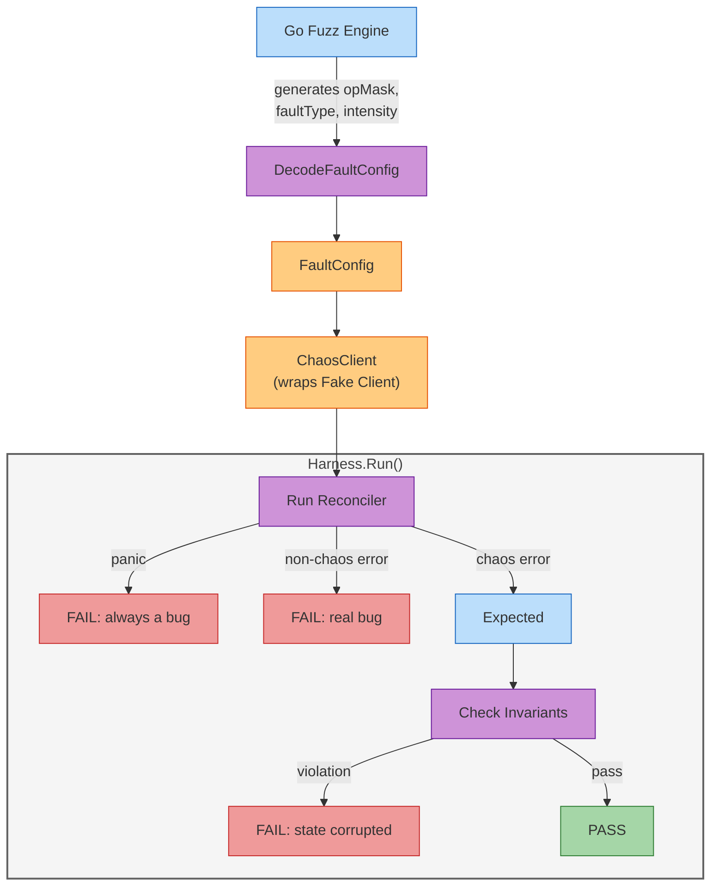

# Fuzz Mode

Use Go's native fuzz engine to automatically explore fault combinations your reconciler might encounter. Instead of writing one test per error scenario, the fuzz harness generates thousands of random fault configurations and runs your reconciler against each one, catching panics, unhandled errors, and state corruption.

!!! tip "When to use Fuzz mode"
    Use this when you want to find edge cases in your reconciler's error handling during development. Manual tests cover the cases you think of. Fuzz testing covers the ones you don't.

## What Does It Actually Do?

Traditional chaos testing requires you to define each fault scenario manually: "inject a connection refused on Get, verify recovery." Fuzz mode inverts this. You provide:

1. A **reconciler factory** (a function that creates your reconciler given a `client.Client`)
2. **Seed objects** (the Kubernetes resources your reconciler expects to exist)
3. **Invariants** (conditions that must always hold after reconciliation)

The fuzz engine then:

- Generates random fault configurations (which operations fail, what error, how often)
- Wraps a fake client with those faults using the [SDK ChaosClient](sdk.md)
- Runs your reconciler
- Reports any panics, unexpected errors, or invariant violations as test failures

No cluster is needed. Everything runs in-process with a fake client.

## How It Works



The key insight: **chaos-injected errors are expected and silently ignored.** If your reconciler returns a `ChaosError`, that means it propagated the injected fault correctly. The harness only reports failures for:

- **Panics**: Your code crashed. Always a bug.
- **Non-chaos errors**: Your reconciler returned an error that didn't originate from the ChaosClient. This means your code has a bug unrelated to fault handling.
- **Invariant violations**: Your reconciler ran to completion, but post-reconcile state is wrong (e.g., a resource that should always exist was deleted).

## Prerequisites

- Go 1.18+ (for native fuzzing support)
- controller-runtime v0.23+
- No Kubernetes cluster needed (uses fake client)

## Step-by-Step Walkthrough

### Step 1: Write a reconciler factory

The fuzz harness needs a function that creates your reconciler given a `client.Client`. This decouples your reconciler construction from any specific client implementation:

```go
import (
    "sigs.k8s.io/controller-runtime/pkg/client"
    "sigs.k8s.io/controller-runtime/pkg/reconcile"
)

func myFactory(c client.Client) reconcile.Reconciler {
    return &MyReconciler{client: c}
}
```

### Step 2: Write the fuzz test

Create a file named `fuzz_test.go` in your controller's package:

```go
package mycontroller_test

import (
    "testing"

    corev1 "k8s.io/api/core/v1"
    metav1 "k8s.io/apimachinery/pkg/apis/meta/v1"
    "k8s.io/apimachinery/pkg/runtime"
    "k8s.io/apimachinery/pkg/types"
    "sigs.k8s.io/controller-runtime/pkg/client"
    "sigs.k8s.io/controller-runtime/pkg/reconcile"

    "github.com/opendatahub-io/operator-chaos/pkg/sdk/fuzz"
)

func FuzzMyReconciler(f *testing.F) {
    // Seed corpus: starting values for the fuzz engine to mutate.
    // Each f.Add() call provides one (opMask, faultType, intensity) tuple.
    f.Add(uint16(0x01FF), uint8(0), uint16(32768))  // all ops, conflict error, 50%
    f.Add(uint16(0x0001), uint8(1), uint16(65535))   // Get only, not found, 100%
    f.Add(uint16(0), uint8(0), uint16(0))            // no faults (baseline)

    scheme := runtime.NewScheme()
    _ = corev1.AddToScheme(scheme)

    f.Fuzz(func(t *testing.T, opMask uint16, faultType uint8, intensity uint16) {
        // Seed objects: the initial cluster state before reconciliation.
        cm := &corev1.ConfigMap{
            ObjectMeta: metav1.ObjectMeta{
                Name:      "my-config",
                Namespace: "default",
            },
            Data: map[string]string{"key": "value"},
        }

        // The reconcile request targeting this ConfigMap.
        req := reconcile.Request{
            NamespacedName: types.NamespacedName{
                Name:      "my-config",
                Namespace: "default",
            },
        }

        // Create harness with factory, scheme, request, and seed objects.
        h := fuzz.NewHarness(myFactory, scheme, req, cm)

        // Add invariant: ConfigMap must still exist after reconciliation.
        h.AddInvariant(fuzz.ObjectExists(
            types.NamespacedName{Name: "my-config", Namespace: "default"},
            &corev1.ConfigMap{},
        ))

        // Decode fuzz bytes into a FaultConfig and run.
        fc := fuzz.DecodeFaultConfig(opMask, faultType, intensity)
        if err := h.Run(t, fc); err != nil {
            t.Fatal(err)
        }
    })
}
```

### Step 3: Run the fuzz test

```bash
# Quick smoke test (30 seconds)
$ go test ./pkg/mycontroller/ -fuzz=FuzzMyReconciler -fuzztime=30s
fuzz: elapsed: 0s, gathering baseline coverage: 0/3 completed
fuzz: elapsed: 0s, gathering baseline coverage: 3/3 completed, now fuzzing with 8 workers
fuzz: elapsed: 3s, execs: 1842 (614/sec), new interesting: 12 (total: 15)
fuzz: elapsed: 6s, execs: 4291 (816/sec), new interesting: 14 (total: 17)
fuzz: elapsed: 9s, execs: 6830 (846/sec), new interesting: 15 (total: 18)
fuzz: elapsed: 12s, execs: 9402 (857/sec), new interesting: 15 (total: 18)
fuzz: elapsed: 15s, execs: 12091 (896/sec), new interesting: 16 (total: 19)
fuzz: elapsed: 18s, execs: 14673 (860/sec), new interesting: 16 (total: 19)
fuzz: elapsed: 21s, execs: 17284 (870/sec), new interesting: 16 (total: 19)
fuzz: elapsed: 24s, execs: 19901 (872/sec), new interesting: 16 (total: 19)
fuzz: elapsed: 27s, execs: 22486 (862/sec), new interesting: 16 (total: 19)
fuzz: elapsed: 30s, execs: 25107 (874/sec), new interesting: 16 (total: 19)
PASS
ok      github.com/example/my-operator/pkg/mycontroller 30.124s
```

The engine ran ~25,000 different fault configurations in 30 seconds. "New interesting" means the engine found inputs that exercise new code paths.

```bash
# Thorough exploration (5 minutes)
$ go test ./pkg/mycontroller/ -fuzz=FuzzMyReconciler -fuzztime=5m

# Run indefinitely until a failure is found
$ go test ./pkg/mycontroller/ -fuzz=FuzzMyReconciler
```

### Step 4: Interpret failures

When the fuzz engine finds a bug, it reports the inputs that triggered it:

```
--- FAIL: FuzzMyReconciler (0.03s)
    --- FAIL: FuzzMyReconciler/seed#1 (0.00s)
        harness.go:87: reconciler panicked: runtime error: invalid memory address
                        or nil pointer dereference

        Failing input:
            opMask:    0x0001 (Get only)
            faultType: 1 (not found)
            intensity: 65535 (100% error rate)
```

This tells you: when every Get call returns "not found", your reconciler panics due to a nil pointer dereference. The fix is to add a nil check after the Get call.

Failing inputs are saved to `testdata/fuzz/FuzzMyReconciler/` and automatically replayed on subsequent `go test` runs, so the bug becomes a permanent regression test.

### Step 5: Fix and re-run

After fixing the bug, re-run to verify the fix and continue exploring:

```bash
# Replay the saved failure (regression test)
$ go test ./pkg/mycontroller/ -run=FuzzMyReconciler
PASS
ok      github.com/example/my-operator/pkg/mycontroller 0.015s

# Continue fuzzing to find more issues
$ go test ./pkg/mycontroller/ -fuzz=FuzzMyReconciler -fuzztime=2m
```

## Auto-Generate from Knowledge Models

If you have an [operator knowledge model](../guides/knowledge-models.md), you can skip writing the fuzz test manually:

```bash
$ operator-chaos generate fuzz-targets \
    --knowledge knowledge/kserve.yaml \
    --output fuzz_kserve_test.go
```

The generated file contains:

- One `FuzzXxx` function per component (e.g., `FuzzKserveControllerManager`)
- Seed objects derived from `managedResources` (Deployments, ConfigMaps, RBAC)
- Invariants from `steadyState.checks` and Deployment replicas
- Seed corpus entries derived from architectural traits (webhooks, finalizers, leader election)

You only need to replace the placeholder `reconcilerFactory` function with your actual reconciler constructor.

## DecodeFaultConfig Reference

The `DecodeFaultConfig` function maps three fuzz primitives to a valid `*sdk.FaultConfig`:

```go
fc := fuzz.DecodeFaultConfig(opMask, faultType, intensity)
```

### opMask (uint16): Which operations get faults

Each bit enables faults for one operation:

| Bit | Hex | Operation |
|-----|-----|-----------|
| 0 | `0x0001` | Get |
| 1 | `0x0002` | List |
| 2 | `0x0004` | Create |
| 3 | `0x0008` | Update |
| 4 | `0x0010` | Delete |
| 5 | `0x0020` | Patch |
| 6 | `0x0040` | DeleteAllOf |
| 7 | `0x0080` | Reconcile |
| 8 | `0x0100` | Apply |

Examples:

- `0x0001` = only Get is faulted
- `0x0009` = Get + Update
- `0x01FF` = all 9 operations

### faultType (uint8): What error to inject

Index into 11 realistic Kubernetes error messages:

| Index | Error Message |
|-------|--------------|
| 0 | `the object has been modified; please apply your changes to the latest version and try again` |
| 1 | `not found` |
| 2 | `context deadline exceeded` |
| 3 | `Internal error occurred: unexpected response: 500` |
| 4 | `etcdserver: request timed out` |
| 5 | `rate limit exceeded, retry after 5s` |
| 6 | `connection refused` |
| 7 | `the server could not find the requested resource (HTTP 410: Gone)` |
| 8 | `admission webhook denied the request` |
| 9 | `exceeded quota` |
| 10 | `Service Unavailable` |

Values > 10 wrap around (modulo 11).

### intensity (uint16): How often the fault fires

Maps linearly to error rate: `0` = never fire, `65535` = always fire, `32768` = ~50%.

## Invariants

Invariants are conditions that must hold after every reconciliation, regardless of what faults were injected.

### Built-in: ObjectExists

Checks that a specific object still exists:

```go
h.AddInvariant(fuzz.ObjectExists(
    types.NamespacedName{Name: "my-config", Namespace: "default"},
    &corev1.ConfigMap{},
))
```

### Built-in: ObjectCount

Checks that the number of objects of a given type matches an expected count:

```go
// Exactly 3 ConfigMaps should exist
h.AddInvariant(fuzz.ObjectCount(&corev1.ConfigMapList{}, 3))

// Exactly 1 ConfigMap with label "app=my-app"
h.AddInvariant(fuzz.ObjectCount(
    &corev1.ConfigMapList{},
    1,
    client.MatchingLabels{"app": "my-app"},
))
```

### Custom invariants

Write any check as a function:

```go
h.AddInvariant(func(ctx context.Context, c client.Client) error {
    cm := &corev1.ConfigMap{}
    key := types.NamespacedName{Name: "my-config", Namespace: "default"}
    if err := c.Get(ctx, key, cm); err != nil {
        return fmt.Errorf("ConfigMap missing: %w", err)
    }
    if cm.Data["key"] != "value" {
        return fmt.Errorf("ConfigMap data corrupted: got %q, want %q",
            cm.Data["key"], "value")
    }
    return nil
})
```

## CI Integration

Add fuzz tests to your CI pipeline. Even a 2-minute run catches many issues:

```yaml
# GitHub Actions
- name: Fuzz test reconcilers
  run: go test ./pkg/... -fuzz=. -fuzztime=2m
```

Commit the `testdata/fuzz/` directory to your repository so discovered failures become permanent regression tests.

## Comparison with Other Modes

| | Fuzz Mode | SDK Mode | CLI Mode |
|--|-----------|----------|----------|
| **Cluster needed?** | No (fake client) | No (fake or real) | Yes (live cluster) |
| **Fault configuration** | Auto-generated | Manual | Manual (YAML) |
| **Coverage** | Thousands of combinations | One scenario per test | One scenario per experiment |
| **What it finds** | Panics, nil pointers, logic bugs | Specific error handling paths | Real recovery behavior |
| **Speed** | ~800 runs/sec | Milliseconds per test | Seconds to minutes per experiment |

## Next Steps

- Learn about [SDK mode](sdk.md) for targeted error injection
- Run full cluster experiments with [CLI mode](cli.md)
