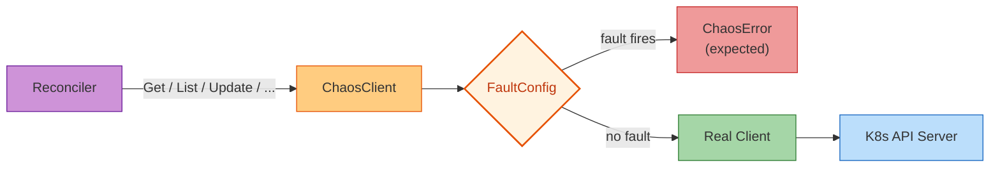

# SDK Mode

Wrap a controller-runtime `client.Client` with fault injection to test how your reconciler handles API-level failures. The `ChaosClient` intercepts CRUD operations and injects errors, delays, or disconnections based on a `FaultConfig`. No code changes to your reconciler are needed.

!!! tip "When to use SDK mode"
    Use this when you want to test how your reconciler handles API-level failures (timeouts, conflicts, connection errors) in unit or integration tests, without needing a live cluster or the full experiment lifecycle.



## Prerequisites

- Go 1.18+
- controller-runtime v0.23+
- Access to your operator's reconciler code

## Step-by-Step Walkthrough

### Step 1: Import the SDK

Add the chaos SDK to your Go module:

```bash
$ go get github.com/opendatahub-io/operator-chaos/pkg/sdk
go: downloading github.com/opendatahub-io/operator-chaos v0.1.0
go: added github.com/opendatahub-io/operator-chaos v0.1.0
```

### Step 2: Create a FaultConfig

A `FaultConfig` defines which operations get faults and how they behave. Each operation (Get, List, Create, Update, Delete, Patch, DeleteAllOf, Reconcile, Apply) can have its own `FaultSpec`:

```go
import "github.com/opendatahub-io/operator-chaos/pkg/sdk"

faults := sdk.NewFaultConfig(map[sdk.Operation]sdk.FaultSpec{
    sdk.OpGet: {
        ErrorRate: 0.3,                   // 30% of Get calls fail
        Error:     "connection refused",  // error message returned
    },
    sdk.OpList: {
        MaxDelay: 2 * time.Second,        // random jitter up to 2s, no errors
    },
    sdk.OpUpdate: {
        ErrorRate: 0.5,
        Error:     "the object has been modified; please apply your changes to the latest version",
        Delay:     500 * time.Millisecond, // fixed 500ms delay on every Update
    },
})
```

**FaultSpec fields:**

| Field | Type | Description |
|-------|------|-------------|
| `ErrorRate` | `float64` | Probability of injecting an error (0.0 = never, 1.0 = always) |
| `Error` | `string` | Error message returned when the fault fires |
| `Delay` | `time.Duration` | Fixed delay added before every operation |
| `MaxDelay` | `time.Duration` | Random delay up to this value (jitter) |

### Step 3: Wrap your client

Create a `ChaosClient` that wraps your existing `client.Client`:

```go
chaosClient := sdk.NewChaosClient(realClient, faults)
```

Use `chaosClient` wherever you would normally use `realClient`. It implements the full `client.Client` interface, so no code changes are needed in your reconciler:

```go
r := &MyReconciler{client: chaosClient}
```

### Step 4: Run your reconciler

When the reconciler calls methods on the client, the `ChaosClient` checks the `FaultConfig`:

- If the random roll is below the `ErrorRate`, the operation returns a `*sdk.ChaosError` instead of calling the real client
- If `Delay` or `MaxDelay` is set, the operation sleeps before proceeding
- Otherwise, the call passes through to the real client

```go
result, err := r.Reconcile(ctx, req)
```

### Step 5: Distinguish chaos errors from real errors

When a fault fires, the `ChaosClient` returns a `*sdk.ChaosError`. Use `errors.As` to tell injected errors apart from real API errors:

```go
var chaosErr *sdk.ChaosError
if errors.As(err, &chaosErr) {
    // This error was injected by ChaosClient.
    // chaosErr.Operation tells you which operation was faulted (e.g. "get")
    // chaosErr.Message tells you the error text
    fmt.Printf("Chaos fault on %s: %s\n", chaosErr.Operation, chaosErr.Message)
} else {
    // This is a real error from the Kubernetes API
}
```

## Complete Example: Integration Test

This example tests that a reconciler correctly requeues when it encounters connection errors:

```go
package mycontroller_test

import (
    "context"
    "errors"
    "testing"
    "time"

    corev1 "k8s.io/api/core/v1"
    metav1 "k8s.io/apimachinery/pkg/apis/meta/v1"
    "k8s.io/apimachinery/pkg/runtime"
    "k8s.io/apimachinery/pkg/types"
    "sigs.k8s.io/controller-runtime/pkg/client/fake"
    "sigs.k8s.io/controller-runtime/pkg/reconcile"

    "github.com/opendatahub-io/operator-chaos/pkg/sdk"
)

func TestReconcilerHandlesConnectionErrors(t *testing.T) {
    // 1. Set up scheme and fake client
    scheme := runtime.NewScheme()
    _ = corev1.AddToScheme(scheme)

    fakeClient := fake.NewClientBuilder().
        WithScheme(scheme).
        WithObjects(&corev1.ConfigMap{
            ObjectMeta: metav1.ObjectMeta{
                Name:      "my-config",
                Namespace: "default",
            },
            Data: map[string]string{"key": "value"},
        }).
        Build()

    // 2. Configure chaos: 100% Get failures
    faults := sdk.NewFaultConfig(map[sdk.Operation]sdk.FaultSpec{
        sdk.OpGet: {
            ErrorRate: 1.0,
            Error:     "connection refused",
        },
    })

    // 3. Wrap the fake client
    chaosClient := sdk.NewChaosClient(fakeClient, faults)

    // 4. Create reconciler with chaos client
    r := &MyReconciler{client: chaosClient}
    req := reconcile.Request{
        NamespacedName: types.NamespacedName{
            Name:      "my-config",
            Namespace: "default",
        },
    }

    // 5. Run reconciliation
    result, err := r.Reconcile(context.Background(), req)

    // 6. Verify: reconciler should requeue on connection errors
    if err != nil {
        var chaosErr *sdk.ChaosError
        if errors.As(err, &chaosErr) {
            t.Logf("Got expected chaos error: %s", chaosErr.Message)
        } else {
            t.Fatalf("Unexpected real error: %v", err)
        }
    }
    if result.RequeueAfter == 0 && !result.Requeue {
        t.Error("Expected reconciler to requeue after connection error")
    }
}
```

Run it:

```bash
$ go test ./pkg/mycontroller/ -run TestReconcilerHandlesConnectionErrors -v
=== RUN   TestReconcilerHandlesConnectionErrors
    mycontroller_test.go:52: Got expected chaos error: connection refused
--- PASS: TestReconcilerHandlesConnectionErrors (0.00s)
PASS
ok      github.com/example/my-operator/pkg/mycontroller 0.012s
```

## TestChaos Helper for Go Tests

The `TestChaos` helper simplifies test setup and auto-cleans up via `t.Cleanup`:

```go
func TestWithTestChaos(t *testing.T) {
    // Creates a FaultConfig that cleans up when the test ends
    tc := sdk.NewForTest(t, "my-component")

    // Activate faults for specific operations
    tc.Activate(sdk.OpGet, sdk.FaultSpec{
        ErrorRate: 1.0,
        Error:     "not found",
    })
    tc.Activate(sdk.OpUpdate, sdk.FaultSpec{
        ErrorRate: 0.5,
        Error:     "conflict",
    })

    // Use tc.Config() to get the FaultConfig
    chaosClient := sdk.NewChaosClient(fakeClient, tc.Config())

    // ... run your test
}
```

## Wrapping a Reconciler Directly

Instead of wrapping the client, you can wrap the entire reconciler to inject faults at the reconcile entry point:

```go
wrapped := sdk.WrapReconciler(myReconciler, sdk.WithFaultConfig(faults))
```

This applies the `FaultConfig` before the reconciler's `Reconcile` method runs. Useful when you want to test the reconciler's error handling at the top level rather than at individual client operations.

## Loading Faults from a ConfigMap

For runtime fault injection in staging environments, load fault configuration from a Kubernetes ConfigMap:

```go
// ConfigMap "operator-chaos-config" with key "config" containing JSON:
// {"active": true, "faults": {"get": {"errorRate": 0.5, "error": "not found"}}}
fc, err := sdk.ParseFaultConfigFromData(configMap.Data)
if err != nil {
    log.Error(err, "parsing fault config")
    return
}
chaosClient := sdk.NewChaosClient(realClient, fc)
```

This lets you enable/disable faults at runtime by editing the ConfigMap, without redeploying the operator.

## Runtime Introspection

The SDK provides an HTTP admin handler for monitoring active chaos faults:

```go
adminHandler := sdk.NewAdminHandler(faults)
```

Mount this handler in your operator's HTTP server (typically the metrics server). It exposes:

| Endpoint | Description |
|----------|-------------|
| `GET /chaos/health` | Health check |
| `GET /chaos/status` | Active state and fault count |
| `GET /chaos/faultpoints` | All configured fault injection points |

Example response from `/chaos/status`:

```json
{
  "active": true,
  "faultCount": 3,
  "operations": ["get", "list", "update"]
}
```

## Supported Operations

```go
sdk.OpGet        // client.Get()
sdk.OpList       // client.List()
sdk.OpCreate     // client.Create()
sdk.OpUpdate     // client.Update()
sdk.OpDelete     // client.Delete()
sdk.OpPatch      // client.Patch()
sdk.OpDeleteAllOf // client.DeleteAllOf()
sdk.OpReconcile  // reconcile.Reconciler.Reconcile()
sdk.OpApply      // client.Apply()
```

## Next Steps

- Explore thousands of fault combinations automatically with [Fuzz mode](fuzz.md)
- Run full cluster-level experiments with [CLI mode](cli.md)
