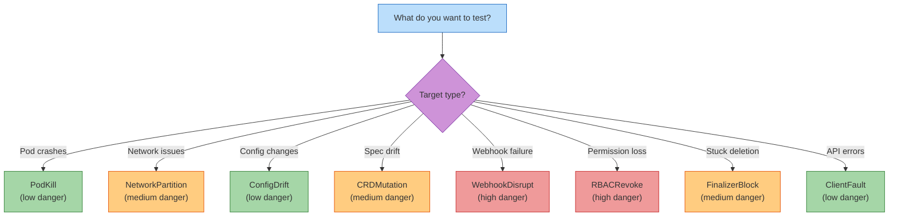

# Experiment Types Reference

ODH Platform Chaos supports 8 injection types designed to test operator resilience against common Kubernetes failure modes.

## Overview

| Type | Target | Danger Level | Reversible | Use Case |
|------|--------|--------------|------------|----------|
| [PodKill](#podkill) | Pods | Low-Medium | Yes | Test crash recovery |
| [NetworkPartition](#networkpartition) | Pods | Medium | Yes | Test network split-brain |
| [ConfigDrift](#configdrift) | ConfigMap/Secret | Low | Yes | Test configuration reconciliation |
| [CRDMutation](#crdmutation) | Custom Resources | Medium | Yes | Test spec drift recovery |
| [WebhookDisrupt](#webhookdisrupt) | Webhooks | High | Yes | Test webhook failure modes |
| [RBACRevoke](#rbacrevoke) | RBAC Bindings | High | Yes | Test permission loss |
| [FinalizerBlock](#finalizerblock) | Any Resource | Medium | Yes | Test stuck finalizers |
| [ClientFault](#clientfault) | In-Process | Low | Yes | Test API client errors |

---

## PodKill

Force-deletes pods matching a label selector to simulate node failures, OOM kills, or crash loops.

### What It Does

- Selects pods by label selector
- Deletes pods with zero grace period (immediate termination)
- Kubernetes recreates pods via owning controller (Deployment, StatefulSet, etc.)

### Spec Fields

```yaml
injection:
  type: PodKill
  count: 2  # Number of pods to kill (default: 1)
  parameters:
    labelSelector: app=my-operator  # Required: label selector for target pods
```

### Example Experiment

```yaml
apiVersion: chaos.opendatahub.io/v1alpha1
kind: ChaosExperiment
metadata:
  name: kill-operator-pod
spec:
  target:
    operator: opendatahub-operator
    component: controller-manager
  injection:
    type: PodKill
    count: 1
    parameters:
      labelSelector: control-plane=controller-manager
  blastRadius:
    maxPodsAffected: 1
    allowedNamespaces: [opendatahub]
  hypothesis:
    description: Operator should restart and resume reconciliation
    recoveryTimeout: 60s
```

### What to Expect

- **During Injection**: Pod terminates immediately
- **Recovery**: New pod scheduled, enters Running state within ~10-30s
- **Success Criteria**: Operator resumes reconciliation with no manual intervention

!!! warning "StatefulSet Pods"
    StatefulSets recreate pods with the same identity. If PVCs are involved, data persists across kills.

---

## NetworkPartition

Creates a NetworkPolicy to deny all ingress/egress traffic for pods matching a label selector.

### What It Does

- Creates a deny-all NetworkPolicy targeting selected pods
- Blocks both ingress and egress traffic
- Effective only if a CNI plugin enforces NetworkPolicies (e.g., Calico, Cilium)

### Spec Fields

```yaml
injection:
  type: NetworkPartition
  parameters:
    labelSelector: app=database  # Required: equality-based selector only
  ttl: 5m  # Optional: auto-cleanup after 5 minutes
```

!!! note "Label Selector Limitation"
    Only equality-based selectors are supported (e.g., `app=foo`, `tier=backend`). Set-based selectors (`app in (foo, bar)`) are rejected.

### Example Experiment

```yaml
apiVersion: chaos.opendatahub.io/v1alpha1
kind: ChaosExperiment
metadata:
  name: partition-cache
spec:
  target:
    operator: redis-operator
    component: redis-cache
  injection:
    type: NetworkPartition
    parameters:
      labelSelector: app=redis
    ttl: 2m
  blastRadius:
    maxPodsAffected: 3
    allowedNamespaces: [opendatahub]
  hypothesis:
    description: Operator should detect unreachable cache and degrade gracefully
    recoveryTimeout: 90s
```

### What to Expect

- **During Injection**: Network calls time out, pods cannot communicate
- **Recovery**: NetworkPolicy deleted, connectivity restored immediately
- **Success Criteria**: Operator detects network failure and continues operating (degraded mode)

---

## ConfigDrift

Overwrites a key in a ConfigMap or Secret to test configuration reconciliation.

### What It Does

- Modifies a single key's value in a ConfigMap or Secret
- Stores original value in rollback annotation for crash-safe recovery
- For Secrets, stores rollback data in a separate Secret

### Spec Fields

```yaml
injection:
  type: ConfigDrift
  parameters:
    resourceType: ConfigMap  # ConfigMap or Secret (default: ConfigMap)
    name: my-config          # Required: resource name
    key: log-level           # Required: key to modify
    value: DEBUG             # Required: new value
```

### Example Experiment

```yaml
apiVersion: chaos.opendatahub.io/v1alpha1
kind: ChaosExperiment
metadata:
  name: drift-operator-config
spec:
  target:
    operator: my-operator
    component: controller
  injection:
    type: ConfigDrift
    parameters:
      resourceType: ConfigMap
      name: operator-config
      key: reconcile-interval
      value: 999s
  blastRadius:
    maxPodsAffected: 1
    allowedNamespaces: [opendatahub]
  hypothesis:
    description: Operator should detect config drift and restore correct value
    recoveryTimeout: 30s
```

### What to Expect

- **During Injection**: ConfigMap/Secret modified with incorrect value
- **Recovery**: Original value restored from rollback annotation
- **Success Criteria**: Operator reconciles the ConfigMap back to desired state (if designed to do so)

!!! tip "Testing Reconciliation Logic"
    This injection tests whether your operator reconciles ConfigMaps/Secrets it owns. Many operators do NOT reconcile these resources, treating them as immutable inputs.

---

## CRDMutation

Mutates a spec field on a custom resource instance to test drift recovery.

### What It Does

- Changes a spec field on an existing CR instance
- Stores original value in rollback annotation
- Triggers operator reconciliation if watching the CR

### Spec Fields

```yaml
injection:
  type: CRDMutation
  parameters:
    apiVersion: my.domain/v1    # Required: full API version
    kind: MyResource            # Required: resource kind
    name: my-instance           # Required: resource name
    field: replicas             # Required: spec field to mutate
    value: "999"                # Required: new value (JSON-typed: "999" → int, "true" → bool)
```

!!! note "Value Parsing"
    The `value` parameter is parsed as JSON. Numeric and boolean values are sent with correct types:

    - `"999"` → integer `999`
    - `"true"` → boolean `true`
    - `"\"text\""` → string `"text"` (escaped quotes)

### Example Experiment

```yaml
apiVersion: chaos.opendatahub.io/v1alpha1
kind: ChaosExperiment
metadata:
  name: mutate-deployment-replicas
spec:
  target:
    operator: cluster-autoscaler
    component: worker-deployment
  injection:
    type: CRDMutation
    parameters:
      apiVersion: apps/v1
      kind: Deployment
      name: worker
      field: replicas
      value: "0"
  blastRadius:
    maxPodsAffected: 5
    allowedNamespaces: [opendatahub]
  hypothesis:
    description: Autoscaler should restore replica count to desired state
    recoveryTimeout: 60s
```

### What to Expect

- **During Injection**: Spec field modified to incorrect value
- **Recovery**: Original value restored
- **Success Criteria**: Operator reconciles CR back to desired spec

---

## WebhookDisrupt

Modifies webhook failure policies to simulate webhook unavailability.

### What It Does

- Changes `failurePolicy` on all webhooks in a `ValidatingWebhookConfiguration`
- Typically sets `Ignore` → `Fail` to make webhook failures block API calls
- Stores original policies in rollback annotation

### Spec Fields

```yaml
injection:
  type: WebhookDisrupt
  parameters:
    webhookName: my-validating-webhook  # Required: ValidatingWebhookConfiguration name
    value: Fail                         # Fail or Ignore (default: Fail)
  dangerLevel: high                     # Required for cluster-scoped resources
```

!!! danger "Cluster-Scoped Impact"
    Webhooks are cluster-scoped and affect ALL namespaces. This injection requires `dangerLevel: high` and `allowDangerous: true`.

### Example Experiment

```yaml
apiVersion: chaos.opendatahub.io/v1alpha1
kind: ChaosExperiment
metadata:
  name: disrupt-pod-webhook
spec:
  target:
    operator: admission-controller
    component: pod-validator
  injection:
    type: WebhookDisrupt
    parameters:
      webhookName: pod-security-webhook
      value: Fail
    dangerLevel: high
  blastRadius:
    maxPodsAffected: 0  # Not applicable for cluster resources
    allowDangerous: true
  hypothesis:
    description: Operator should handle webhook failures gracefully
    recoveryTimeout: 30s
```

### What to Expect

- **During Injection**: Webhook failure policy changed (e.g., `Ignore` → `Fail`)
- **Recovery**: Original policies restored
- **Success Criteria**: API calls fail fast instead of timing out; operator retries appropriately

---

## RBACRevoke

Clears subjects from a `ClusterRoleBinding` or `RoleBinding` to simulate permission loss.

### What It Does

- Removes all subjects from the target binding
- ServiceAccounts/Users lose permissions immediately
- Stores original subjects in rollback annotation

### Spec Fields

```yaml
injection:
  type: RBACRevoke
  parameters:
    bindingType: ClusterRoleBinding  # ClusterRoleBinding or RoleBinding
    bindingName: my-operator-role    # Required: binding name
  dangerLevel: high                  # Required for ClusterRoleBinding
```

### Example Experiment

```yaml
apiVersion: chaos.opendatahub.io/v1alpha1
kind: ChaosExperiment
metadata:
  name: revoke-operator-rbac
spec:
  target:
    operator: my-operator
    component: controller
  injection:
    type: RBACRevoke
    parameters:
      bindingType: ClusterRoleBinding
      bindingName: my-operator-manager-rolebinding
    dangerLevel: high
  blastRadius:
    maxPodsAffected: 1
    allowDangerous: true
  hypothesis:
    description: Operator should surface RBAC errors in status and logs
    recoveryTimeout: 30s
```

### What to Expect

- **During Injection**: All RBAC permissions revoked; API calls return `403 Forbidden`
- **Recovery**: Subjects restored; permissions active immediately
- **Success Criteria**: Operator logs clear RBAC errors, does not crash-loop

---

## FinalizerBlock

Adds a stuck finalizer to a resource to test termination handling.

### What It Does

- Adds a finalizer to the target resource
- Resource enters `Terminating` state if deleted
- Tests operator behavior when resources cannot complete deletion

### Spec Fields

```yaml
injection:
  type: FinalizerBlock
  parameters:
    apiVersion: v1             # Optional: defaults to v1
    kind: ConfigMap            # Required: resource kind
    name: my-config            # Required: resource name
    finalizer: chaos.opendatahub.io/block  # Optional: custom finalizer name
```

### Example Experiment

```yaml
apiVersion: chaos.opendatahub.io/v1alpha1
kind: ChaosExperiment
metadata:
  name: block-pvc-deletion
spec:
  target:
    operator: storage-operator
    component: pvc-manager
  injection:
    type: FinalizerBlock
    parameters:
      apiVersion: v1
      kind: PersistentVolumeClaim
      name: data-volume
  blastRadius:
    maxPodsAffected: 1
    allowedNamespaces: [opendatahub]
  hypothesis:
    description: Operator should handle stuck PVC gracefully
    recoveryTimeout: 60s
```

### What to Expect

- **During Injection**: Finalizer added; resource stuck in `Terminating` if deleted
- **Recovery**: Finalizer removed; resource completes deletion
- **Success Criteria**: Operator does not deadlock waiting for resource deletion

!!! tip "Cleanup Workflows"
    Use this to test operator cleanup logic. Does your operator retry deletion? Surface errors? Time out gracefully?

---

## ClientFault

Injects in-process faults into operators using the Go SDK's `ChaosClient`.

### What It Does

- Creates or updates a ConfigMap containing fault configuration
- Operators using `sdk.ChaosClient` read this ConfigMap and inject faults
- Supports error injection, latency, and operation-specific rules

### Spec Fields

```yaml
injection:
  type: ClientFault
  parameters:
    configMapName: odh-chaos-config  # Optional: defaults to odh-chaos-config
    faults: |                        # Required: JSON fault configuration
      {
        "get": {
          "errorRate": 0.1,
          "error": "simulated API server timeout"
        },
        "update": {
          "delay": "50ms",
          "maxDelay": "200ms"
        }
      }
```

### Fault Configuration Schema

```json
{
  "operationName": {
    "errorRate": 0.1,           // 0.0-1.0: probability of error
    "error": "error message",   // Error message to return
    "delay": "50ms",            // Fixed delay (Go duration)
    "maxDelay": "200ms"         // Random delay ceiling (overrides delay)
  }
}
```

**Supported Operations**: `get`, `list`, `create`, `update`, `delete`, `patch`, `deleteAllOf`, `apply`

### Example Experiment

```yaml
apiVersion: chaos.opendatahub.io/v1alpha1
kind: ChaosExperiment
metadata:
  name: client-api-errors
spec:
  target:
    operator: my-operator
    component: controller
  injection:
    type: ClientFault
    parameters:
      faults: |
        {
          "get": {"errorRate": 0.05, "error": "connection refused"},
          "update": {"errorRate": 0.1, "error": "conflict"}
        }
  blastRadius:
    maxPodsAffected: 1
    allowedNamespaces: [opendatahub]
  hypothesis:
    description: Operator should retry API errors with backoff
    recoveryTimeout: 60s
```

### What to Expect

- **During Injection**: ConfigMap created with fault config; operators inject errors
- **Recovery**: ConfigMap deleted or restored to original state
- **Success Criteria**: Operator retries failed API calls, eventually succeeds

!!! info "Requires SDK Integration"
    This injection only works for operators using `github.com/opendatahub-io/odh-platform-chaos/pkg/sdk.ChaosClient`. See [Go SDK Reference](go-sdk.md).

---

## Choosing the Right Injection Type



---

## Upgrade Simulation Experiments

The upgrade diff engine auto-generates chaos experiments from structural changes detected between operator versions. These experiments test upgrade-specific failure modes like CRD schema migrations, resource ownership shifts, and dependency graph changes.

### How They're Generated

The diff engine analyzes versioned knowledge models and maps detected changes to targeted injections:

| Detected Change | Generated Injection | Purpose |
|-----------------|---------------------|---------|
| Component Added | `PodKill` | Test crash recovery for new components |
| Managed Resource Added | `ConfigDrift` or `CRDMutation` | Test reconciliation for new resource types |
| CRD Breaking Change | `CRDMutation` | Simulate upgrade-time schema violations |
| Webhook Added | `WebhookDisrupt` | Test webhook failure policies and timeouts |
| Finalizer Added | `FinalizerBlock` | Verify cleanup logic handles stuck resources |
| Dependency Added | `PodKill` with collateral checks | Test cascading failure detection |

### Example: Auto-Generated CRD Migration Test

**Source Diff:**

```json
{
  "path": "spec.storage",
  "type": "FieldRemoved",
  "severity": "Breaking",
  "oldVersion": "v2.20",
  "newVersion": "v2.21"
}
```

**Generated Experiment:**

```yaml
apiVersion: chaos.opendatahub.io/v1alpha1
kind: ChaosExperiment
metadata:
  name: upgrade-test-storage-field-removed
  annotations:
    chaos.opendatahub.io/generated-by: diff-engine
    chaos.opendatahub.io/upgrade-version: v2.20-to-v2.21
spec:
  target:
    operator: kserve-operator
    component: kserve-controller-manager
  injection:
    type: CRDMutation
    parameters:
      apiVersion: serving.kserve.io/v1beta1
      kind: InferenceService
      name: test-isvc
      field: storage
      value: '{"type": "s3", "bucket": "models"}'
  hypothesis:
    description: "Operator should migrate spec.storage data without loss during upgrade"
    recoveryTimeout: 300s
  blastRadius:
    maxPodsAffected: 1
    allowedNamespaces: [kserve]
```

**What It Tests:**

- Does the operator migrate data from removed fields to new schema?
- Are existing CRs preserved across CRD version updates?
- Does the operator handle schema validation errors gracefully?
- No crash-loops due to unrecognized fields?

### Running Upgrade Simulation Suites

Generate experiments from version diffs:

```bash
# Generate suite without running
odh-chaos simulate-upgrade \
  --from knowledge/v2.20/ \
  --to knowledge/v2.21/ \
  --output experiments/upgrade-suite/

# Generate and run
odh-chaos simulate-upgrade \
  --from knowledge/v2.20/ \
  --to knowledge/v2.21/ \
  --execute \
  --report-dir reports/upgrade-v2.20-to-v2.21/
```

**Output Structure:**

```
experiments/upgrade-suite/
├── component-added-llmisvc.yaml
├── crd-breaking-storage-removed.yaml
├── webhook-added-llmisvc-validator.yaml
├── dependency-added-modelregistry.yaml
└── suite-manifest.yaml
```

### Experiment Annotations

Auto-generated experiments include metadata annotations:

```yaml
metadata:
  annotations:
    chaos.opendatahub.io/generated-by: "diff-engine"
    chaos.opendatahub.io/upgrade-version: "v2.20-to-v2.21"
    chaos.opendatahub.io/diff-type: "CRDSchemaChange"
    chaos.opendatahub.io/severity: "Breaking"
```

Use these to:

- Track which diff triggered the experiment
- Filter experiments by severity (`Breaking` vs `Warning`)
- Group experiments by upgrade path

### Best Practices

**For Release Qualification:**

1. Generate upgrade suite from latest two versions
2. Run suite against a staging cluster with the old version installed
3. Perform the actual upgrade (OLM, Helm, or manual)
4. Evaluate verdicts (expect `Resilient` for all `Breaking` changes)

**For CI/CD:**

```yaml
# GitLab CI example
upgrade-chaos-test:
  stage: test
  script:
    - odh-chaos simulate-upgrade --from knowledge/v${OLD_VERSION}/ --to knowledge/v${NEW_VERSION}/ --execute
  artifacts:
    reports:
      junit: reports/upgrade-test-results.xml
```

See [Upgrade Testing Guide](../guides/upgrade-testing.md) for full workflow.

## Next Steps

- [CRD Schema Reference](crd-schema.md) — Full CRD specification
- [Upgrade Diff Engine Architecture](../architecture/upgrade-diff-engine.md) — Deep dive into diff algorithms
- [Upgrade Testing Guide](../guides/upgrade-testing.md) — Step-by-step upgrade testing workflow
- [Architecture: Injection Engine](../architecture/injection-engine.md) — How injections are implemented
- [Contributing: Adding Injection Types](../contributing/adding-injection-types.md) — Implement your own injection type
